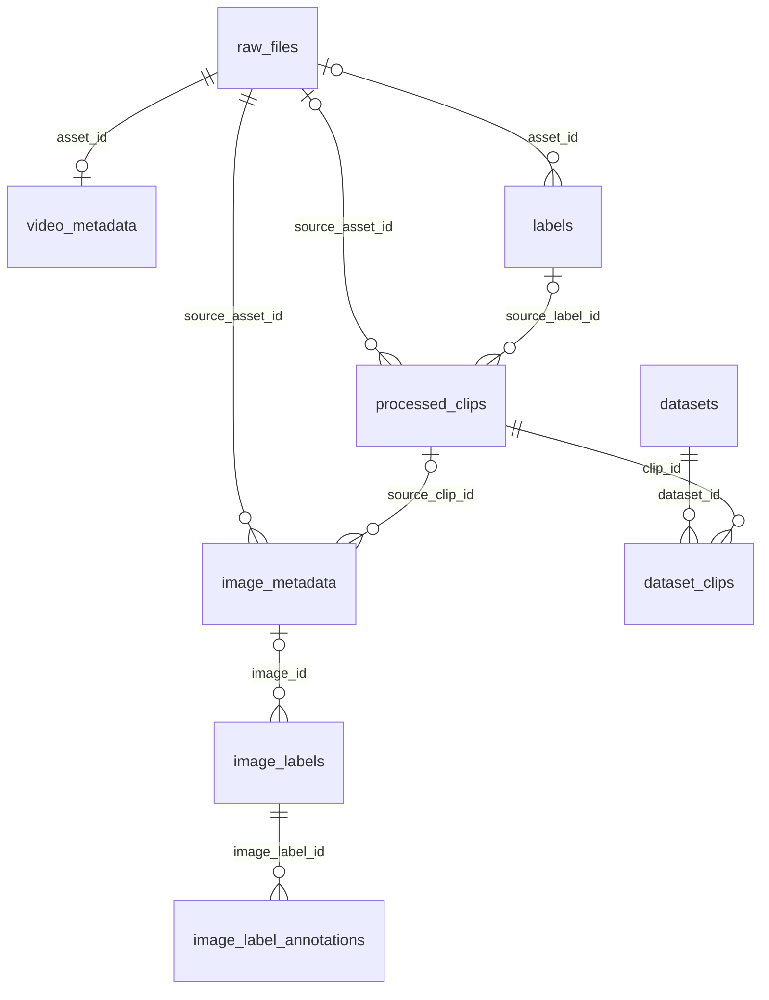

# VLM DataOps Pipeline

CCTV·보안 영상과 이미지로 VLM(Vision-Language Model) 학습 데이터를 만드는 파이프라인.
NAS 수집 → 중복 제거 → Gemini(Vertex) 이벤트 라벨링 → SAM3 bbox 검출 → Label Studio 사람 검수 → 데이터셋 구축.
오케스트레이션은 **Dagster**, 파이프라인 DB는 **PostgreSQL**, 객체 저장소는 **MinIO**.

파이프라인 write path는 PostgreSQL 단일 경로. DuckDB는 `pg_duckdb` 분석용이며 MotherDuck 동기화는 폐기됨.
YOLO-World 코드는 남아 있으나 운영 설정은 `ENABLE_YOLO_DETECTION=false`; bbox는 SAM3가 담당.
폐기 스크립트는 [`scripts/archive/`](scripts/archive/)에 보관하며 운영 명령으로 사용하지 않음.

에이전트 진입점은 [AGENTS.md](AGENTS.md). 운영 맥락은 [CLAUDE.md](CLAUDE.md), 설계·계획·런북은
[docs/index.md](docs/index.md)에서 필요한 주제만 탐색.

## Architecture

```text
NAS / GCS / 외부 수집
  └─ /nas/data/incoming + .manifests
       └─ Dagster: raw_ingest → 검증·중복 제거·MinIO 업로드 → archive

Agent polling / .dispatch/pending / 선택적 dispatch webhook
  └─ dispatch_stage_job
       ├─ Gemini: 이벤트·캡션·영상 분류
       └─ 프레임 추출 → SAM3 bbox
            └─ Label Studio 검수 → finalized
                 ├─ post_review_clip_job → clip·frame
                 └─ dataset build

PostgreSQL: 상태·메타데이터·라벨 투영·pgvector·모델/데이터셋 계보
MinIO:      vlm-raw / vlm-labels / vlm-processed / vlm-dataset / vlm-classification
부가 서비스: embedding-service, GenAI Studio + ComfyUI, FiftyOne/Streamlit, MLflow
```

NAS는 호스트 `NAS_DATA_ROOT`를 컨테이너 `/nas/data`에 **단일 bind mount**로 연결.
`incoming`과 `archive`를 같은 mount에 두어 폴더 이동의 cross-device 복사를 피함.
Dagster의 run/event/schedule storage는 `docker/app/dagster_home/dagster.yaml`의 SQLite 설정이며,
파이프라인 데이터 DB와 별개.

주요 조립 지점:
[definitions.py](src/vlm_pipeline/definitions.py),
[definitions_production.py](src/vlm_pipeline/definitions_production.py),
[Compose](docker/docker-compose.yaml).

## 환경 (Production / Staging)

서버는 `10.0.0.10`, NAS/MinIO는 `10.0.0.51`.
각 환경은 별도 clone·Compose project·DB를 사용하며 SAM3는 운영 컨테이너를 공유.
이미지 태그도 공유한다(Compose `IMAGE_NAME` 기본값·원본 배포 워크플로 모두 `datapipeline:gpu-cu124`) — dev 재빌드 뒤 재빌드 없는 prod 배포는 dagster를 dev 이미지로 띄운다.
아래 포트·경로는 환경 설정값; 변경 시 해당 env와 wrapper를 함께 확인.

| 항목 | Production (`main`) | Staging (`dev`) |
|---|---|---|
| Dagster UI | `http://10.0.0.10:3030` | `http://10.0.0.10:3031` |
| 호스트 clone | `/home/user/work_p/Datapipeline-Data-data_pipeline` | `/home/user/work_p/Datapipeline-Data-data_pipeline_test` |
| Compose project | `docker` | `pipeline-test` |
| PostgreSQL DB | `vlm_pipeline` | `vlm_pipeline_staging` |
| PostgreSQL 컨테이너 / 호스트 포트 | `docker-postgres-1` / `15433` | `pipeline-test-postgres-1` / `15432` |
| MinIO API | `http://10.0.0.51:9000` | `http://10.0.0.51:9002` |
| NAS 루트 | `/home/user/mou/nas_primary` | `/home/user/mou/nas_primary/staging` |
| 컨테이너 NAS 루트 | `/nas/data` | `/nas/data` |
| env | `docker/.env` | staging clone의 `docker/.env.test` |
| wrapper | `scripts/compose-prod.sh` | `scripts/compose-staging.sh` |
| Agent API | `host.docker.internal:8080` | `host.docker.internal:8081` |
| SAM3 API | `http://sam3:8002` | `http://docker-sam3-1:8002` |

Compose 조작은 **해당 clone의 wrapper**로 실행. project 이름을 빼면 staging 작업이 운영 컨테이너를 건드릴 수 있고,
env-file을 빼면 DSN·포트·NAS 경로가 달라짐. staging은 필요할 때 기동하는 환경이므로 `:3031` 무응답만으로 장애 판단 금지.

## Data Flow

### 자동 라벨링 (dispatch 경로)

```text
production_agent_dispatch_sensor  ← Agent API polling
 dispatch_sensor                 ← /nas/data/incoming/.dispatch/pending/*.json
 dispatch-webhook (선택 profile)  → 같은 pending JSON 생성
           │
           ▼
 dispatch_stage_job
   raw_ingest
   clip_timestamp → clip_captioning
   classification_video
   raw_video_to_frame → dispatch_sam3_image_detection
           │
           ▼
 ls_task_create_sensor → ls_task_create_job → Label Studio task
           │
      사람 Submit → reviewed
      /sync-approve → finalized
           ├─ post_review_clip_job → clip_to_frame
           └─ build_dataset_on_finalize_sensor → build_dataset
```

- 단계 실행은 dispatch의 `requested_outputs`·spec·처리 상태에 따라 결정. 모든 요청이 모든 단계를 실행하는 것은 아님.
- `ingest_job`·`mvp_stage_job`은 수집 전용. 자동 라벨링 요청은 `dispatch_stage_job`으로 전달.
- `dispatch_stage_job`에는 `clip_to_frame`이 없음. clip은 사람 확정 timestamp로 `post_review_clip_job`에서 생성.
- 처리 limit로 남은 라벨링 backlog는 `auto_labeling_sensor`가 `auto_labeling_job`으로 이어서 처리.
- `review_status`는 `auto_generated → reviewed → finalized`. dataset 게이트는 `finalized` 기준.
- finalize 후 dataset 자동 빌드는 `build_dataset_on_finalize_sensor`를 활성화해야 동작; 코드 기본값은 STOPPED.

### 단계별 요약

| 단계 | Asset | 결과 |
|---|---|---|
| GCS 수집 | `pipeline/incoming_nas` | NAS incoming 다운로드 |
| SourceA 수집 | `pipeline/sourcea_site` | 외부 MinIO → NAS |
| INGEST | `raw_ingest` | `vlm-raw`, `raw_files`, 영상·이미지 메타데이터, archive |
| TIMESTAMP | `clip_timestamp` | `vlm-labels/**/events/*.json`, timestamp 처리 상태 |
| CAPTION | `clip_captioning` | 이벤트 JSON → `labels` |
| 영상 분류 | `classification_video` | `vlm-labels/**/video_classifications/*.json` |
| RAW FRAME | `raw_video_to_frame` | 검수 전 프레임 → `vlm-processed`, `image_metadata` |
| BBOX | `dispatch_sam3_image_detection` | COCO JSON → `vlm-labels/**/sam3_segmentations/`, `image_labels` |
| CLIP | `clip_to_frame` | 확정 구간의 clip·frame → `vlm-processed`, `processed_clips` |
| BUILD | `build_dataset` | 학습 데이터셋 → `vlm-dataset`, `datasets` |
| 분류 빌드 | `build_classification` | 카테고리별 원본 → `vlm-classification` |
| 임베딩 | `frame_embedding`·`caption_embedding`·`video_embedding` | pgvector `image_embeddings` |

## Auto Labeling 상세

### 1. Gemini Timestamp / Caption

`clip_timestamp`가 영상의 이벤트 구간·캡션을 JSON으로 저장하고, `clip_captioning`이 이를 `labels`에 정규화.
Vertex 인증·모델·병렬 호출은 Gemini 설정으로 제어. 요청 categories와 spec은
`defs/label/timestamp.py`, 프롬프트는 `lib/gemini_prompts.py`에서 확인.

- 이벤트 JSON 정본은 `vlm-labels`; DB에는 객체 키·이벤트 인덱스·timestamp·캡션·처리 상태를 저장.
- 이벤트 항목은 `category`·`duration`·`timestamp`·`ko_caption`·`en_caption`. 450MB(`GEMINI_SAFE_VIDEO_BYTES`)·
  3600초(`GEMINI_MAX_DURATION_SEC`) 초과 영상은 preview mp4로 축소·절단해 요청; 429는 backoff 재시도.
- `labels.caption_text`는 한국어 우선 폴백 값. `caption_text_en`은 Gemini 영문 원문이며 없으면 NULL.
- 캡션 임베딩은 `caption_text_en`을 우선 사용; 구 행의 번역·폴백 처리는 `defs/embed/helpers.py` 확인.
- 완료 판단은 `video_metadata.timestamp_status`와 객체 키로 수행. 이벤트 0건이면 `labels` 행이 없어도 처리 완료 가능.
- 생성 프롬프트 계보는 `generation_prompts`와 `video_metadata.timestamp_generation_prompt_id`에 기록.

구현: [timestamp.py](src/vlm_pipeline/defs/label/timestamp.py),
[captioning.py](src/vlm_pipeline/defs/process/captioning.py).

### 2. Frame Extraction

| 경로 | 시점 | 간격 / 용도 |
|---|---|---|
| `raw_video_to_frame` | 사람 검수 전 | `RAW_VIDEO_FRAME_INTERVAL_SEC`로 원본 영상 bbox용 프레임 추출 |
| `clip_to_frame` | 사람 `finalized` 후 | 이벤트 clip 분할 + 1fps 프레임 |

raw-video 간격은 기본 1초, 1초 미만은 1초로 제한. 원본과 clip 프레임 밀도가 다를 수 있으므로 비교 시 설정을 확인.
clip 프레임의 top-1 relevance 이미지 캡션은 `image_metadata.image_caption_text`와
`vlm-labels/**/image_captions/*.json`에 저장.

샘플링 정책: [video_frames.py](src/vlm_pipeline/lib/video_frames.py).
처리 구현: [`defs/process/`](src/vlm_pipeline/defs/process/).

### 3. SAM3 Detection (현재 기본 bbox 엔진)

`docker/sam3/` 서비스가 bbox를 검출하고 COCO JSON을 `vlm-labels/**/sam3_segmentations/`에 저장.
`image_labels`는 그 객체와 상태를 추적. 대상은 `source_image`·`raw_video_frame`·`processed_clip_frame`.

- 운영 SAM3는 GPU1 사용. staging은 `SAM3_API_URL`로 같은 컨테이너에 연결하므로 별도 `sam3` profile 활성화에 주의.
- checkpoint 경로는 Compose의 `SAM3_CHECKPOINT_PATH`; 모델 파일은 `docker/data/models/sam3/`에 배치.
- 워커 수는 `SAM3_WORKERS`. 프로세스마다 모델 사본이 생기므로 늘리기 전 GPU 메모리 확인.
- 검출 클래스: spec이 있으면 spec `classes`(bbox `target_classes`와 교집합 우선)만, 없으면 dispatch `classes` →
  `categories` 온톨로지 확장 → 서버 기본값([target_classes.py](src/vlm_pipeline/defs/spec/target_classes.py)).
- `sam3_shadow_compare`는 YOLO와의 동의도 비교용; 검출 결과의 학습 허용 게이트가 아님.

구현: [`defs/sam/`](src/vlm_pipeline/defs/sam/),
[postgres_detection.py](src/vlm_pipeline/resources/postgres_detection.py).

### 4. YOLO-World (레거시, 현재 비활성)

`ENABLE_YOLO_DETECTION=false`가 운영 설정과 코드 기본값. `docker/yolo/` 서비스·asset은 남아 있으며
플래그를 켜면 관련 asset/job을 등록. SAM3가 기본 bbox 경로이므로 YOLO 기동·등록을 필수 설치 단계로 안내하지 않음.

### 5. Label Studio 사람 검수

UI는 `http://10.0.0.10:8084`. `ls_task_create_sensor`가 완료 dispatch를 검수 task로 전달하고,
Submit 동기화는 `reviewed`, `/sync-approve`는 `finalized`로 전이.
확정 bbox는 `image_label_annotations`에 박스 단위로 투영.

- `DATASET_REQUIRE_LS_FINALIZED=1` 유지. Compose 기본값은 1이며 코드 단독 실행의 기본값은 0이므로 env 없는 실행에 주의.
- finalized 라벨은 재 Submit으로 reviewed 상태에 회귀하지 않도록 보호.
- LS timestamp 재동기화는 구간이 유지된 이벤트의 캡션만 재사용; 사람이 경계를 바꾸면 캡션은 NULL로 남을 수 있음.
- task gate 때문에 task 수와 입력 수가 다를 수 있음. 실제 결과는 `dispatch_requests.ls_task_status`·오류로 확인.
  `ls_task_create_job`의 SUCCESS만으로 task 생성 성공을 판단하지 않음; `failed` 요청은 자동 재시도 대상이 아님.
- 합성본에는 출처와 합성 품질 검수 항목을 표시. 사람 확정 전 dataset에 편입하지 않음.

```bash
# 프로젝트 webhook 등록
python src/gemini/ls_webhook.py register --project <id>
# presigned URL 갱신
python src/gemini/ls_tasks.py renew --project-name <name>
```

운영 절차: [Label Studio 가이드](docs/references/label-studio-ops-guide.md).
구현: [`src/gemini/ls_*.py`](src/gemini/),
[LS sensor](src/vlm_pipeline/defs/ls/sensor.py).

## 임베딩 & 분석

`embedding-service`는 PE-Core-L14-336(`open_clip`, 1024차원) 이미지·텍스트 임베딩을 제공.
운영 호스트 `:8004` → 컨테이너 `:8003`, PE-Core는 GPU0 사용.
`/embed`·`/embed_text`·`/warmup`·`/unload`·`/health`와 maintenance API를 제공하며 정비 중 추론은 503으로 응답.

- 벡터는 pgvector `image_embeddings`에 저장. `entity_type`·`model_name`을 함께 지정해 조회하고,
  `entity_type`별 partial HNSW(`frame`·`caption`·`video`·`prompt`·`al_frame`)를 사용.
- 활성 모델 포인터는 `embedding_active_model`. 모델 버전과 다른 벡터를 한 검색 공간에 섞지 않음.
- 선택적 PLM 이미지 캡션(`/caption`)은 `PLM_ENABLED`로 제어. GPU1을 SAM3와 공유하며 VRAM 부족 시 503,
  유휴 시 unload. 자세한 설정은 Compose와 `docker/embedding/gpu_guard.py` 확인.

분석 스택은 profile `analysis`의 JupyterLab·FiftyOne·Streamlit·동기화 API·MongoDB로 구성.

| 구성 | 역할 |
|---|---|
| `analysis` | JupyterLab |
| `analysis-fiftyone`, `analysis-fiftyone-2`~`-5` | 사용자별 App 프로세스; Mongo 데이터는 공유 |
| `analysis-fiftyone-proxy` | 좌석 라우팅 입구 |
| `analysis-streamlit` | 검색·대시보드 |
| `analysis-sync` | `/sync/*` 증분 동기화, 좌석 배정, 번들 업로드; 내부 `:8010` |
| `fiftyone-mongo` | FiftyOne 메타데이터 |

FiftyOne 좌석은 UI 상태를 프로세스별로 분리. 같은 좌석에 접속하면 화면 상태를 공유하므로 사용자별 좌석을 선택.
좌석 포트·메모리 상한은 Compose, 라우팅은 `docker/analysis/nginx-seats.conf` 확인.
검색 헬퍼는 `docker/analysis/fiftyone_pgvector.py`(텍스트→프레임·유사 이미지·캡션 hybrid), 예제 SQL은
[vectordb_queries.sql](docker/analysis/vectordb_queries.sql), 사용법은 [analysis README](docker/analysis/README.md).
FiftyOne 이미지가 브라우저에 뜨려면 `ANALYSIS_MINIO_ENDPOINT`를 브라우저가 닿는 주소로 설정(기본 `minio:9000`은 미도달).

배포 스크립트가 기동을 보증하는 분석 서비스는 `analysis`·`analysis-fiftyone`·`analysis-streamlit`·`analysis-sync` **4개**.
추가 좌석·proxy·MongoDB는 그 목록에 없으며 설치·변경 시 별도 확인 필요.
`docker/analysis/**` 단독 변경은 배포 트리거에서 제외되고 Python/플러그인은 bind mount로 반영.
Dockerfile·requirements 변경도 같은 제외 경로에 있으므로 자동 이미지 재빌드를 가정하지 않음.

운영: [FiftyOne 런북](docs/runbook/fiftyone-operations.md),
[HNSW 튜닝](docs/runbook/hnsw-tuning.md),
[임베딩 백업/복구](docs/runbook/embedding-backup-restore.md).

## GenAI Studio / ComfyUI 로컬 생성

GenAI Studio(`docker/genai/`, 운영 `:8089` → 컨테이너 `:8088`)는 생성형 증강 UI/API.
엔진 선택은 `GENAI_ENGINES_ENABLED`, 인증은 HTTP Basic(`GENAI_BASIC_AUTH_USER`/`PASS`); 미설정이면 `GENAI_AUTH_DISABLED=true` 없이는 503. 헬스 경로는 `/healthz`.

- 생성물 기본 저장소는 `/nas/data/genai_studio`. incoming과 분리하여 auto-bootstrap이 일반 카메라 미디어로 수집하지 않게 함.
- 파이프라인 편입은 Promote의 dispatch 경로. `genai_poll_sensor`는 GenAI 내부 API를 HTTP로 폴링.
- ComfyUI는 profile `comfyui`, GPU0 로컬 생성 worker. 호스트 포트 없이 GenAI가 내부 `:8188`로 호출.
- 실행 workflow와 모델 manifest는 `docker/comfyui/`에서 관리. 모델은 기동 시 자동 다운로드하지 않으며
  `model_manifest.json`의 size/SHA-256 검증이 health에 반영됨.
- 로컬 생성은 `generation_gpu_leases`를 확보하고 embedding-service 정비·unload 후 실행, 종료 시 복구.
  생성 중 임베딩 backlog는 defer될 수 있음. 동시성은 `COMFY_LOCAL_MAX_CONCURRENT`, VRAM 입장 기준은 `COMFYUI_MIN_FREE_VRAM_GB`.
- `comfy_local` Promote는 사람 검수 경로를 요구. 합성 출처·검수 결과를 보존하고 `finalized` 후 dataset 편입.
- 합성 coverage planner와 dispatch sensor는 기본 STOPPED. `/internal/coverage/dispatch`는 아직
  `docker/genai/`에 구현되지 않아 sensor가 endpoint 부재를 `endpoint_unavailable`로 defer.

운영·롤백: [ComfyUI / GenAI 런북](docs/runbook/comfyui-local-genai.md).
스키마·계획 로직: migrations 030·032·033, `defs/genai/`, `resources/postgres_coverage.py`.

## MLOps (파인튜닝 트랙)

SAM3 / PE-Core 파인튜닝의 스캐폴딩. 동결 학습셋·레지스트리·정비·승격 경로를 제공하며 실제 GPU 학습·승격은 수동.
`train_eval_gate`의 기본 GPU scoring 함수는 `NotImplementedError`이므로 평가 경로를 완성된 자동 학습으로 가정하지 않음.

| 구성 | 계약 |
|---|---|
| `build_trainset` | 확정 bbox로 split을 동결해 `vlm-dataset/_trainsets/<id>/`와 `train_dataset_versions`에 기록 |
| `train_eval_gate` | 봉인된 split에서 후보·incumbent 평가 후 `model_registry.status` 판정 |
| `scripts/promote_model.py` | promotable 모델의 artifact 검증·승격·롤백; 실행 전 `--help` 확인 |
| `gpu_maintenance_lock` / `maintenance_guard_sensor` | 서빙 정비 owner·heartbeat·TTL 관리와 stale 해제 |
| `dataset_catalog_reconciliation_sensor` | DVC 카탈로그 색인; `DVC_DATA_REPO_PATH` 없으면 skip |
| `docker/analysis/al_*.py` | AL 선별 → LS 전송 → 회수 → 라운드 평가 |

- 학습 정본은 사람 확정 라벨. 모델 파생 라벨을 GT로 재사용하지 않음; 학습셋 스냅샷은 동결.
- AL의 `LABEL_SOURCES`(기본 `human,derived`) 필터는 GT 쿼리에 적용. 미라벨 선별 풀에 적용하면 후보가 사라짐.
- AL 선별은 migration 031의 `al_frames.eval_holdout`을 제외. 작은 cohort는 실제 holdout 수를 확인.
- `build_trainset`·`train_eval_gate`·`pseudo_label_*_qa`는 수동 materialize asset. pseudo-label QA 결과는 run metadata에 기록.
- CI는 학습을 기동하지 않으며 배포 스크립트도 trainer를 자동 기동하지 않음.

절차: [.agent/skill/mlops-finetune/SKILL.md](.agent/skill/mlops-finetune/SKILL.md).
설계: [파인튜닝 스캐폴딩](docs/superpowers/specs/2026-06-29-mlops-finetune-scaffolding-design.md).

## Database Schema

DDL은 [기본 스키마](src/vlm_pipeline/sql/schema_postgres.sql)와
[PostgreSQL migrations](src/vlm_pipeline/sql/migrations/postgres/)를 함께 확인.
마이그레이션 파일은 **001~033, 총 34개**. `030_al_frames_unit.sql`과 `030_comfy_local.sql`이 같은 번호를 사용.
파일 목록이 실제 DB 적용 완료를 뜻하지 않으며 적용 이력은 `_pg_migrations`로 조회.

### 운영 핵심

| 객체 | 용도 / grain |
|---|---|
| `raw_files` | 원본 파일·checksum·MinIO key·ingest 상태·출처 |
| `video_metadata` | 영상 메타·라벨링 단계 상태·환경/카메라 분류 |
| `labels` | 영상 이벤트 timestamp·캡션·검수 상태 |
| `processed_clips` | 라벨에서 생성한 clip과 처리 상태 |
| `image_metadata` | 원본 이미지·영상 프레임·clip 프레임과 출처 |
| `image_labels` | bbox JSON key·검수 상태 |
| `image_label_annotations` | 사람 확정 bbox의 박스별 투영 |
| `datasets` / `dataset_clips` | 데이터셋 메타·clip 구성·재현성 계보 |
| `classification_datasets` | 카테고리별 원본 데이터셋 |
| `v_finalized_labels` | 확정 caption·image caption·bbox 통합 조회 |

### dispatch / spec

| 객체 | 용도 |
|---|---|
| `dispatch_requests` / `dispatch_pipeline_runs` | 요청·처리 상태·run 추적 |
| `labeling_specs` / `labeling_configs` / `requester_config_map` | 요청자별 spec/config 연결 |
| `staging_model_configs` | 모델 설정 |

### 임베딩 / MLOps / GenAI

| 객체 | 용도 |
|---|---|
| `image_embeddings` / `embedding_active_model` | pgvector 벡터·활성 모델 포인터 |
| `train_dataset_versions` / `model_registry` | 동결 학습셋·모델 이력·승격 상태 |
| `gpu_maintenance_lock` | GPU 서빙 정비락 |
| `dataset_catalog*` | DVC 큐레이션 색인·alias·pin 이력 |
| `al_frames` / `al_rounds` / `al_selections` | AL 단위·라운드·선별·eval holdout |
| `genai_batches` / `genai_jobs` | 생성 batch·job 상태 |
| `genai_job_provenance` / `generation_gpu_leases` | 로컬 생성 출처·GPU lease |
| `coverage_unit_facts` / `coverage_context_facts` / `generation_reference_pool` | coverage 사실·문맥·생성 reference |
| `synthetic_coverage_*` / `coverage_snapshot*` / `synthetic_generation_*` | coverage 정책·snapshot·campaign·task 제어평면 |

### 프롬프트 / 온톨로지 DB

| 객체 | 용도 |
|---|---|
| `generation_prompts` | 생성 모델에 보낸 프롬프트 원문·hash·계보 |
| `prompt_banks` / `bank_sentences` | 임베딩 대상 문장 뱅크·문장 정본 |
| `v_prompt_catalog` / `v_prompt_lineage` | 두 프롬프트 계열 카탈로그·생성 라벨 계보 |
| `label_classes` / `label_class_aliases` | 코드 온톨로지의 DB 투영 |
| `observed_categories` | 미상 카테고리 원문과 사람 판단·매핑 |

코드 라벨 의미의 정본은 [`label_ontology.json`](src/vlm_pipeline/data/label_ontology.json).
온톨로지 변경은 JSON과 PG seed의 정합성을 함께 확인; DB 투영만으로 코드 의미가 바뀌지 않음.

### 마이그레이션 탐색 (001~033)

아래는 기능별 안내. 세부 변경·전제조건은 **각 SQL 파일의 헤더와 DDL**, 실행 정책은
[postgres_migration.py](src/vlm_pipeline/resources/postgres_migration.py) 확인.
헤더의 과거 운영 상태를 현재 DB 적용 상태로 읽지 않음.

| 파일 범위 | 내용 | 헤더 진입점 |
|---|---|---|
| 001~005 | 기반 테이블·GenAI/Veo·dataset 계보·라벨 UNIQUE | [001_init.sql](src/vlm_pipeline/sql/migrations/postgres/001_init.sql) |
| 006~010 | pgvector·caption/video 벡터·partial HNSW·키워드 검색 | [006_image_embeddings.sql](src/vlm_pipeline/sql/migrations/postgres/006_image_embeddings.sql) |
| 011~016 | bbox 투영·finalized view·학습/모델·정비락·활성 모델·DVC | [011_image_label_annotations.sql](src/vlm_pipeline/sql/migrations/postgres/011_image_label_annotations.sql) |
| 017~023 | 카메라 씬·생성 프롬프트·문장 뱅크·계보 view·온톨로지 | [017_video_camera_angle.sql](src/vlm_pipeline/sql/migrations/postgres/017_video_camera_angle.sql) |
| 024~026 | 조회 인덱스·영문 캡션·온톨로지 seed 확장 | [025_labels_caption_text_en.sql](src/vlm_pipeline/sql/migrations/postgres/025_labels_caption_text_en.sql) |
| 027~031 (`030_al_frames_unit` 포함) | AL frame/round/selection·벡터 인덱스·unit·eval holdout | [027_al_frames.sql](src/vlm_pipeline/sql/migrations/postgres/027_al_frames.sql) |
| `030_comfy_local` | ComfyUI 엔진·provenance·GPU lease | [030_comfy_local.sql](src/vlm_pipeline/sql/migrations/postgres/030_comfy_local.sql) |
| 032 | coverage 사실·카메라 매핑·reference·eligibility view | [032_coverage_facts.sql](src/vlm_pipeline/sql/migrations/postgres/032_coverage_facts.sql) |
| 033 | coverage 정책·snapshot·campaign/task·품질·예산 | [033_coverage_control_plane.sql](src/vlm_pipeline/sql/migrations/postgres/033_coverage_control_plane.sql) |

### 테이블 관계도 (ERD)

핵심 참조만 표시. 전체 컬럼·제약은 SQL 확인.



마이그레이션 계약:

- forward-only. 적용 판정 키는 **파일명 전체**이므로 기존 파일의 이름·번호를 바꾸지 않음; 두 `030_*` 유지.
- 러너는 파일명 정렬 순서로 실행. `ensure_runtime_schema()`는 프로세스에서 최초 호출 시 적용·baseline 검사.
  배포 직후 모든 파일이 적용됐다고 가정하지 않음.
- optional migration은 extension 등 전제조건 미충족 시 적용·단언·기록을 skip.
- `@ASSERT_AFTER`는 이미 적용된 파일도 재검증. 인덱스 삭제·제약 변경 전 관련 단언 확인.
- `_pg_migrations.checksum`은 러너가 기록·비교하지 않으므로 SQL 내용 변경 감지 수단이 아님.

## MinIO 버킷 & 키 규칙

| 버킷 | 용도 |
|---|---|
| `vlm-raw` | 원본 미디어 |
| `vlm-labels` | 이벤트·bbox·캡션·분류 JSON의 정본 |
| `vlm-processed` | clip·frame 미디어 |
| `vlm-dataset` | 최종 데이터셋·`_trainsets/`·`_models/` |
| `vlm-classification` | 카테고리별 원본 복사 |

주요 key:

```text
vlm-raw        <source_unit_name>/<rel_path>
vlm-labels     <raw_parent>/events/<video_stem>.json
               <raw_parent>/sam3_segmentations/<image_stem>.json
               <raw_parent>/image_captions/<image_stem>.json
               <raw_parent>/video_classifications/<video_stem>.json
               <events_stem>.pseudo.json
vlm-processed  <raw_parent>/clips/<stem>_<start_ms:08d>_<end_ms:08d>.mp4
               <raw_parent>/image/<clip_stem>_<frame_index:08d>.jpg
               <raw_parent>/image/<video_stem>_<frame_index:08d>.jpg
```

`raw_key`의 source unit·상대 경로는 sanitizer로 정규화하며 업로드 key와 DB key를 동일하게 사용.
`source_unit_type=file`은 prefix 없이 상대 경로, GCP unit은 선두 `gcp/`를 제거.
`YYYY/MM` prefix 금지. key 생성은 [key_builders.py](src/vlm_pipeline/lib/key_builders.py),
raw 등록은 [ops_register.py](src/vlm_pipeline/defs/ingest/ops_register.py) 확인.

### 운영 규칙

- 버킷은 위 5개 고정. 라벨 JSON을 `vlm-processed`에 복제하지 않음.
- 파일 오류는 실패 기록 후 다른 파일을 계속 처리. `file_missing`·`empty_file`·`ffprobe_failed`는 DB 등록·archive 이동 제외.
- 전량 성공한 directory unit은 폴더 단위 archive 이동; chunked manifest는 파일 단위 누적 이동.
- `ingest_status='completed'`는 downstream 후보 조회의 게이트. archive·업로드 결과를 확인하지 않고 상태만 승격하지 않음.
- checksum은 SHA-256 + UNIQUE로 정확 중복을 차단; NULL은 중복 제약을 통과하므로 누락을 점검.
  이미지 근사 중복은 pHash Hamming ≤ 5, 비디오는 checksum 기준.
- GCP auto-bootstrap은 `pending → processed → completed(summary)`. `_DONE` 후 chunk별 processed 파일을
  source unit/signature 요약으로 compact; [compaction.py](src/vlm_pipeline/defs/ingest/compaction.py) 확인.

## Project Structure

```text
src/
├─ vlm_pipeline/
│  ├─ definitions.py / definitions_production.py  # Dagster 조립
│  ├─ defs/        # ingest/dispatch/label/process/sam/build/embed/train/genai/ls/viz
│  ├─ resources/   # PostgresResource mixin·MinIOResource
│  ├─ lib/         # 순수 로직·공유 helper (Dagster import 금지)
│  ├─ data/        # 라벨 온톨로지
│  └─ sql/         # 기본 DDL·migrations/postgres/
├─ gemini/         # Label Studio task·webhook·sync·finalize
└─ python/         # NAS 폴더 KPI → PostgreSQL

docker/            # Compose·서비스 이미지·Dagster 설정
scripts/           # 운영·검증·배포 (archive/는 폐기)
configs/           # 파이프라인 설정
tests/unit/        # 단위 검사
tests/integration/ # 별도 PG 기반 통합 검사
docs/              # 설계·계획·런북·레퍼런스
.agent/skill/      # 작업 절차
```

import 방향은 `definitions* → defs → resources/lib`.
`lib/`의 `dagster`·`vlm_pipeline.defs`·`vlm_pipeline.resources`·`vlm_pipeline.ops` import는 금지하며 lazy import도 검사.
[check_lib_layer_imports.py](scripts/check_lib_layer_imports.py)가 원본 CI/pre-commit에서 확인; 미러에서는 직접 실행.
파이프라인 DB 변경은 `PostgresResource`(`db`)로 처리하고 센서 조회는 `lib/sensor_db.py` 사용.

## Infrastructure

서비스 정의는 [docker/docker-compose.yaml](docker/docker-compose.yaml).
호스트 포트는 env로 override되므로 컨테이너 포트와 구분.
아래 표는 운영 설정값과 Compose 정의를 요약하며 실제 기동 상태를 뜻하지 않음.

| 서비스 | 컨테이너 포트 | 운영 호스트 포트 | profile / 비고 |
|---|---|---|---|
| `dagster` | 3030 | 3030 | UI |
| `dagster-daemon` / `dagster-code-server` | – / 4000 | – | sensor·schedule / gRPC |
| `postgres` | 5432 | 15433 | `POSTGRES_IMAGE`로 이미지 선택 |
| `sam3` | 8002 | 8002 | `sam3`; staging 공유 |
| `embedding-service` | 8003 | 8004 | `embedding` |
| `genai` | 8088 | 8089 | `genai` |
| `comfyui` | 8188 | 없음 | `comfyui`; 내부 호출 |
| `analysis` | 8888 | 8888 | `analysis`; JupyterLab |
| `analysis-fiftyone-proxy` | 5151 | 5153 | `analysis`; 좌석 입구 |
| `analysis-fiftyone` | 5151 | 5158 | `analysis`; 좌석 1 |
| `analysis-fiftyone-2`~`-5` | 5151 | 5154~5157 | `analysis`; 추가 좌석 |
| `analysis-streamlit` | 8501 | 8503 | `analysis` |
| `analysis-sync` | 8010 | 없음 | `analysis`; 내부 API |
| `fiftyone-mongo` | 27017 | 없음 | `analysis`; `mongo:8.0` |
| `mlflow` | 5000 | 5500 | `mlflow`; 배포 기동 목록 밖 |
| `pg-backup` | – | – | `backup` |
| `grafana` | 3000 | 3000 | 대시보드 |
| `trainer` | – | – | `trainer`; 수동 one-shot |
| `dispatch-webhook` | 8090 | `DISPATCH_WEBHOOK_PORT` | `webhook`; 선택적 ingress |
| `yolo` | 8001 | `YOLO_PORT` | 레거시; YOLO asset 기본 미등록 |
| `minio` | 9000/9001 | `MINIO_API_PORT` / `MINIO_CONSOLE_PORT` | 로컬 서비스 정의; 운영 pipeline endpoint는 NAS |

`COMPOSE_PROFILES`와 asset 등록용 `ENABLE_*`는 별도 설정.
운영 profile은 `sam3,backup,genai,embedding,analysis,comfyui`이며 `mlflow`·`trainer`·`webhook` 활성은 별도 확인.
Compose 전체 `up`은 profile 없는 `yolo`·로컬 `minio`도 대상으로 삼으므로 필요한 서비스명을 지정.

PostgreSQL 기본 이미지는 `postgres:15`; 운영 env는 `pgduckdb/pgduckdb:15-v1.1.1`을 지정.
[postgres/Dockerfile](docker/postgres/Dockerfile)은 별도 빌드 정의이며 Compose가 자동 build하지 않음.
이미지·extension 교체 전 pgvector/HNSW 및 데이터 볼륨 호환성 검토.
MongoDB 변경 전에는 Compose의 FCV 관련 주석과 FiftyOne 런북 확인.

### 동시성

[dagster.yaml](docker/app/dagster_home/dagster.yaml)의 `QueuedRunCoordinator`:
`max_concurrent_runs: 20`, `gpu_trainer`·`pg_writer` 태그별 limit 1.
태그 제한은 해당 태그를 가진 run에만 적용되므로 모든 PostgreSQL write를 직렬화한다고 가정하지 않음.
`build_asset_job(writer_tag=...)`는 하위 호환 인자이며 writer 태그를 부여하지 않음.

### GPU 할당

| 컴포넌트 | 호스트 GPU | 계약 |
|---|---|---|
| Dagster 계열 | 0,1 | torch·NVENC 작업 |
| SAM3 | 1 | bbox 서빙; 컨테이너에서는 `cuda:0` |
| embedding-service | 0,1 | PE-Core는 GPU0, 선택적 PLM은 GPU1 |
| ComfyUI | 0 | 생성 lease와 embedding maintenance로 조율 |
| trainer | 1 | SAM3와 공유; 학습 전 정비 drain 필요 |

GPU를 공유하므로 profile·워커·학습 설정을 바꾸기 전 정비 절차와 VRAM 여유 확인.

## Getting Started

### 1. Requirements

- Python 3.10+와 파이프라인 의존성
- Docker / Docker Compose, NVIDIA GPU·드라이버·컨테이너 GPU 지원
- NAS mount, PostgreSQL·MinIO 접속, Vertex 인증
- 필요한 모델 파일·서비스별 설정

의존성 목록: [docker/app/requirements.txt](docker/app/requirements.txt), 각 서비스의 `Dockerfile`·`requirements.txt`.

### 2. 환경 설정

새 환경은 [docker/.env.test.example](docker/.env.test.example)을 참조해 해당 clone의 env를 구성.
기존 운영 env를 예제로 덮어쓰지 않음. 예제의 `ENABLE_YOLO_DETECTION=true`는 운영값과 다르므로
SAM3 경로에 맞춰 false로 설정. Compose의 endpoint 기본값에 의존하지 말고 endpoint를 명시.

| 변수 | 용도 |
|---|---|
| `DATAOPS_POSTGRES_DSN` | 필수 pipeline DB 접속; 없으면 Definitions 조립 실패 |
| `MINIO_ENDPOINT` / `MINIO_ACCESS_KEY` / `MINIO_SECRET_KEY` | 객체 저장소 접속; `minioadmin` 등 기본 자격은 거부 |
| `NAS_DATA_ROOT` | 호스트 NAS → `/nas/data` 단일 mount |
| `COMPOSE_PROFILES` | 부가 서비스 선택 |
| `ENABLE_SAM3_DETECTION` / `ENABLE_YOLO_DETECTION` / `ENABLE_EMBEDDING` | asset/job 등록 |
| `GEMINI_GOOGLE_APPLICATION_CREDENTIALS` | Vertex 인증 파일 경로 |
| `PROD_AGENT_POLLING_ENABLED` / `PROD_AGENT_BASE_URL` | Agent polling 활성·주소 |
| `RAW_VIDEO_FRAME_INTERVAL_SEC` | 원본 bbox 프레임 간격 |
| `INGEST_UPLOAD_WORKERS` / `GEMINI_MAX_WORKERS` / `GEMINI_CHUNK_MAX_WORKERS` | 업로드·Gemini 병렬도 |
| `LS_API_KEY` / `LS_PORT` / `WEBHOOK_HOST` | Label Studio 연결 |
| `GENAI_ENGINES_ENABLED` | GenAI 엔진 선택 |
| `DATASET_REQUIRE_LS_FINALIZED` | 사람 확정 dataset 게이트; 1 유지 |
| `DATAOPS_DUCKDB_PATH` | 레거시 키; 배포 필수 키 검사에 남아 있으므로 임의 삭제 금지 |

비밀 값은 문서·로그에 복사하지 않음. `MOTHERDUCK_*`를 현재 동기화 설정으로 사용하지 않음.

### 3. 인프라 실행

운영 배포는 원본 저장소의 CI 경로를 사용(미러 미포함). 신규·검증 환경에서 수동 기동할 때는 서비스명을 지정하고 해당 wrapper 사용.

```bash
# 운영 상태 조회
./scripts/compose-prod.sh ps

# staging clone 루트에서 기본 스택 기동
./scripts/compose-staging.sh up -d postgres dagster dagster-daemon dagster-code-server
```

SAM3 공유 연결·추가 profile의 모델/의존 서비스를 확인한 뒤 필요한 서비스만 기동.
배포·재시작은 진행 중 run에 영향을 주므로 [배포 가이드](docs/references/deployment-guide.md) 확인.

### 4. 환경 검증

```bash
# 운영 설정 기준; staging은 해당 포트 사용
curl -fsS http://127.0.0.1:3030/server_info
./scripts/compose-prod.sh exec -T postgres sh -c 'pg_isready -U "$POSTGRES_USER"'
curl -fsS http://127.0.0.1:8002/health   # SAM3
curl -fsS http://127.0.0.1:8004/health   # embedding-service
curl -fsS http://127.0.0.1:8089/healthz  # GenAI Studio
```

서비스 미기동·모델 로딩 상태는 wrapper의 `ps`·`logs`와 health 응답으로 확인.

### 5. 테스트

저장소 루트, 의존성이 갖춰진 venv에서 실행.
`pyproject.toml`은 `.gitignore` 대상이므로 fresh clone에서 `pip install -e ".[dev]"`를 설치 절차로 가정하지 않음.
원본 CI는 self-hosted 러너의 고정 venv에서 `PYTHONPATH=<checkout>/src`로 체크아웃 코드를 검증.

```bash
PYTHONPATH=src python -m pytest tests/unit -q --tb=short
python3 scripts/check_lib_layer_imports.py
ruff check src/ tests/
ruff format --check src/ tests/
```

Ruff는 원본 CI와 같은 `0.7.4`로 고정; 설정은 `ruff.toml`. pyright 설정은 `pyrightconfig.json`(원본 CI에서 non-blocking).

통합 검사는 **별도 테스트 PostgreSQL**의 `DATAOPS_TEST_POSTGRES_DSN`을 명시한 뒤 실행:

```bash
PYTHONPATH=src python -m pytest tests/integration -q --tb=short
```

fixture가 임시 DB를 생성·삭제. DSN 미지정 시 `DATAOPS_POSTGRES_DSN`으로 fallback하므로 운영 env로 실행 금지.
DB 접속이 없으면 skip될 수 있으므로 통과 수와 skip 사유를 함께 확인.

## Dagster Jobs & Sensors

등록 정본은 [definitions.py](src/vlm_pipeline/definitions.py)와
[definitions_production.py](src/vlm_pipeline/definitions_production.py).
아래 상태는 코드 기본값이며 UI에서 저장한 활성 상태와 다를 수 있음.

### Jobs

| Job | 역할 / 등록 조건 |
|---|---|
| `mvp_stage_job` / `ingest_job` | 수집 전용 |
| `gcs_download_job` / `sourcea_download_job` | 외부 수집 |
| `dispatch_stage_job` | 요청 기반 자동 라벨링·bbox; 검수 전 clip 분할 없음 |
| `auto_labeling_job` | 라벨링 backlog |
| `upload_label_job` | archive 자산 업로드 |
| `post_review_clip_job` | 사람 확정 후 clip·frame |
| `sam3_shadow_compare_job` | SAM3/YOLO 비교 |
| `manual_label_import_job` | `ENABLE_MANUAL_LABEL_IMPORT` |
| `yolo_standard_detection_job` | `ENABLE_YOLO_DETECTION`; 기본 미등록 |
| `sam3_standard_detection_job` | `ENABLE_SAM3_DETECTION` |
| `frame_embedding_job` / `caption_embedding_job` / `video_embedding_job` | `ENABLE_EMBEDDING` |
| `ls_presign_renew_job` | 검수 URL 갱신 |
| `video_env_backfill_job` / `video_scene_backfill_job` | 환경·카메라 씬 분류 |
| `fiftyone_sync_job` | 분석 동기화 API 호출 |
| `synthetic_coverage_planner_job` | coverage snapshot·campaign 계획; 생성은 별도 경로 |

`ls_task_create_job`·`build_dataset_single_job`은 해당 sensor 모듈에서 대상 job으로 연결.
`build_dataset`·`build_classification`·`build_trainset`·`train_eval_gate`·`pseudo_label_*_qa`는 materialize 가능한 asset.

### Sensors

| Sensor | 대상 / 역할 | 코드 기본 상태 |
|---|---|---|
| `production_agent_dispatch_sensor` | Agent polling → dispatch/ingest | STOPPED |
| `dispatch_sensor` | pending JSON → dispatch/ingest | STOPPED |
| `archive_dispatch_sensor` | archive 요청 → upload | RUNNING |
| `incoming_manifest_sensor` | manifest → ingest | RUNNING |
| `auto_bootstrap_manifest_sensor` | manifest 자동 생성 | RUNNING |
| `auto_labeling_sensor` | 라벨링 backlog | RUNNING |
| `ls_task_create_sensor` | 완료 dispatch → LS task | RUNNING |
| `build_dataset_on_finalize_sensor` | 확정 라벨 → dataset | STOPPED |
| `genai_poll_sensor` | 생성 job 상태 폴링 | RUNNING |
| `synthetic_campaign_dispatch_sensor` | 승인 campaign → 생성 제출; endpoint 구현 필요 | STOPPED |
| `fiftyone_sync_sensor` | 분석 증분 동기화 | RUNNING |
| `dispatch_run_success_sensor` / `dispatch_run_failure_sensor` / `dispatch_run_canceled_sensor` | dispatch 상태 후처리 | RUNNING |
| `run_failure_alert_sensor` | run 실패 알림 | RUNNING |
| `stuck_run_guard_sensor` | stuck/orphan run 처리 | RUNNING |
| `nas_health_sensor` / `cross_table_consistency_sensor` | NAS·DB 정합성 모니터링 | RUNNING |
| `stale_state_reaper_sensor` | stale 상태 정리 | STOPPED |
| `maintenance_guard_sensor` | GPU 정비락 stale 해제 | RUNNING |
| `frame_embedding_backlog_sensor` / `caption_embedding_backlog_sensor` / `video_embedding_backlog_sensor` | 임베딩 backlog; `ENABLE_EMBEDDING` | STOPPED |
| `dataset_catalog_reconciliation_sensor` | DVC 카탈로그 | STOPPED |

두 dispatch sensor는 기본 STOPPED. Dagster storage 초기화 후 자동 라벨링에 필요한 sensor 활성 상태를 확인.
주기는 각 decorator와 관련 env에서 확인.

### Schedules

| Schedule | cron (Asia/Seoul) | 코드 기본 상태 |
|---|---|---|
| `gcs_download_schedule` | `0 4 * * *` | STOPPED |
| `sourcea_download_schedule` | `0 6 * * *` | RUNNING |
| `ls_presign_renew_schedule` | `0 5 * * *` | STOPPED |
| `video_env_backfill_schedule` | `0 19 * * 1-5` | STOPPED |
| `video_scene_backfill_schedule` | `0 20 * * 1-5` | STOPPED |
| `fiftyone_label_refresh_schedule` | `0 3 * * *` | RUNNING |
| `synthetic_coverage_planner_schedule` | `0 5 * * *` | STOPPED |

### Asset Checks

`raw_ingest`·`clip_timestamp`의 non-blocking WARN 체크 3종:
completed 원본의 archive 연결, 영상 메타데이터 연결, completed timestamp의 라벨 key.
구현: [asset_checks.py](src/vlm_pipeline/defs/ingest/asset_checks.py).
WARN은 run을 막지 않으므로 결과를 따로 확인.

## 배포 (CI/CD)

원본 저장소의 `deploy-production.yml`은 `main`, `deploy-test.yml`은 `dev` push와 수동 dispatch에서 실행.
공개 미러에는 `.github/workflows/`·`.pre-commit-config.yaml`이 없고 [deploy-stack.sh](scripts/deploy/deploy-stack.sh)만 포함 — 미러 push로는 CI·배포가 돌지 않음.
배포 job은 `Orderlee/Datapipeline-Data-data_pipeline` 저장소의 self-hosted runner 조건으로 제한.

1. **test**: import 계층 검사·체크아웃 코드 import 확인·unit/integration 검사. integration은 PostgreSQL sidecar 사용.
2. **detect_image_rebuild**: 변경 경로로 재빌드 결정. `src/vlm_pipeline/`·서비스 Dockerfile/코드 등은 재빌드 대상.
3. **deploy**: `scripts/deploy/deploy-stack.sh`가 rsync·git 동기화·이미지 build·서비스 재생성·health 확인.

운영 계약:

- **운영 호스트의 checkout이 곧 배포 루트.** 호스트의 `src/`·`configs/`·`scripts/`·Compose 수동 수정은
  다음 배포의 `rsync --delete` + `git reset --hard`에 덮어쓰임.
- 배포가 실행되면 이미지 재빌드 여부와 관계없이 Dagster UI·daemon·code-server를 stop/rm/recreate.
  실행 중 라벨링이 중단될 수 있으므로 코드 push 전 run 상태 확인.
- ComfyUI profile 활성 시 GenAI보다 먼저 기동하고 최대 10분 health 대기. 실패하면 배포 종료;
  Dagster는 이미 재기동됐고 이후 서비스 보증은 실행되지 않았을 수 있음.
- analysis는 명시된 4개 서비스만 `up -d --no-deps`; trainer는 활성 profile이면 build만 수행.
- 배포 `paths-ignore`: `docs/**`, `*.md`, `tests/**`, `.cursor/**`, `.agent/**`,
  `.github/copilot-instructions.md`, `.github/workflows/claude*.yml`, `docker/analysis/**`.
  이 경로만 바뀐 push는 배포를 트리거하지 않음; workflow_dispatch는 별도.
- lint는 원본 저장소 `lint.yml`의 Ruff check/format·pyright 경로(미러 미포함).

권장 브랜치 흐름은 feature → dev 검증 → main. 세부 절차:
[배포 가이드](docs/references/deployment-guide.md), [Git 워크플로](docs/git-workflow-guide.md).

## Query Examples

PostgreSQL 조회 예제. 접속 대상은 해당 환경의 `DATAOPS_POSTGRES_DSN`으로 결정.

```sql
-- 수집 상태
SELECT ingest_status, COUNT(*) FROM raw_files GROUP BY 1 ORDER BY 2 DESC;

-- Gemini timestamp 상태
SELECT timestamp_status, COUNT(*) FROM video_metadata GROUP BY 1;

-- 라벨 검수 상태
SELECT review_status, COUNT(*) FROM labels GROUP BY 1;

-- bbox JSON이 연결된 이미지 수
SELECT COUNT(DISTINCT image_id) FROM image_labels;

-- 임베딩 커버리지
SELECT entity_type, model_name, COUNT(*) FROM image_embeddings GROUP BY 1, 2;

-- 모델 레지스트리
SELECT model, version, status, incumbent_source, created_at
FROM model_registry ORDER BY created_at DESC LIMIT 10;

-- 마이그레이션 적용 이력 (SQL 파일 목록과 별개)
SELECT name, applied_at FROM _pg_migrations ORDER BY name;
```

## 운영 팁

- 자동 라벨링 ingress는 Agent polling 또는 pending dispatch JSON. env·sensor 활성 상태·요청 상태를 함께 확인.
- Gemini 처리는 `video_metadata` 상태·객체 key·run 로그로 추적. 오류·skip·이벤트 0건을 구분.
- NAS discovery 부하는 `AUTO_BOOTSTRAP_DISCOVERY_MAX_TOP_ENTRIES`·`AUTO_BOOTSTRAP_MAX_UNITS_PER_TICK` 등
  해당 sensor 설정으로 제어. 재시도 전에 manifest·DB 상태를 확인.
- 검수 task 생성은 job 상태와 `ls_task_status`를 함께 확인. task가 없으면 후보·gate·오류를 조사.
- 복구 전 [runbook](docs/runbook.md)에서 주제별 절차 확인. staging 정리는 `.agent/skill/staging_reset/SKILL.md` 참조.
- 인덱스·모델·GPU 서비스 변경은 `@ASSERT_AFTER`·정비락·manifest를 확인한 뒤 수행.

## 참고 문서

| 목적 | 문서 |
|---|---|
| 에이전트 진입 / 리뷰 | [AGENTS.md](AGENTS.md), [REVIEW.md](REVIEW.md) |
| 운영 맥락 | [CLAUDE.md](CLAUDE.md)의 해당 절 |
| 전체 문서 탐색 | [docs/index.md](docs/index.md) |
| 설계 / 실행 계획 | [Design Docs](docs/design-docs/index.md), [Exec Plans](docs/exec-plans/index.md) |
| 운영 레퍼런스 | [References](docs/references/index.md) |
| 자동 라벨링 | [기능 명세](docs/logic/Auto_Labeling_기능_명세서.md), [명세·현행 갭](docs/logic/Auto_Labeling_명세_대비_현행_갭_및_수정사항.md) |
| 장애 대응 / PG 복구 | [runbook](docs/runbook.md), [PG 복구 드릴](docs/runbook/pg-restore-drill.md) |
| 협업·라우팅 | [multi-agent](docs/references/multi-agent.md), [agent-teams](docs/references/agent-teams.md) |
| 작업 절차 | [`.agent/skill/`](.agent/skill/) |

공유할 설계·운영 판단은 `docs/`에 기록. `.gitignore`의 로컬 전용 메모는 fresh clone에 없으므로 공유 문서로 인용하지 않음.
운영 값은 해당 env, 실행 동작은 코드·Compose·배포 스크립트를 확인.
