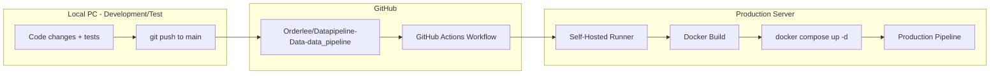

# Production-Test Environment Complete Separation and Automatic Deployment Plan

> Written: 2026-04-10
> Status: Files created; awaiting runner installation + first deployment

## Current State (AS-IS)

- **One production server** running production + staging via Docker Compose profiles
- Staging uses a separate git clone at `STAGING_REPO_PATH` with source bind-mounted
- No CI/CD — manually running `docker compose build && up -d`
- Code changes require **git pull + rebuild directly on the production server**
- Development, test, and production are physically mixed on the same server

## Target State (TO-BE)



- **Local PC**: development + pytest + staging tests (Docker or `dagster dev`)
- **Production server**: runs production only, no direct code modification
- **Deployment**: push to `main` branch triggers GitHub Actions to automatically build and deploy on the production server's self-hosted runner

---

## TODO Checklist

- [x] Phase 1: Define git branch strategy (dev=development, main=production deployment)
- [x] Phase 2: Configure local development/test environment → `docker/docker-compose.dev.yaml`, `.env.dev.example`
- [ ] Phase 3: Install GitHub self-hosted runner on production server → run `scripts/deploy/setup-runner.sh`
- [x] Phase 4: Write GitHub Actions deployment workflow → `.github/workflows/deploy-production.yml`
- [x] Phase 5: Clean up production server code management → `scripts/deploy/rollback.sh`
- [x] Phase 6: Add safeguards → test + health check in workflow, `docs/references/deployment-guide.md`

---

## Phase-by-Phase Plan

### Phase 1: Define Git Branch Strategy

The existing `main` and `dev` branches are leveraged as-is.

- **`dev` branch**: development and testing
- **`main` branch**: production deployment trigger (merge from dev after validation)
- Production server tracks `main` branch only; direct commits prohibited

### Phase 2: Configure Local Development/Test Environment

Set up the environment so tests can run independently on a local PC.

- Create `docker-compose.dev.yaml` — lightweight local development compose (MinIO + DuckDB only, no GPU services)
- Or local testing with `dagster dev` + in-memory DuckDB + mocked MinIO
- Existing pytest (`tests/unit`, `tests/integration`) used as-is on local
- Create `.env.dev` template — local paths/ports configuration

### Phase 3: Install GitHub Self-Hosted Runner on Production Server

Install the runner so the production server can execute GitHub Actions jobs.

- Register a self-hosted runner at GitHub repo Settings > Actions > Runners
- Register the runner as a systemd service (auto-start on server reboot)
- Grant the runner user docker permissions (add to `docker` group)
- Runner label: `production` (used to target from workflow)

### Phase 4: Write GitHub Actions Deployment Workflow

Create `.github/workflows/deploy-production.yml`:

```yaml
name: Deploy to Production
on:
  push:
    branches: [main]
    paths-ignore:
      - 'docs/**'
      - '*.md'
      - 'tests/**'

jobs:
  deploy:
    runs-on: [self-hosted, production]
    steps:
      - name: Checkout code
        uses: actions/checkout@v4

      - name: Build Docker image
        working-directory: ./docker
        run: docker compose build app

      - name: Rolling restart (zero-downtime)
        working-directory: ./docker
        run: |
          docker compose up -d --no-deps --build dagster-code-server
          sleep 10
          docker compose up -d --no-deps dagster-daemon dagster
```

Key points:
- Triggered only on `main` branch push
- docs/test changes excluded from deployment (`paths-ignore`)
- The self-hosted runner builds and restarts directly on the production server
- code-server restarts first, then webserver/daemon in sequence (Dagster gRPC pattern)

### Phase 5: Change Production Server Code Management

Clean up how code is managed on the production server.

- Fix production server repo to `main` branch (`git checkout main`)
- Since the self-hosted runner pulls code via `actions/checkout`, no separate git pull is needed
- **Remove or disable staging-related services/volumes from the production compose** (staging moves to local)
- Document the rule prohibiting direct code modification on the production server

### Phase 6: Add Safeguards

- **Pre-deployment tests**: add `pytest tests/unit -q` step to the workflow (deployment stops on failure)
- **Slack/Discord notifications**: notify on deployment success/failure (optional)
- **Rollback method**: `docker compose up -d` with a previous image tag (tag Docker images with git SHA)
- **`.env` protection**: `.env` is not in git, so it is managed directly on the production server (same as current)

---

## Summary of Files to Change

| File | Action |
|------|--------|
| `.github/workflows/deploy-production.yml` | New — automatic deployment workflow |
| `docker/docker-compose.yaml` | Clean up staging-related sections (optional) |
| `docker/docker-compose.dev.yaml` | New — local development compose |
| `.env.dev.example` | New — local environment variable template |
| `.gitignore` | Add `.env.dev` |
| `docs/references/deployment-guide.md` | New — deployment guide document |

---

## Post-Deployment Operational Flow

1. Develop on `dev` branch on local PC + run `pytest`
2. After tests pass, merge to `main` (PR or direct push)
3. GitHub Actions auto-triggered → self-hosted runner on production server:
   - Checks out code
   - Builds Docker image
   - Runs unit tests
   - On pass: deploys with `docker compose up -d`
4. Production pipeline auto-restarts; existing data/DB/MinIO unaffected

---

## Important Notes

- **DuckDB file**: DuckDB is volume-mounted so it is unrelated to the image build (safe)
- **MinIO data**: Docker named volume, unaffected by container restarts
- **Dagster run history**: `dagster_home/storage/` is a volume, so it is preserved
- **GPU services (YOLO, SAM3)**: no restart needed if code is unchanged — can be excluded from the workflow
- **NAS mounts**: host bind mounts, unrelated to deployment

---

## Next Steps (manual execution required)

Proceed in the order below. Each step must be completed before the next begins.

### Step 1: Commit Changes + Sync main Branch

```bash
# 1-1. Commit current changes on dev branch
cd /home/user/work_p/Datapipeline-Data-data_pipeline
git add .github/workflows/deploy-production.yml \
       docker/docker-compose.dev.yaml \
       .env.dev.example \
       .gitignore \
       scripts/deploy/ \
       docs/exec-plans/ \
       docs/references/deployment-guide.md \
       docs/references/index.md
git commit -m "feat: production/test environment separation — GitHub Actions automatic deployment setup"

# 1-2. Push dev → origin
git push origin dev

# 1-3. Sync main branch with dev
git checkout main
git merge dev
git push origin main
git checkout dev
```

### Step 2: Install Self-Hosted Runner (production server)

```bash
# Run on the production server
bash scripts/deploy/setup-runner.sh

# Or run with the token directly
bash scripts/deploy/setup-runner.sh --token <registration-token>
RUNNER_TOKEN=<registration-token> bash scripts/deploy/setup-runner.sh
```

- Issue a token at GitHub repo > Settings > Actions > Runners > New self-hosted runner
- If no token is passed as an argument or environment variable, the script will prompt for it
- Automatically registered as a systemd service

### Step 3: Verify Runner Docker Permissions

```bash
# Verify the runner user can execute docker commands
groups $USER | grep docker || sudo usermod -aG docker $USER
# Re-login required after group change
```

### Step 4: First Deployment Test

```bash
# Push a small change to main branch (or trigger manually via workflow_dispatch)
# Verify the workflow runs under the GitHub repo > Actions tab
```

### Step 5: Validation

- [ ] Confirm GitHub Actions workflow runs successfully
- [ ] Confirm Docker image builds
- [ ] Confirm Dagster services restart successfully
- [ ] Confirm Dagster UI (http://server-IP:3030) is accessible
- [ ] Confirm existing pipeline run history is preserved
