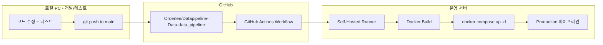

# 운영-테스트 환경 완전 분리 및 자동 배포 계획

> 작성일: 2026-04-10
> 상태: 파일 생성 완료, runner 설치 + 첫 배포 대기

## 현재 상태 (AS-IS)

- **운영 서버 1대**에서 production + staging을 Docker Compose profile로 분리 운영
- staging은 `STAGING_REPO_PATH`에 별도 git clone 후 소스를 바인드 마운트
- CI/CD 없음 — 수동으로 `docker compose build && up -d`
- 운영 코드 변경 시 **운영 서버에서 직접 git pull + rebuild** 필요
- 개발/테스트/운영이 물리적으로 같은 서버에 혼재

## 목표 상태 (TO-BE)



- **로컬 PC**: 개발 + pytest + staging 테스트 (Docker 또는 `dagster dev`)
- **운영 서버**: production만 실행, 코드 직접 수정 금지
- **배포**: `main` 브랜치 push 시 GitHub Actions가 운영 서버의 self-hosted runner에서 자동 빌드 + 배포

---

## TODO 체크리스트

- [x] Phase 1: Git 브랜치 전략 정리 (dev=개발, main=운영 배포)
- [x] Phase 2: 로컬 개발/테스트 환경 구성 → `docker/docker-compose.dev.yaml`, `.env.dev.example`
- [ ] Phase 3: 운영 서버에 GitHub self-hosted runner 설치 → `scripts/deploy/setup-runner.sh` 실행 필요
- [x] Phase 4: GitHub Actions 배포 워크플로 작성 → `.github/workflows/deploy-production.yml`
- [x] Phase 5: 운영 서버 코드 관리 정리 → `scripts/deploy/rollback.sh`
- [x] Phase 6: 안전장치 추가 → 워크플로에 test + health check 포함, `docs/references/deployment-guide.md`

---

## 단계별 계획

### Phase 1: Git 브랜치 전략 정리

현재 `main`과 `dev` 브랜치가 있으므로 이를 활용합니다.

- **`dev` 브랜치**: 로컬에서 개발/테스트 진행
- **`main` 브랜치**: 운영 배포 트리거 (dev에서 검증 후 merge/push)
- 운영 서버에서는 `main` 브랜치만 추적, 직접 커밋 금지

### Phase 2: 로컬 개발/테스트 환경 구성

로컬 PC에서 독립적으로 테스트할 수 있도록 정리합니다.

- `docker-compose.dev.yaml` 생성 — 로컬 개발용 경량 compose (MinIO + DuckDB만, GPU 서비스 제외)
- 또는 `dagster dev` + in-memory DuckDB + mocked MinIO로 로컬 테스트
- 기존 pytest (`tests/unit`, `tests/integration`)는 로컬에서 그대로 사용
- `.env.dev` 템플릿 생성 — 로컬 경로/포트 설정

### Phase 3: 운영 서버에 GitHub Self-Hosted Runner 설치

운영 서버에서 GitHub Actions 작업을 실행할 수 있도록 runner를 설치합니다.

- GitHub repo Settings > Actions > Runners에서 self-hosted runner 등록
- runner를 systemd 서비스로 등록 (서버 재부팅 시 자동 시작)
- runner 사용자에게 docker 권한 부여 (`docker` 그룹 추가)
- runner label: `production` (워크플로에서 지정용)

### Phase 4: GitHub Actions 배포 워크플로 작성

`.github/workflows/deploy-production.yml` 생성:

```yaml
name: Deploy to Production
on:
  push:
    branches: [main]
    paths-ignore:
      - 'docs/**'
      - '*.md'
      - 'tests/**'

jobs:
  deploy:
    runs-on: [self-hosted, production]
    steps:
      - name: Checkout code
        uses: actions/checkout@v4

      - name: Build Docker image
        working-directory: ./docker
        run: docker compose build app

      - name: Rolling restart (zero-downtime)
        working-directory: ./docker
        run: |
          docker compose up -d --no-deps --build dagster-code-server
          sleep 10
          docker compose up -d --no-deps dagster-daemon dagster
```

핵심 포인트:
- `main` 브랜치 push 시에만 트리거
- docs/test 변경은 배포 제외 (`paths-ignore`)
- self-hosted runner가 운영 서버에서 직접 빌드 + 재시작
- code-server 먼저 재시작 후 webserver/daemon 순차 재시작 (Dagster gRPC 패턴)

### Phase 5: 운영 서버 코드 관리 방식 변경

현재 운영 서버의 코드 관리를 정리합니다.

- 운영 서버의 repo를 `main` 브랜치로 고정 (`git checkout main`)
- self-hosted runner가 `actions/checkout`으로 코드를 가져오므로, 별도 git pull 불필요
- **staging 관련 서비스/볼륨은 운영 compose에서 제거하거나 비활성화** (staging은 로컬로 이전)
- 운영 서버에서 직접 코드 수정 금지 규칙 문서화

### Phase 6: 안전장치 추가

- **배포 전 테스트**: 워크플로에 `pytest tests/unit -q` 단계 추가 (실패 시 배포 중단)
- **Slack/Discord 알림**: 배포 성공/실패 시 알림 (선택)
- **롤백 방법**: 이전 이미지 태그로 `docker compose up -d` (Docker 이미지에 git SHA 태깅)
- **`.env` 보호**: `.env` 파일은 git에 포함하지 않으므로 운영 서버에 직접 관리 (현재와 동일)

---

## 변경 대상 파일 요약

| 파일 | 작업 |
|------|------|
| `.github/workflows/deploy-production.yml` | 신규 — 자동 배포 워크플로 |
| `docker/docker-compose.yaml` | staging 관련 정리 (선택) |
| `docker/docker-compose.dev.yaml` | 신규 — 로컬 개발용 compose |
| `.env.dev.example` | 신규 — 로컬 환경변수 템플릿 |
| `.gitignore` | `.env.dev` 추가 |
| `docs/references/deployment-guide.md` | 신규 — 배포 가이드 문서 |

---

## 배포 후 운영 흐름

1. 로컬 PC에서 `dev` 브랜치로 개발 + `pytest` 실행
2. 테스트 통과 후 `main`에 merge (PR 또는 직접 push)
3. GitHub Actions 자동 트리거 -> self-hosted runner가 운영 서버에서:
   - 코드 checkout
   - Docker 이미지 빌드
   - unit test 실행
   - 통과 시 `docker compose up -d` 로 배포
4. 운영 파이프라인 자동 재시작, 기존 데이터/DB/MinIO 영향 없음

---

## 주의사항

- **DuckDB 파일**: 배포 시 DuckDB는 볼륨 마운트이므로 이미지 빌드와 무관 (안전)
- **MinIO 데이터**: Docker named volume이므로 컨테이너 재시작에 영향 없음
- **Dagster run history**: `dagster_home/storage/`는 볼륨이므로 보존됨
- **GPU 서비스 (YOLO, SAM3)**: 코드 변경이 없으면 재시작 불필요 — 워크플로에서 제외 가능
- **NAS 마운트**: 호스트 바인드 마운트이므로 배포와 무관

---

## 다음 작업 (수동 실행 필요)

아래 순서대로 진행합니다. 각 단계는 이전 단계가 완료된 후 진행해야 합니다.

### Step 1: 변경 사항 커밋 + main 브랜치 동기화

```bash
# 1-1. dev 브랜치에서 현재 변경 사항 커밋
cd /home/pia/work_p/Datapipeline-Data-data_pipeline
git add .github/workflows/deploy-production.yml \
       docker/docker-compose.dev.yaml \
       .env.dev.example \
       .gitignore \
       scripts/deploy/ \
       docs/exec-plans/ \
       docs/references/deployment-guide.md \
       docs/references/index.md
git commit -m "feat: 운영/테스트 환경 분리 — GitHub Actions 자동 배포 구성"

# 1-2. dev → origin push
git push origin dev

# 1-3. main 브랜치를 dev와 동기화
git checkout main
git merge dev
git push origin main
git checkout dev
```

### Step 2: Self-Hosted Runner 설치 (운영 서버)

```bash
# 운영 서버에서 실행
bash scripts/deploy/setup-runner.sh

# 또는 토큰을 직접 넘겨서 실행
bash scripts/deploy/setup-runner.sh --token <registration-token>
RUNNER_TOKEN=<registration-token> bash scripts/deploy/setup-runner.sh
```

- GitHub repo > Settings > Actions > Runners > New self-hosted runner에서 토큰 발급
- 토큰을 인자/환경변수로 넘기지 않으면 스크립트가 입력을 요청함
- systemd 서비스로 자동 등록됨

### Step 3: Runner Docker 권한 확인

```bash
# runner 사용자가 docker 명령을 실행할 수 있는지 확인
groups $USER | grep docker || sudo usermod -aG docker $USER
# 그룹 변경 후 재로그인 필요
```

### Step 4: 첫 배포 테스트

```bash
# main 브랜치에 작은 변경 push (또는 workflow_dispatch로 수동 트리거)
# GitHub repo > Actions 탭에서 워크플로 실행 확인
```

### Step 5: 검증

- [ ] GitHub Actions 워크플로가 정상 실행되는지 확인
- [ ] Docker 이미지가 빌드되는지 확인
- [ ] Dagster 서비스가 정상 재시작되는지 확인
- [ ] Dagster UI (http://서버IP:3030) 접속 확인
- [ ] 기존 파이프라인 run history가 보존되는지 확인
