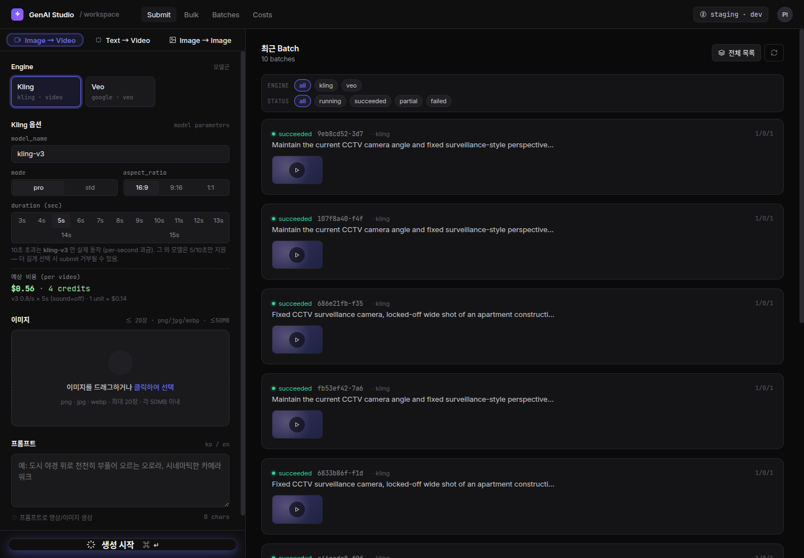
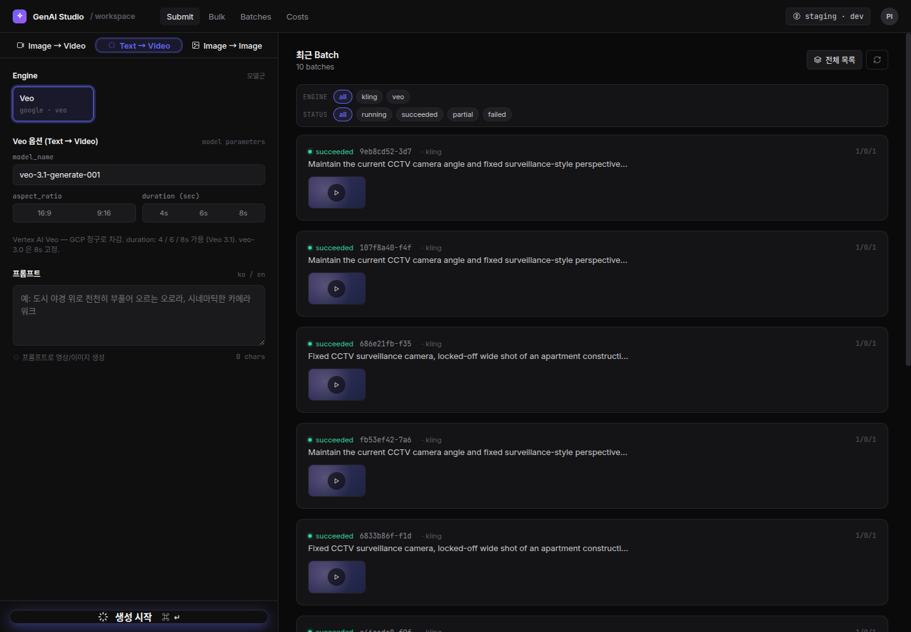
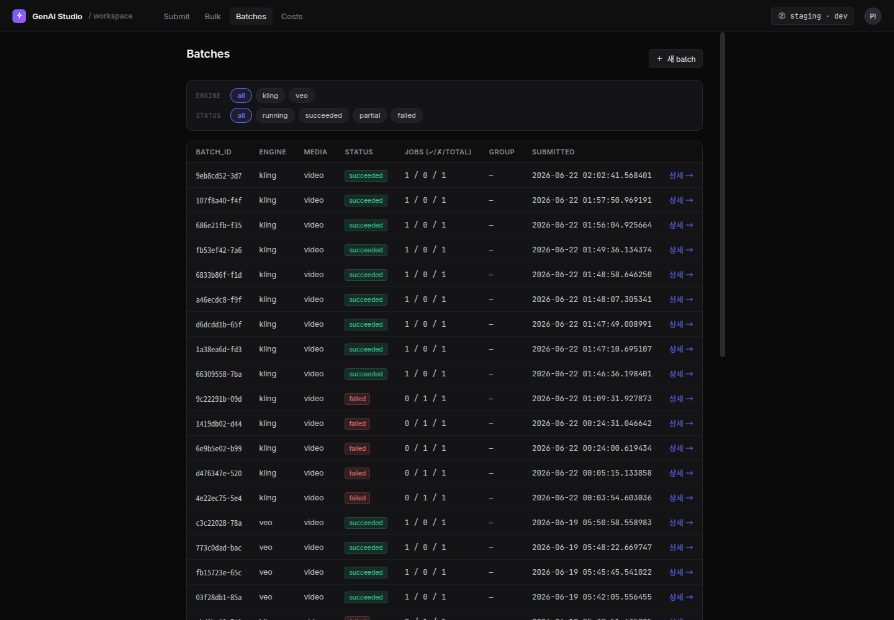
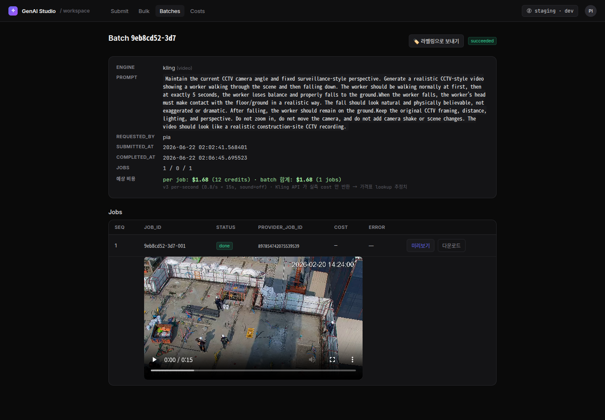
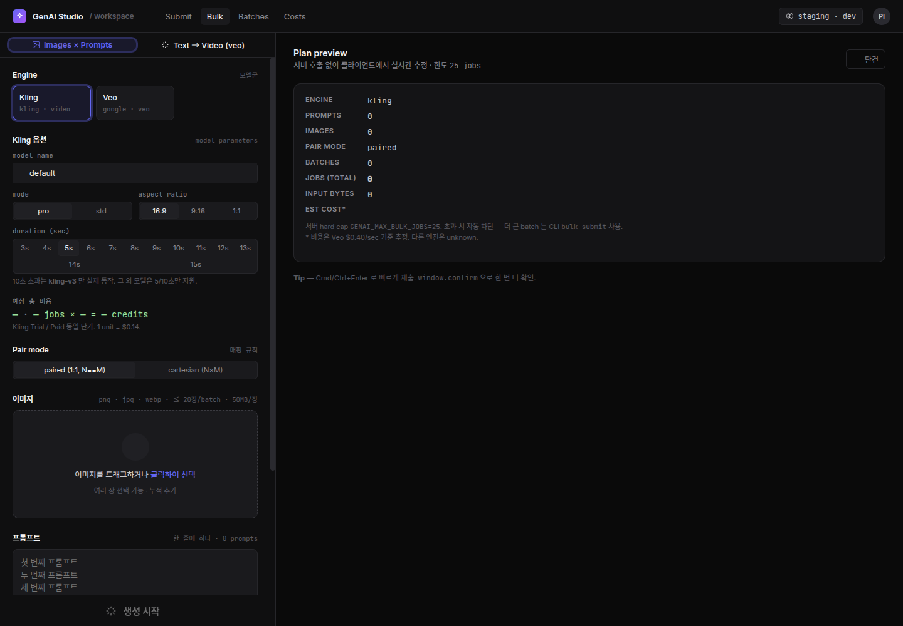
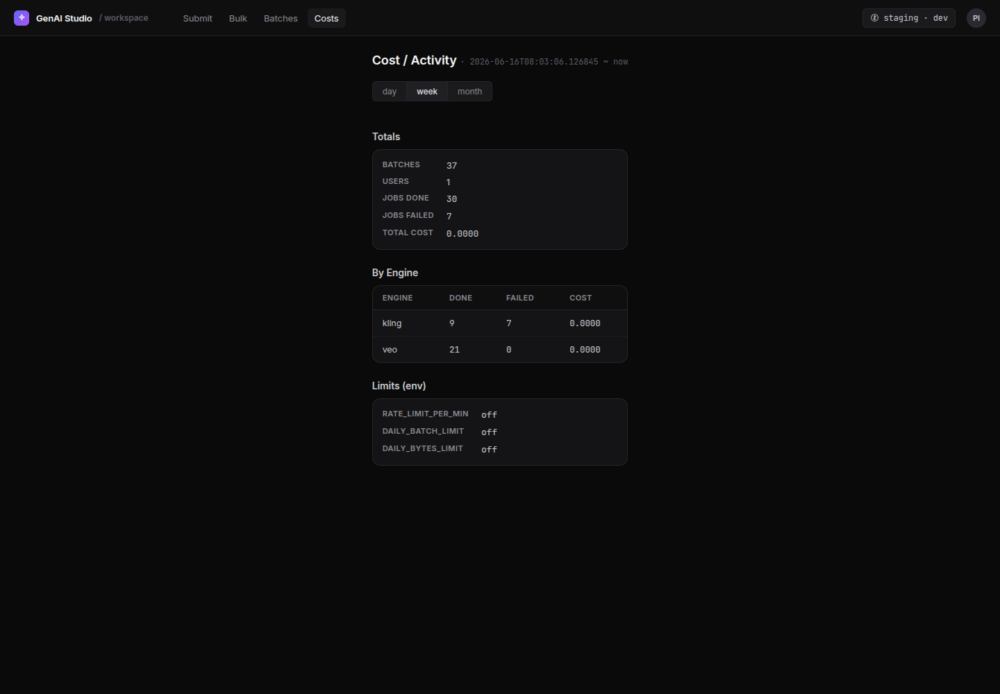

# GenAI Studio 사용 설명서

> **한 줄 요약** — 사진 한 장 또는 글 몇 줄을 넣으면, AI가 몇 분 만에 짧은 **영상**을 만들어 주는 웹 도구입니다.
>
> 이 문서는 **처음 쓰는 사람**을 위한 설명서입니다. 컴퓨터·AI를 잘 몰라도 순서대로 따라 하면 됩니다.
> (운영 환경 **prod / `:8089`** 기준)

---

## 0. 이게 무슨 도구인가요?

“**GenAI Studio**”는 우리 팀이 쓰는 **AI 영상 생성기**입니다.

- 사진 1장을 올리고 *“이 사람이 5초쯤에 넘어진다”* 같은 설명을 적으면 → AI가 그 장면의 **영상**을 만들어 줍니다.
- 직접 찍기 어렵거나 위험한 장면(예: **공사장에서 작업자가 넘어지는 CCTV 영상**)을, 카메라 없이 AI로 만들어 **학습용 데이터**로 씁니다.

```
[사진 또는 글]  ──▶  [GenAI Studio]  ──▶  [짧은 영상 .mp4]
   당신이 입력            AI가 생성              다운로드해서 사용
```

> 💡 **어렵게 생각하지 마세요.** “사진/글을 넣고 → 버튼 누르고 → 잠깐 기다렸다가 → 결과 영상을 받는다” 이게 전부입니다.

---

## 1. 접속하기

1. 웹 브라우저(크롬 권장) 주소창에 입력:

   ```
   http://10.0.0.10:8089/
   ```

2. **아이디 / 비밀번호** 창이 뜨면 입력합니다. *(계정은 관리자에게 문의하세요.)*

3. 접속에 성공하면 아래 화면(**Submit**)이 보입니다.



> 📌 화면 맨 위 메뉴: **Submit(만들기) · Bulk(대량) · Batches(결과 보기) · Costs(사용량)**
> 90%의 작업은 **Submit** 과 **Batches** 두 곳에서 끝납니다.
>
> ℹ️ 화면 오른쪽 위에 `staging · dev` 라고 적힌 작은 배지가 **항상 표시**되는데, **무시해도 됩니다.** (화면에 고정된 라벨일 뿐, 여러분이 접속한 곳은 운영(prod) 서버가 맞습니다.)

---

## 2. 딱 5단계 — 첫 영상 만들기

가장 많이 쓰는 “**사진 1장 → 영상**” 방법입니다.

| 단계 | 할 일 |
|----|------|
| **①** | 접속하면 자동으로 **Submit(만들기)** 화면이 열립니다. 왼쪽 위에서 **`Image → Video`** 탭이 선택돼 있는지 확인 |
| **②** | **Engine(엔진 = 영상을 만드는 AI 종류)** 에서 **`kling`** 선택 *(사진으로 영상 만들 때 추천)* |
| **③** | **이미지** 칸에 사진을 **끌어다 놓기**(또는 클릭해서 선택) |
| **④** | **프롬프트** 칸에 원하는 장면을 글로 적기 *(한국어/영어 모두 OK)* |
| **⑤** | 맨 아래 **`✨ 생성 시작`** 버튼 클릭 → 끝! |

버튼을 누르면 화면이 잠깐 새로고침되며 **제출 성공** 상태가 됩니다. 작업은 화면 오른쪽(또는 **Batches** 메뉴)에 나타나고, **보통 1~2분 뒤** 영상이 완성됩니다.

> ⏳ **바로 안 나와도 정상입니다.** 영상 생성은 시간이 좀 걸려요. 버튼을 여러 번 누르지 말고 기다리세요.
>
> ⚠️ 화면 위에 탭이 **3개**(`Image → Video` · `Text → Video` · `Image → Image`) 보이지만, 이 서버에서 실제로 쓰는 건 **앞의 두 개**입니다. **`Image → Image` 탭은 이 서버에서 지원하지 않아 눌러도 아무것도 나오지 않습니다** — 신경 쓰지 마세요.

### 화면에서 어디에 무엇을 넣나요?

위 Submit 화면(§1 이미지)을 기준으로, 칸마다 하는 일은 다음과 같습니다.

- **Engine** — 어떤 AI로 만들지 선택 (`kling` 또는 `veo`)
- **Kling 옵션** — 영상 품질/모양 설정 (아래 § 5에서 쉽게 설명)
- **이미지** — 사진을 넣는 칸 (png·jpg·webp, 최대 20장, 한 장당 50MB 이내)
- **프롬프트** — “어떤 영상을 원하는지” 글로 적는 칸
- **예상 비용** — 만들기 전에 대략 얼마가 드는지 미리 보여줍니다
- **✨ 생성 시작** — 누르면 만들기 시작

> 💡 **사진 여러 장을 한 번에** 넣으면, *같은 설명(프롬프트)* 으로 사진마다 영상이 하나씩 만들어집니다. (사진 5장 = 영상 5개) 이때 **Batches 목록에는 1개 항목**으로 묶여 보이고, 그 안에 영상 5개가 들어 있습니다.

---

## 3. 사진 없이, 글만으로 영상 만들기 (Text → Video)

사진이 없어도 글 설명만으로 영상을 만들 수 있습니다. 단, 이 기능은 **`veo`** 엔진만 가능합니다.

1. 왼쪽 위 탭에서 **`Text → Video`** 클릭
2. 엔진이 자동으로 **`veo`** 로 바뀝니다 (이미지 넣는 칸이 사라집니다 — 정상)
3. **프롬프트** 에 원하는 장면을 적고 **생성 시작**



> 예시 프롬프트: *“도시 야경 위로 천천히 부풀어 오르는 오로라, 시네마틱한 카메라 워크”*

---

## 4. 결과 영상 보기 & 다운로드 (Batches)

만든 영상은 **Batches** 메뉴에서 모두 볼 수 있습니다.



- 한 줄 = 작업 하나(=Batch). **STATUS** 칸에 영어로 상태가 표시됩니다:
  - `succeeded` (초록) — **완성됨**
  - `running` (노랑) — **만드는 중** (기다리세요)
  - `failed` (빨강) — **실패** (§ 8 문제 해결 참고)
  - `partial` (주황) — **일부만 성공**. 사진 여러 장 중 일부만 됐다는 뜻 — 성공한 건 받을 수 있고, 실패한 건 재시도(retry)할 수 있습니다.
- 위쪽 **engine / status** 버튼으로 원하는 것만 골라 볼 수 있습니다.
- 각 줄 맨 앞의 짧은 글자(예: `9eb8cd52-3d7`)가 **Batch ID** 입니다 — 문제가 생겨 관리자에게 문의할 때 이 ID를 알려 주세요.
- 오른쪽 **`상세 →`** 를 누르면 영상이 나오는 상세 화면으로 들어갑니다.

### 상세 화면에서 영상 재생 / 받기



- **화면 안에서 영상이 바로 재생**됩니다 (▶ 버튼).
- **`다운로드`** 를 누르면 영상 파일(.mp4)을 내 컴퓨터에 저장합니다.
- **`미리보기`** 는 새 탭에서 영상만 크게 보기.
- 실패한 작업은 **`retry`(재시도)** 버튼으로 다시 시도할 수 있습니다.
- **`🏷 라벨링으로 보내기`** — 만든 영상을 우리 학습 데이터 라벨링 작업으로 넘기는 버튼입니다. *(데이터팀 작업용 — 일반 사용 시에는 안 눌러도 됩니다.)*

> 💾 **결과는 항상 여기서 받으면 됩니다.** 파일이 서버 어디에 저장되는지 몰라도 괜찮아요 — **다운로드 버튼**이면 충분합니다.

---

## 5. 옵션 쉽게 이해하기 (Kling 기준)

만들기 전에 영상의 “모양”을 정하는 설정입니다. **잘 모르겠으면 기본값 그대로 두세요.**

| 옵션 | 쉽게 말하면 | 추천 |
|------|------------|------|
| **model_name** | AI 모델 버전 | **`kling-v3`** (이 서버 기본값, 추천) |
| **mode** | 품질 vs 비용 | `pro`(고품질·고비용) / `std`(일반 품질·저비용) |
| **aspect_ratio** | 영상 비율(가로·세로) | `16:9`(가로) · `9:16`(세로, 폰) · `1:1`(정사각형) |
| **duration** | 영상 길이(초) | `3s`~`15s` 선택 가능, 보통 `5s` |
| **예상 비용** | 이 설정으로 만들면 대략 드는 돈 | 만들기 전에 자동 표시 |

> ⚠️ **길이 주의:** 길이는 3~15초까지 고를 수 있지만, **10초보다 긴 영상은 `kling-v3`에서만** 실제로 만들어집니다. 다른 모델은 5초·10초만 지원하며, 더 길게 고르면 만들기가 거부될 수 있어요. 긴 영상이 필요하면 `kling-v3`를 쓰세요.

### 엔진 두 가지, 뭐가 다른가요?

| 엔진 | 잘하는 것 | 입력 | 영상 길이 | 비율 |
|------|----------|------|----------|------|
| **kling** | 사진을 자연스러운 영상으로 (이 서버의 주력) | 사진 → 영상 | 3~15초 | 16:9 · 9:16 · 1:1 |
| **veo** | **글만으로도** 영상 생성 (구글) | 사진→영상, **글→영상** | 4 · 6 · 8초 | 16:9 · 9:16 *(1:1 없음)* |

> 🔰 **처음이라면:** *사진이 있으면 `kling`, 사진 없이 글로만 만들고 싶으면 `veo`* — 이렇게만 기억해도 됩니다.
>
> 💰 **참고:** 예상 비용은 **`kling`** 일 때만 화면에 표시됩니다. `veo`는 화면에 비용이 안 뜨며, 구글(GCP) 청구서로 정산됩니다.

---

## 6. 한 번에 많이 만들기 (Bulk)

여러 프롬프트와 여러 사진을 **한꺼번에** 조합해 대량으로 만들 때 씁니다. (맨 위 **Bulk** 메뉴)



- **paired (1:1)** — 사진 1장 ↔ 프롬프트 1줄을 짝지어 만듦 *(주의: 사진 수와 프롬프트 줄 수가 **정확히 같아야** 합니다. 다르면 오류)*
- **cartesian (N×M)** — 모든 사진 × 모든 프롬프트의 **전체 조합**을 만듦 *(예: 사진 3장 × 프롬프트 4줄 = 12개)*
- 오른쪽 **Plan preview** 가 “총 몇 개가 만들어지고 비용이 얼마인지” 실시간으로 보여줍니다.
- **한 번에 최대 25개**까지. 그보다 많으면 관리자(CLI)를 통해야 합니다.

> 🔰 처음에는 Bulk 대신 **Submit**(§2) 으로 충분합니다. 같은 작업을 수십 개씩 만들 때만 Bulk를 쓰세요.

---

## 7. 사용량 / 비용 보기 (Costs)

지금까지 얼마나, 얼마치 만들었는지 한눈에 봅니다. (맨 위 **Costs** 메뉴)



- 위쪽 **day(오늘) / week(이번 주) / month(이번 달)** 로 기간 선택
- **Totals** — 전체 작업 수, 성공/실패 수, 총비용
- **By Engine** — 엔진별(kling/veo) 사용량

---

## 8. 문제가 생겼을 때 (자주 만나는 경우)

| 이런 화면/증상이 보이면 | 무슨 뜻인가요 | 어떻게 하나요 |
|----------------------|-------------|-------------|
| 계속 **running** 이고 영상이 안 나옴 | 아직 만드는 중 | **1~2분 기다리기.** 5분 넘게 그대로면 관리자에게 |
| `1201 model is not supported` | 모델 이름을 잘못 지정 | 모델은 **직접 입력하지 말고 드롭다운에서 선택** |
| `1303 ... resource pack limit` | 동시에 너무 많이 요청 | **자동으로 잠시 뒤 다시 시도**됩니다. 그냥 기다리세요 |
| `429` + 메시지에 **balance** | AI 사용 크레딧 소진 | 관리자에게 충전 요청 |
| `429` + 메시지에 **한도/limit 초과** | 하루 사용량 한도 초과 | 잠시 뒤 다시 시도하거나 관리자에게 문의 |
| veo에서 **안전 필터 차단(RAI)** | 폭력·무기·화재 등 민감 내용 감지 | 프롬프트/사진을 부드럽게 바꿔 다시 시도 (이 경우 비용 청구 안 됨) |
| 영상이 깨지거나 용량이 비정상적으로 작음 | 서버가 **테스트(가짜) 모드** | 관리자에게 “자격증명(키) 확인” 요청 |

> 🆘 **막히면 혼자 끙끙대지 말고** 관리자에게 알려 주세요. 이때 **Batch ID**(Batches 목록의 각 줄 맨 앞 글자, 예: `9eb8cd52-3d7`)를 함께 전달하면 훨씬 빨리 해결됩니다.

---

## 9. 자주 묻는 질문 (FAQ)

**Q. 영상은 얼마나 길게 만들 수 있나요?**
A. `kling`은 3~15초(단, 10초 초과는 `kling-v3` 전용), `veo`는 4·6·8초입니다.

**Q. 비용이 걱정돼요.**
A. **만들기 전에** 화면에 “예상 비용”이 표시됩니다. 확인하고 누르세요.

**Q. 사진 없이 영상을 만들 수 있나요?**
A. 네. **`veo` + `Text → Video`** 를 쓰면 글만으로 만듭니다. (§3)

**Q. 한 번에 여러 개 만들 수 있나요?**
A. 네. Submit에서 사진을 여러 장 넣거나(§2), Bulk를 쓰세요(§6).

**Q. 만든 영상은 어디서 받나요?**
A. **Batches → 상세 → 다운로드** 입니다. (§4)

**Q. 한국어 프롬프트도 되나요?**
A. 네, 한국어/영어 모두 됩니다.

---

## 10. 프롬프트(설명) 잘 쓰는 팁

좋은 영상은 좋은 설명에서 나옵니다. 아래처럼 **구체적으로** 적을수록 결과가 좋아집니다.

- **무엇이 / 어디서 / 어떻게 움직이는지**를 적기
  - ❌ “사람이 걷는다”
  - ✅ “작업자가 공사장을 천천히 가로질러 걷다가, 5초쯤 균형을 잃고 바닥에 넘어진다”
- **카메라**를 지정하기 — “고정된 CCTV 시점, 줌·이동 없음”
- **분위기/화질**을 적기 — “사실적인 보안 카메라 영상 느낌”
- 너무 많은 요구를 한 문장에 욱여넣지 말고, 핵심 동작 1~2개에 집중
- 한국어도 되지만, **`kling`은 영어 프롬프트에서 결과가 더 안정적**인 경우가 많습니다. 중요한 작업은 영어로도 한 번 시도해 보세요.

---

### 📎 부록 — 용어 한눈에

| 용어 | 뜻 |
|------|----|
| **프롬프트(prompt)** | AI에게 주는 “이런 영상 만들어줘” 설명 글 |
| **엔진(engine)** | 영상을 만드는 AI 종류 (kling / veo) |
| **Batch / Job** | 한 번의 제출 = 1 Batch, 그 안의 영상 1개 = 1 Job |
| **succeeded / running / failed** | 완성 / 만드는 중 / 실패 |
| **retry** | 실패한 작업 다시 시도 |

---

> 이 설명서는 GenAI Studio **prod(`:8089`)** 화면 기준이며, 실제 화면을 캡처해 만들었습니다.
> 더 자세한 기술·운영 내용은 사내 문서 `docs/genai_rollout/genai-guide.md` 를 참고하세요.
