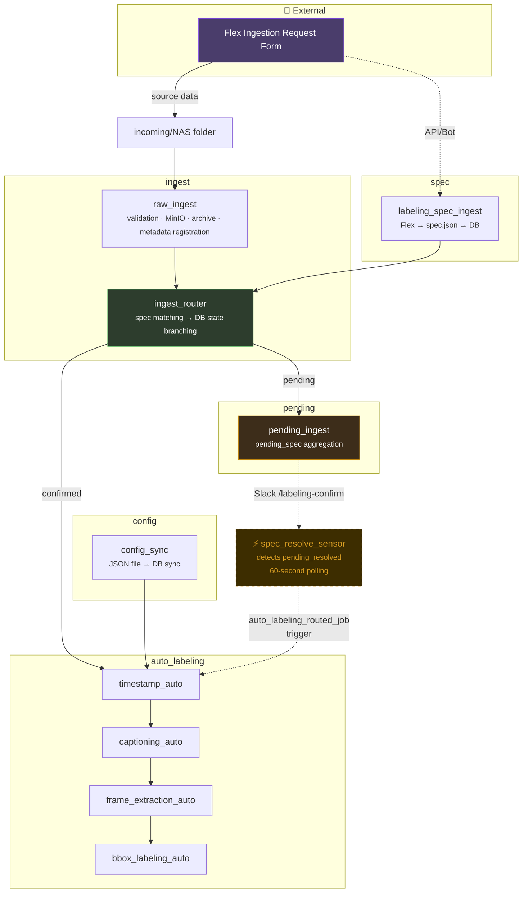
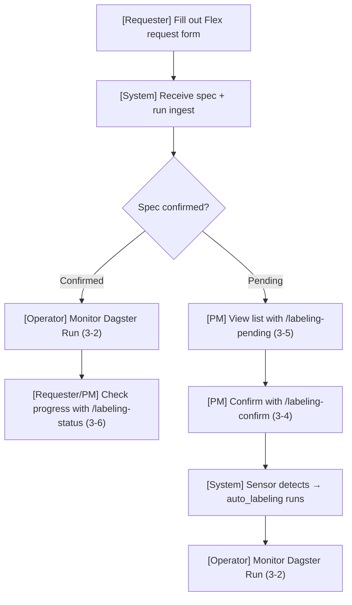

# Auto Labeling UI Specification

## 1. Document Overview

- No dedicated UI will be developed; existing tools (Dagster UI, Slack) are used instead.
- **User types**

| User | Role | Primary touchpoints |
| --- | --- | --- |
| Pipeline operator (PM/DE) | Pipeline execution, monitoring, config management | Dagster UI, config files, Slack |
| Data requester | Submitting labeling requests, confirming pending specs | openclaw, playwright, slackbot, etc. |

---

## 2. Interface List

| # | Interface | Type | New/Existing |
| --- | --- | --- | --- |
| 3-1 | Dagster Asset Lineage | Web UI | Existing |
| 3-2 | Dagster Run Details | Web UI | Existing |
| 3-3 | Dagster Sensor Management | Web UI | Existing |
| 3-4 | Slack /labeling-confirm | Conversational | New |
| 3-5 | Slack /labeling-pending | Conversational | New |
| 3-6 | Slack /labeling-status | Conversational | New |
| 3-7 | Config file management | File edit | New |
| 3-8 | External ingestion request integration | External API | New |

---

## 3. Pipeline Structure (Asset Lineage View)

- The full DAG structure visible in Dagster UI → Lineage.
- **`ingest_router` performs only spec matching and branching — it does not look up config.**
- **Config is looked up at the first step of `auto_labeling` (`timestamp_auto`).**
- **Standard `auto_labeling`** always executes `timestamp_auto → captioning_auto → frame_extraction_auto → bbox_labeling_auto` **in this fixed order**. The captioning step is never skipped.



**Dagster UI Operations Summary:**

| Screen | Location | Key actions |
| --- | --- | --- |
| Asset Lineage | Lineage tab | Click node → details, [Materialize] → manual run |
| Run Details | Runs → individual run | View per-step logs, [Re-execute] → re-run |
| Sensor Management | Automation tab | ON/OFF toggle, view tick history |

> `config_sync` is executed via manual Materialize from the Lineage view.

---

### 3-4. Slack /labeling-confirm

- **Channel:** #data-labeling
- **Purpose:** Confirm labeling information for a spec in pending state

**Input:**

```
/labeling-confirm <spec_id>
    --method <task1,task2,...>
    --categories <cat1,cat2>
    --classes <cls1,cls2>
```

**Input example:**

```
/labeling-confirm SPEC-20260313-001
    --method timestamp,captioning,bbox
    --categories smoke,fire
    --classes smoke,fire,flame
```

(When saved, `labeling_method` is stored as a JSON array `["timestamp","captioning","bbox"]`. Aligning with the standard pipeline is recommended.)

**Response — success:**

```
✅ Spec confirmed
─────────────────
spec_id     SPEC-20260313-001
method      ["timestamp", "captioning", "bbox"]
categories  smoke, fire
classes     smoke, fire, flame
status      pending → pending_resolved
target files    42 records
─────────────────
The sensor will automatically trigger auto_labeling.
```

**Response — failure:**

| Situation | Response |
| --- | --- |
| spec_id not found | `❌ spec_id not found.` |
| Already confirmed | `⚠️ This spec has already been processed. (current status: active)` |
| Required parameter missing | `❌ --method is required.` |

---

### 3-5. Slack /labeling-pending

- **Channel:** #data-labeling
- **Purpose:** Retrieve list of specs in pending state

**Input:**

```
/labeling-pending
/labeling-pending --requester <requester_id>
```

**Response:**

```
📋 Pending Spec List (2 records)
─────────────────
1. SPEC-20260312-005
   Requester  kim_researcher (vision_team)
   Folder     20260312_dashcam_seoul
   Waiting    128 records
   Created    2026-03-12 14:30

2. SPEC-20260313-001
   Requester  lee_engineer (ai_team)
   Folder     20260313_cctv_busan
   Waiting    42 records
   Created    2026-03-13 09:15
─────────────────
Confirm: /labeling-confirm <spec_id> --method ...
```

**Response — 0 records:**

```
✅ No specs are currently pending.
```

---

### 3-6. Slack /labeling-status

- **Channel:** #data-labeling
- **Purpose:** Query processing status of a specific spec

**Input:**

```
/labeling-status <spec_id>
```

**Response — in progress:**

```
📊 Spec Processing Status
─────────────────
spec_id      SPEC-20260313-001
status       active (retry: 0/3)
requester    lee_engineer (ai_team)
method       ["timestamp", "captioning", "bbox"]
config       ai_team_bbox_v2 (team default)
─────────────────
  ✅ timestamp detection     42/42
  🔄 captioning generation   38/42
  ⏳ frame extraction        waiting
  ⏳ bbox labeling           waiting
```

**Response — failed:**

```
📊 Spec Processing Status
─────────────────
spec_id      SPEC-20260313-001
status       failed (retry: 3/3)
─────────────────
  ✅ timestamp detection     42/42
  ❌ captioning generation   failed
─────────────────
Manual intervention required. Dagster Run: <run_url>
```

---

### 3-7. Config File Management

- **Location:** `config/parameters/<config_id>.json`
- **Purpose:** Define auto_labeling parameters and sync to DB (config is looked up at the first task of auto_labeling)

**File structure:**

```json
{
  "timestamp": {
    "detection_model": "event_detector_v3",
    "confidence_threshold": 0.7,
    "min_event_duration_sec": 2.0,
    "max_event_duration_sec": 300.0,
    "merge_gap_sec": 1.0,
    "pre_event_buffer_sec": 0.5,
    "post_event_buffer_sec": 0.5
  },
  "captioning": {
    "model": "caption_model_v2",
    "language": "ko",
    "max_caption_length": 200
  },
  "frame_extraction": {
    "frame_interval_sec": 1.0,
    "max_frames_per_clip": 30,
    "output_format": "jpeg",
    "output_quality": 90
  },
  "bbox": {
    "detection_model": "yolov8x",
    "confidence_threshold": 0.5,
    "nms_threshold": 0.45,
    "max_detections_per_image": 100
  }
}
```

**Rollout procedure:**

1. Create/edit JSON file (`_fallback.json` must always exist)
2. Dagster UI → config_sync → [Materialize]
3. Confirm synced count in logs

---

### 3-8. External Ingestion Request Integration

- **Source:** Flex "[Data] Data Ingestion Request" form
- **Direction:** Flex → pipeline (receive only)
- **Collection tool:** TBD (OpenClaw / Playwright API / Slack bot / other)

> [Screenshot: Flex ingestion request form view]

**Fields to receive:**

| Flex form field | spec.json field | Conversion rule |
| --- | --- | --- |
| Requester | `requester_id` | Name → ID conversion |
| Department | `team_id` | Department name → ID conversion |
| Source path | `source_unit_name` | Extract incoming folder name from path |
| Event type | `categories` | Multi-select → array |
| Expected output | `labeling_method` | Multi-select → array (same as Functional Spec 6-1) |

**Event type → categories + classes auto-derivation:**

| Selection | categories | classes |
| --- | --- | --- |
| Smoke | `smoke` | `["smoke"]` |
| Fire | `fire` | `["fire", "flame"]` |
| Falldown | `falldown` | `["person_fallen"]` |
| Weapon | `weapon` | `["knife", "gun", "weapon"]` |
| Violence | `violence` | `["violence", "fight"]` |

**Expected output → labeling_method (standard pipeline):**

| Selection | Standard pipeline |
| --- | --- |
| timestamp | O |
| captioning | O (never skipped) |
| bbox | O |
| image classification | X (not implemented) |
| video classification | X (not implemented) |

When multiple selections are made, stored as an array. To align with the standard run: e.g. `["timestamp", "captioning", "bbox"]`

**Final spec.json format:**

```json
{
  "spec_id": "auto-generated",
  "requester_id": "jin_sanghun",
  "team_id": "data_team",
  "source_unit_name": "20260313_cctv_busan",
  "categories": ["smoke", "fire"],
  "classes": ["smoke", "fire", "flame"],
  "labeling_method": ["timestamp", "captioning", "bbox"]
}
```

**When labeling is not yet defined:**

```json
{
  "spec_id": "auto-generated",
  "requester_id": "kim_researcher",
  "team_id": "vision_team",
  "source_unit_name": "20260313_dashcam_seoul",
  "categories": [],
  "classes": [],
  "labeling_method": []
}
```

---

## 4. Inter-interface Workflow (User Perspective)



## 5. Notification Definitions

| **Event** | **Notification required** | **Channel example** |
| --- | --- | --- |
| auto_labeling complete | Nice to have | Slack #data-labeling |
| auto_labeling failure | **Required** | Slack #data-labeling |
| spec_status → failed (retry exceeded 3 times) | **Required** | Slack #data-labeling |
| New pending spec created | Nice to have | Slack #data-labeling |
