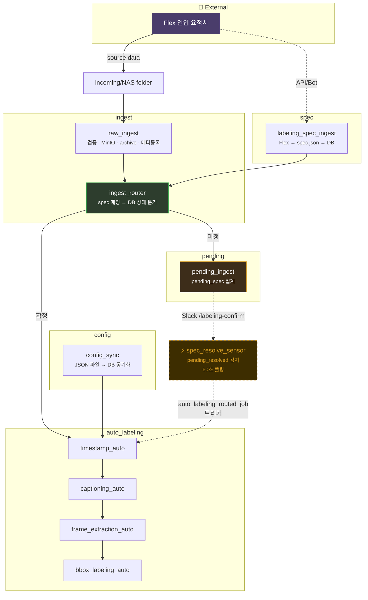
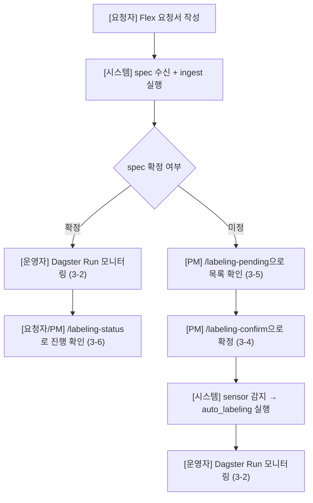

# Auto Labeling 화면 명세서

## 1. 문서 개요

- 전용 UI를 별도 개발하지 않으며, 기존 도구(Dagster UI, Slack)를 활용
- **사용자 유형**

| 사용자 | 역할 | 주요 접점 |
| --- | --- | --- |
| 파이프라인 운영자 (PM/DE) | 파이프라인 실행, 모니터링, config 관리 | Dagster UI, config 파일, Slack |
| 데이터 요청자 | labeling 요청 발행, pending 확정 | openclaw, playwright, slackbot 등 |

---

## 2. 인터페이스 목록

| # | 인터페이스 | 유형 | 신규/기존 |
| --- | --- | --- | --- |
| 3-1 | Dagster Asset Lineage | 웹 UI | 기존 |
| 3-2 | Dagster Run 상세 | 웹 UI | 기존 |
| 3-3 | Dagster Sensor 관리 | 웹 UI | 기존 |
| 3-4 | Slack /labeling-confirm | 대화형 | 신규 |
| 3-5 | Slack /labeling-pending | 대화형 | 신규 |
| 3-6 | Slack /labeling-status | 대화형 | 신규 |
| 3-7 | Config 파일 관리 | 파일 편집 | 신규 |
| 3-8 | 외부 인입 요청서 연동 | 외부 API | 신규 |

---

## 3. 파이프라인 구조 (Asset Lineage 시점)

- Dagster UI → Lineage 에서 확인할 수 있는 전체 DAG 구조.
- **ingest_router는 spec 매칭·분기만 수행하며 config 조회는 하지 않는다.**
- **config는 auto_labeling 첫 단계(timestamp_auto)에서 조회한다.**
- **표준 auto_labeling**은 `timestamp_auto → captioning_auto → frame_extraction_auto → bbox_labeling_auto` 를 **항상 이 순서로** 수행한다. captioning 단계는 생략하지 않는다.



**Dagster UI 조작 요약:**

| 화면 | 위치 | 주요 조작 |
| --- | --- | --- |
| Asset Lineage | Lineage 탭 | 노드 클릭 → 상세, [Materialize] → 수동 실행 |
| Run 상세 | Runs → 개별 Run | step별 로그 확인, [Re-execute] → 재실행 |
| Sensor 관리 | Automation 탭 | ON/OFF 토글, tick 이력 확인 |

> config_sync는 Lineage에서 수동 Materialize로 실행한다.

---

### 3-4. Slack /labeling-confirm

- **채널:** #data-labeling
- **목적:** pending 상태 spec의 labeling 정보 확정

**입력:**

```
/labeling-confirm <spec_id>
    --method <task1,task2,...>
    --categories <cat1,cat2>
    --classes <cls1,cls2>
```

**입력 예시:**

```
/labeling-confirm SPEC-20260313-001
    --method timestamp,captioning,bbox
    --categories smoke,fire
    --classes smoke,fire,flame
```

(저장 시 `labeling_method`는 JSON 배열 `["timestamp","captioning","bbox"]`로 저장된다. 표준 파이프라인과 일치시키는 것을 권장한다.)

**응답 — 성공:**

```
✅ Spec 확정 완료
─────────────────
spec_id     SPEC-20260313-001
method      ["timestamp", "captioning", "bbox"]
categories  smoke, fire
classes     smoke, fire, flame
status      pending → pending_resolved
대상 파일    42건
─────────────────
sensor가 자동으로 auto_labeling을 트리거합니다.
```

**응답 — 실패:**

| 상황 | 응답 |
| --- | --- |
| spec_id 없음 | `❌ spec_id를 찾을 수 없습니다.` |
| 이미 확정 | `⚠️ 이미 처리된 spec입니다. (현재 상태: active)` |
| 필수 파라미터 누락 | `❌ --method는 필수입니다.` |

---

### 3-5. Slack /labeling-pending

- **채널:** #data-labeling
- **목적:** pending 상태 spec 목록 조회

**입력:**

```
/labeling-pending
/labeling-pending --requester <requester_id>
```

**응답:**

```
📋 Pending Spec 목록 (2건)
─────────────────
1. SPEC-20260312-005
   요청자  kim_researcher (vision_team)
   폴더    20260312_dashcam_seoul
   대기    128건
   생성    2026-03-12 14:30

2. SPEC-20260313-001
   요청자  lee_engineer (ai_team)
   폴더    20260313_cctv_busan
   대기    42건
   생성    2026-03-13 09:15
─────────────────
확정: /labeling-confirm <spec_id> --method ...
```

**응답 — 0건:**

```
✅ 현재 대기 중인 spec이 없습니다.
```

---

### 3-6. Slack /labeling-status

- **채널:** #data-labeling
- **목적:** 특정 spec 처리 현황 조회

**입력:**

```
/labeling-status <spec_id>
```

**응답 — 진행 중:**

```
📊 Spec 처리 현황
─────────────────
spec_id      SPEC-20260313-001
상태          active (retry: 0/3)
요청자        lee_engineer (ai_team)
method       ["timestamp", "captioning", "bbox"]
config       ai_team_bbox_v2 (team default)
─────────────────
  ✅ timestamp 감지       42/42
  🔄 captioning 생성      38/42
  ⏳ frame 추출           대기
  ⏳ bbox labeling        대기
```

**응답 — 실패:**

```
📊 Spec 처리 현황
─────────────────
spec_id      SPEC-20260313-001
상태          failed (retry: 3/3)
─────────────────
  ✅ timestamp 감지       42/42
  ❌ captioning 생성      실패
─────────────────
수동 개입 필요. Dagster Run: <run_url>
```

---

### 3-7. Config 파일 관리

- **위치:** `config/parameters/<config_id>.json`
- **목적:** auto_labeling 파라미터 정의 및 DB 동기화 (조회 시점은 auto_labeling 첫 task)

**파일 구조:**

```json
{
  "timestamp": {
    "detection_model": "event_detector_v3",
    "confidence_threshold": 0.7,
    "min_event_duration_sec": 2.0,
    "max_event_duration_sec": 300.0,
    "merge_gap_sec": 1.0,
    "pre_event_buffer_sec": 0.5,
    "post_event_buffer_sec": 0.5
  },
  "captioning": {
    "model": "caption_model_v2",
    "language": "ko",
    "max_caption_length": 200
  },
  "frame_extraction": {
    "frame_interval_sec": 1.0,
    "max_frames_per_clip": 30,
    "output_format": "jpeg",
    "output_quality": 90
  },
  "bbox": {
    "detection_model": "yolov8x",
    "confidence_threshold": 0.5,
    "nms_threshold": 0.45,
    "max_detections_per_image": 100
  }
}
```

**반영 절차:**

1. JSON 파일 생성/수정 (`_fallback.json`은 반드시 존재)
2. Dagster UI → config_sync → [Materialize]
3. 로그에서 synced 건수 확인

---

### 3-8. 외부 인입 요청서 연동

- **원천:** Flex "[데이터] 데이터 인입 요청" 문서
- **방향:** Flex → 파이프라인 (수신 전용)
- **수집 도구:** 미정 (OpenClaw / Playwright API / Slack 봇 / 기타)

> [캡처: Flex 인입 요청서 폼 화면]

**수신 대상 필드:**

| Flex 폼 필드 | spec.json 필드 | 변환 규칙 |
| --- | --- | --- |
| 요청자 | `requester_id` | 이름 → ID 변환 |
| 부서 | `team_id` | 부서명 → ID 변환 |
| 소스 경로 | `source_unit_name` | 경로에서 incoming 폴더명 추출 |
| 이벤트 타입 | `categories` | 다중 선택 → 배열 |
| 기대 산출물 | `labeling_method` | 다중 선택 → 배열 (기능 명세서 6-1과 동일) |

**이벤트 타입 → categories + classes 자동 파생:**

| 선택지 | categories | classes |
| --- | --- | --- |
| 연기(Smoke) | `smoke` | `["smoke"]` |
| 화재(Fire) | `fire` | `["fire", "flame"]` |
| 쓰러짐(Falldown) | `falldown` | `["person_fallen"]` |
| 무기 소지(Weapon) | `weapon` | `["knife", "gun", "weapon"]` |
| 폭력(Violence) | `violence` | `["violence", "fight"]` |

**기대 산출물 → labeling_method (표준 파이프라인):**

| 선택지 | 표준 파이프라인 |
| --- | --- |
| timestamp | O |
| captioning | O (생략 없음) |
| bbox | O |
| image classification | X (미구현) |
| video classification | X (미구현) |

다중 선택 시 배열로 저장. 표준 실행과 맞추려면 예: `["timestamp", "captioning", "bbox"]`

**spec.json 최종 포맷:**

```json
{
  "spec_id": "자동 생성",
  "requester_id": "jin_sanghun",
  "team_id": "data_team",
  "source_unit_name": "20260313_cctv_busan",
  "categories": ["smoke", "fire"],
  "classes": ["smoke", "fire", "flame"],
  "labeling_method": ["timestamp", "captioning", "bbox"]
}
```

**labeling 미정 시:**

```json
{
  "spec_id": "자동 생성",
  "requester_id": "kim_researcher",
  "team_id": "vision_team",
  "source_unit_name": "20260313_dashcam_seoul",
  "categories": [],
  "classes": [],
  "labeling_method": []
}
```

---

## 4. 인터페이스 간 워크플로우(사용자 시점)



## 5. 알림/통지 정의

| **이벤트** | **알림 필요 여부** | **채널 예시** |
| --- | --- | --- |
| auto_labeling 완료 | 필요(있으면 좋음) | Slack #data-labeling |
| auto_labeling 실패 | **필요** | Slack #data-labeling |
| spec_status → failed (retry 3회 초과) | **필요** | Slack #data-labeling |
| 새로운 pending 발생 | 필요(있으면 좋음) | Slack #data-labeling |
