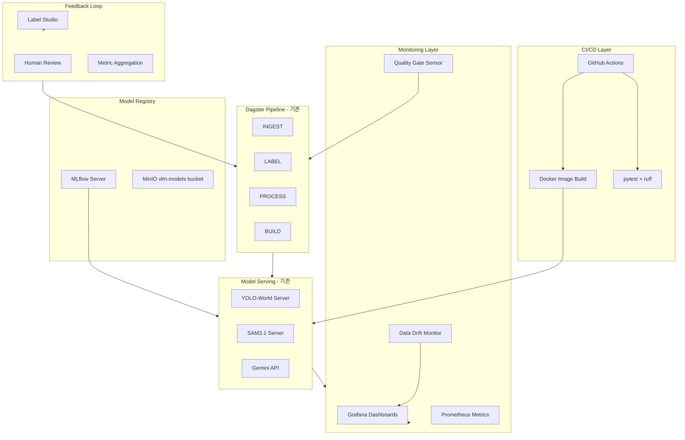

# VLM Data Pipeline MLOps 도입 전략

> 최종 갱신: 2026-04-09
> 상태: 현황 분석 완료, 단계별 구현 대기

## 목적

현재 VLM 데이터 파이프라인의 인프라/모델/데이터 현황을 분석하고, 단계적으로 MLOps를 도입하기 위한 기술 스택과 구현 전략을 정의한다.

---

## 현황 진단

### 현재 갖춰진 것

- **오케스트레이션**: Dagster (webserver + daemon + gRPC code server) -- asset 기반 선언적 파이프라인
- **데이터 저장**: DuckDB (로컬) + MotherDuck (클라우드 동기화) + MinIO (객체 스토리지 4버킷)
- **모델 서빙**: YOLO-World / SAM3.1 각각 독립 FastAPI 서버 (GPU 분리)
- **외부 AI**: Gemini (Vertex AI) 호출
- **모니터링**: Grafana + PostgreSQL 대시보드, Dagster UI, Slack 알림 (NAS health)
- **벤치마크**: SAM3 vs YOLO shadow compare (IoU/coverage/latency)
- **환경 분리**: Production / Staging (Docker Compose profile)

### 현재 빠져 있는 것

| 영역 | 현황 |
|------|------|
| CI/CD | 없음 (GitHub Actions/GitLab CI 미구성) |
| 모델 레지스트리 | 없음 (파일 경로 고정) |
| 실험 추적 | 없음 (MLflow/W&B 미사용) |
| 데이터 버전 관리 | DVC 패키지만 설치, 실제 미사용 |
| 모델 학습 | 없음 (순수 추론 파이프라인) |
| 자동 품질 게이트 | 파일 무결성만, ML 메트릭 기반 게이트 없음 |
| 피처 스토어 | 없음 |
| A/B 테스트 | shadow compare만, 트래픽 분할 없음 |

### 핵심 특성

이 파이프라인은 **"학습"이 아니라 "추론 + 데이터 조립"이 중심**이다. 따라서 MLOps 전략도 전통적인 "학습 루프 자동화"보다는 아래에 집중해야 한다:

1. **추론 모델의 버전 관리와 배포 자동화**
2. **데이터 품질 모니터링과 드리프트 감지**
3. **추론 결과의 품질 추적과 피드백 루프**
4. **CI/CD를 통한 파이프라인 코드 + 모델 배포 자동화**

---

## 제안 아키텍처

---

## Phase 1: 기반 인프라 (1-2주)

**목표**: CI/CD와 기본 모니터링 체계를 구축하여 변경의 안전성을 확보한다.

### 1-1. GitHub Actions CI/CD

현재 CI/CD가 전혀 없으므로 최우선으로 구축한다.

**기술**: GitHub Actions

**파이프라인 구성**:
- **PR 검증**: ruff lint + pytest (unit) + Docker build 검증
- **main 머지 시**: Docker 이미지 빌드 + 태깅 + staging 자동 배포
- **릴리스 태그 시**: production 배포 (수동 승인 게이트)

**구현 위치**: `.github/workflows/ci.yml`, `.github/workflows/deploy.yml`

**이유**: 현재 수동 `docker compose up`으로만 배포하고 있어, 코드 변경이 테스트 없이 프로덕션에 반영될 위험이 있다.

### 1-2. 추론 서버 메트릭 수집

현재 YOLO/SAM3 서버에 `/health`와 `/info`만 있고, Prometheus 메트릭 엔드포인트가 없다.

**기술**: Prometheus + 기존 Grafana

**추가할 메트릭**:
- 요청당 latency (p50/p95/p99)
- GPU 메모리 사용량 (추론 시)
- 요청 처리량 (RPS)
- 에러율
- 모델 로드 시간
- 클래스별 detection count 분포

**구현 위치**:
- `docker/yolo/app.py`, `docker/sam3/app.py`에 `prometheus_fastapi_instrumentator` 추가
- `docker/docker-compose.yaml`에 Prometheus 서버 서비스 추가 (현재 MinIO만 `MINIO_PROMETHEUS_AUTH_TYPE: public` 설정)
- Grafana 대시보드 추가

### 1-3. 파이프라인 코드 품질 게이트

**기술**: pre-commit + ruff + pytest

**구현**: `.pre-commit-config.yaml` 생성, CI에서 강제 실행

---

## Phase 2: 모델 버전 관리 (2-3주)

**목표**: 모델 가중치의 버전을 추적하고, 모델 교체를 안전하게 수행할 수 있는 체계를 만든다.

### 2-1. MLflow 도입 (모델 레지스트리)

현재 모델은 파일 경로 고정(`/data/models/yolo/yolov8l-worldv2.pt`)으로 관리되어, 모델 교체 시 추적이 불가능하다.

**기술**: MLflow (Tracking Server + Model Registry)

**구성**:
- MLflow 서버를 Docker Compose에 추가
- 백엔드 스토어: 기존 PostgreSQL 활용
- 아티팩트 스토어: MinIO에 `vlm-models` 버킷 추가
- 모델 등록: YOLO-World, SAM3.1, Places365 각각 버전 관리

**구현 위치**: `docker/mlflow/` 디렉터리 신규, `docker-compose.yaml`에 서비스 추가

**워크플로**:
1. 새 모델 가중치를 MLflow에 등록 (버전 + 메타데이터)
2. staging에서 shadow compare 실행
3. 품질 기준 통과 시 production 승격 (MLflow stage: Staging -> Production)
4. 서빙 서버가 시작 시 MLflow에서 "Production" 스테이지 모델을 로드

### 2-2. 모델 배포 자동화

**기술**: MLflow Model Registry + Dagster sensor

**구현**:
- MLflow에서 모델 스테이지 변경 시 Dagster sensor가 감지
- 해당 모델 서버 컨테이너 재시작 트리거
- 롤백: 이전 버전으로 스테이지 되돌리면 자동 롤백

---

## Phase 3: 데이터 품질 + 드리프트 모니터링 (2-3주)

**목표**: 입력 데이터와 추론 결과의 품질을 자동으로 모니터링하고, 이상 시 알림한다.

### 3-1. 입력 데이터 품질 모니터링

현재 `lib/validator.py`가 파일 무결성만 검사한다. ML 관점의 데이터 품질 검사가 필요하다.

**기술**: Evidently AI 또는 Great Expectations

**모니터링 대상**:
- 이미지 해상도 분포 변화
- 프레임 밝기/대비 분포 (야간/주간 비율 변화)
- 비디오 길이 분포
- 소스별 데이터 비율 변화 (GCS 버킷별)
- 빈 프레임 / 손상 프레임 비율

**구현 위치**: `src/vlm_pipeline/lib/data_quality.py` (신규), Dagster asset으로 주기적 실행

### 3-2. 추론 결과 드리프트 감지

**기술**: Evidently AI (또는 커스텀 DuckDB 쿼리 기반)

**모니터링 대상**:
- YOLO detection count 분포 변화 (이미지당 평균 객체 수)
- 클래스별 detection 비율 변화
- confidence score 분포 변화
- SAM3 vs YOLO IoU 일치율 추이 (기존 shadow compare 확장)
- Gemini 이벤트 category 분포 변화

**구현**:
- DuckDB의 `image_labels` + `labels` 테이블에서 일별/주별 집계
- Grafana 대시보드에 트렌드 차트 추가
- 임계값 초과 시 Slack 알림 (기존 webhook 재사용)

### 3-3. 품질 게이트 센서

**기술**: Dagster sensor + DuckDB 쿼리

**구현**:
- `defs/monitoring/quality_gate_sensor.py` (신규)
- BUILD 단계 진입 전 자동 품질 검사
- detection 비율이 임계값 이하면 BUILD 차단 + 알림

---

## Phase 4: 피드백 루프 (3-4주)

**목표**: 사람의 검수 결과를 파이프라인에 반영하여 지속적으로 품질을 개선한다.

### 4-1. Label Studio 피드백 통합 강화

현재 Label Studio가 있지만, 검수 결과가 파이프라인에 자동 반영되는 루프가 약하다.

**구현**:
- YOLO/SAM3 결과를 Label Studio에 pre-annotation으로 자동 로드
- 검수 완료된 라벨을 `vlm-labels`에 "gold standard"로 저장
- gold standard 대비 모델 정확도를 주기적으로 계산

### 4-2. 모델 성능 대시보드

**기술**: Grafana + DuckDB/MotherDuck

**메트릭**:
- gold label 대비 mAP (YOLO), mIoU (SAM3)
- 클래스별 precision/recall
- 시간에 따른 성능 추이
- 모델 버전별 성능 비교

### 4-3. 재학습 트리거 (향후)

현재는 사전학습 모델만 사용하지만, 향후 fine-tuning을 도입할 경우:
- gold label 기반 학습 데이터셋 자동 구축 (BUILD 단계 확장)
- 성능 하락 감지 시 재학습 파이프라인 트리거
- MLflow에 새 모델 등록 -> shadow compare -> 승격

---

## 기술 스택 요약

| 영역 | 현재 | 추가 제안 | 이유 |
|------|------|-----------|------|
| 오케스트레이션 | Dagster | 유지 | 이미 잘 구축됨, asset 기반이 MLOps에 적합 |
| CI/CD | 없음 | **GitHub Actions** | 저장소가 GitHub, 무료 tier 충분 |
| 모델 레지스트리 | 파일 경로 | **MLflow** | 오픈소스, MinIO/PostgreSQL 재사용 가능, 모델 스테이징 지원 |
| 메트릭 수집 | Grafana만 | **Prometheus** + Grafana | MinIO 이미 Prometheus 노출, 서버 메트릭 통합 |
| 서버 계측 | 없음 | **prometheus-fastapi-instrumentator** | FastAPI 서버에 1줄 추가로 메트릭 노출 |
| 데이터 품질 | validator.py | **Evidently AI** | 드리프트 감지 특화, Dagster 통합 쉬움 |
| 데이터 버전 | DVC 미사용 | **DVC** (이미 설치됨) | MinIO를 remote로 사용, 데이터셋 버전 추적 |
| 실험 추적 | 없음 | **MLflow Tracking** | 레지스트리와 통합, shadow compare 결과 기록 |
| 라벨 검수 | Label Studio | 강화 | 피드백 루프 자동화 |
| 알림 | Slack (일부) | Slack 확장 | 기존 인프라 재사용 |

---

## 우선순위 및 일정

---

## 즉시 실행 가능한 Quick Win

Phase를 기다리지 않고 바로 적용할 수 있는 항목:

1. **`.pre-commit-config.yaml` 추가** -- ruff + pytest 자동 실행
2. **YOLO/SAM3 서버에 `/metrics` 엔드포인트 추가** -- `prometheus-fastapi-instrumentator` 1줄
3. **기존 shadow compare 결과를 Grafana 대시보드로 시각화** -- DuckDB 쿼리 + Grafana panel
4. **DVC 초기화** -- 이미 패키지 설치됨, `dvc init` + MinIO remote 설정만 하면 데이터셋 버전 추적 시작 가능

---

## 주의사항

- **GPU 리소스 제약**: 현재 GPU 2장(0: SAM3, 1: YOLO)으로 분리 운영 중. MLflow 서버나 Prometheus는 CPU만 사용하므로 GPU 경합 없음
- **DuckDB 단일 writer**: 품질 모니터링 쿼리는 READ_ONLY로 실행해야 함. MotherDuck 동기화 데이터를 활용하는 것이 안전
- **Dagster sensor timeout**: 새 센서 추가 시 `DAGSTER_SENSOR_GRPC_TIMEOUT_SECONDS` 고려
- **MinIO 버킷 정책**: 기존 4버킷 고정 원칙. MLflow 아티팩트용 `vlm-models` 버킷은 별도 추가

---

## 구현 단계별 체크리스트

### Phase 1: 기반 인프라

- [ ] `.github/workflows/ci.yml` -- PR 검증 (ruff + pytest + docker build)
- [ ] `.github/workflows/deploy.yml` -- main 머지 시 staging 배포, 릴리스 태그 시 production 배포
- [ ] `.pre-commit-config.yaml` 생성
- [ ] `docker/yolo/app.py`에 `prometheus-fastapi-instrumentator` 추가
- [ ] `docker/sam3/app.py`에 `prometheus-fastapi-instrumentator` 추가
- [ ] `docker/docker-compose.yaml`에 Prometheus 서버 서비스 추가
- [ ] Grafana에 YOLO/SAM3 메트릭 대시보드 추가

### Phase 2: 모델 버전 관리

- [ ] `docker/mlflow/` 디렉터리 + Dockerfile 생성
- [ ] `docker-compose.yaml`에 MLflow 서비스 추가
- [ ] MinIO에 `vlm-models` 버킷 생성
- [ ] YOLO-World, SAM3.1, Places365 모델을 MLflow에 초기 등록
- [ ] 서빙 서버 시작 시 MLflow에서 모델 로드하도록 변경
- [ ] Dagster sensor: MLflow 스테이지 변경 감지 -> 서버 재시작

### Phase 3: 데이터 품질 + 드리프트

- [ ] `src/vlm_pipeline/lib/data_quality.py` 신규 생성
- [ ] Dagster asset: 주기적 데이터 품질 검사
- [ ] DuckDB 기반 추론 결과 드리프트 집계 쿼리
- [ ] Grafana 트렌드 대시보드 추가
- [ ] `defs/monitoring/quality_gate_sensor.py` 신규 생성
- [ ] Slack 알림 연동 (드리프트 임계값 초과 시)

### Phase 4: 피드백 루프

- [ ] YOLO/SAM3 결과 -> Label Studio pre-annotation 자동 로드
- [ ] gold standard 라벨 저장 체계 구축
- [ ] gold label 대비 모델 정확도 계산 asset
- [ ] Grafana 모델 성능 대시보드
- [ ] 재학습 트리거 설계 (향후 fine-tuning 대비)
