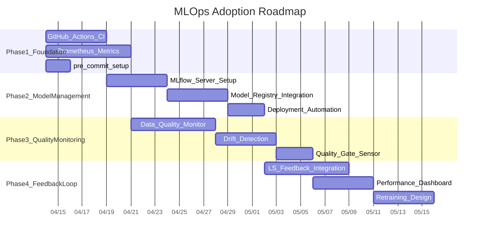

# VLM Data Pipeline MLOps Adoption Strategy

> Last updated: 2026-04-09
> Status: Current-state analysis complete, phased implementation pending

## Purpose

Analyze the current infrastructure, model, and data landscape of the VLM data pipeline, and define the technology stack and implementation strategy for a phased MLOps rollout.

---

## Current-State Diagnosis

### What is already in place

- **Orchestration**: Dagster (webserver + daemon + gRPC code server) — asset-based declarative pipeline
- **Data storage**: DuckDB (local) + MotherDuck (cloud sync) + MinIO (object storage, 4 buckets)
- **Model serving**: YOLO-World / SAM3.1 each as independent FastAPI servers (separate GPUs)
- **External AI**: Gemini (Vertex AI) calls
- **Monitoring**: Grafana + PostgreSQL dashboard, Dagster UI, Slack notifications (NAS health)
- **Benchmarking**: SAM3 vs YOLO shadow compare (IoU/coverage/latency)
- **Environment separation**: Production / Staging (Docker Compose profile)

### What is missing

| Area | Current status |
|------|----------------|
| CI/CD | None (GitHub Actions/GitLab CI not configured) |
| Model registry | None (fixed file paths) |
| Experiment tracking | None (MLflow/W&B not in use) |
| Data versioning | DVC package installed but not actually used |
| Model training | None (pure inference pipeline) |
| Automated quality gate | File integrity only; no ML metric-based gate |
| Feature store | None |
| A/B testing | Shadow compare only; no traffic splitting |

### Core Characteristics

This pipeline centers on **"inference + data assembly" rather than "training"**. Accordingly, the MLOps strategy should focus on the following rather than traditional "training loop automation":

1. **Version management and deployment automation for inference models**
2. **Data quality monitoring and drift detection**
3. **Quality tracking of inference results and a feedback loop**
4. **Pipeline code + model deployment automation via CI/CD**

---

## Proposed Architecture

---

## Phase 1: Foundation Infrastructure (1-2 weeks)

**Goal**: Establish CI/CD and basic monitoring to ensure safe changes.

### 1-1. GitHub Actions CI/CD

There is currently no CI/CD at all; this is the top priority.

**Technology**: GitHub Actions

**Pipeline configuration**:
- **PR validation**: ruff lint + pytest (unit) + Docker build verification
- **On main merge**: Docker image build + tagging + automatic staging deployment
- **On release tag**: production deployment (manual approval gate)

**Implementation location**: `.github/workflows/ci.yml`, `.github/workflows/deploy.yml`

**Rationale**: Currently, deployment is done only via manual `docker compose up`, which carries the risk of code changes reaching production without testing.

### 1-2. Inference Server Metrics Collection

Currently, YOLO/SAM3 servers expose only `/health` and `/info`, with no Prometheus metrics endpoint.

**Technology**: Prometheus + existing Grafana

**Metrics to add**:
- Per-request latency (p50/p95/p99)
- GPU memory usage (during inference)
- Request throughput (RPS)
- Error rate
- Model load time
- Per-class detection count distribution

**Implementation location**:
- Add `prometheus_fastapi_instrumentator` to `docker/yolo/app.py` and `docker/sam3/app.py`
- Add Prometheus server service to `docker/docker-compose.yaml` (currently only MinIO has `MINIO_PROMETHEUS_AUTH_TYPE: public`)
- Add Grafana dashboards

### 1-3. Pipeline Code Quality Gate

**Technology**: pre-commit + ruff + pytest

**Implementation**: Create `.pre-commit-config.yaml`, enforce via CI

---

## Phase 2: Model Version Management (2-3 weeks)

**Goal**: Track model weight versions and establish a safe process for model replacement.

### 2-1. MLflow (Model Registry)

Currently, models are managed at fixed file paths (`/data/models/yolo/yolov8l-worldv2.pt`), making it impossible to track model replacements.

**Technology**: MLflow (Tracking Server + Model Registry)

**Configuration**:
- Add MLflow server to Docker Compose
- Backend store: reuse existing PostgreSQL
- Artifact store: add `vlm-models` bucket to MinIO
- Model registration: version management for YOLO-World, SAM3.1, and Places365

**Implementation location**: New `docker/mlflow/` directory, add service to `docker-compose.yaml`

**Workflow**:
1. Register new model weights in MLflow (version + metadata)
2. Run shadow compare on staging
3. On passing quality criteria, promote to production (MLflow stage: Staging → Production)
4. Serving server loads the "Production" stage model from MLflow at startup

### 2-2. Model Deployment Automation

**Technology**: MLflow Model Registry + Dagster sensor

**Implementation**:
- Dagster sensor detects model stage changes in MLflow
- Triggers restart of the relevant model server container
- Rollback: reverting the stage to a previous version triggers automatic rollback

---

## Phase 3: Data Quality + Drift Monitoring (2-3 weeks)

**Goal**: Automatically monitor the quality of input data and inference results, and send alerts on anomalies.

### 3-1. Input Data Quality Monitoring

Currently, `lib/validator.py` checks only file integrity. ML-perspective data quality checks are needed.

**Technology**: Evidently AI or Great Expectations

**Monitoring targets**:
- Image resolution distribution changes
- Frame brightness/contrast distribution (night/day ratio shifts)
- Video duration distribution
- Per-source data ratio changes (by GCS bucket)
- Blank frame / corrupted frame ratio

**Implementation location**: `src/vlm_pipeline/lib/data_quality.py` (new), run periodically as a Dagster asset

### 3-2. Inference Result Drift Detection

**Technology**: Evidently AI (or custom DuckDB query-based)

**Monitoring targets**:
- YOLO detection count distribution changes (avg objects per image)
- Per-class detection ratio changes
- Confidence score distribution changes
- SAM3 vs YOLO IoU agreement rate trend (extension of existing shadow compare)
- Gemini event category distribution changes

**Implementation**:
- Daily/weekly aggregation from `image_labels` + `labels` tables in DuckDB
- Add trend charts to Grafana dashboard
- Slack notification on threshold breach (reuse existing webhook)

### 3-3. Quality Gate Sensor

**Technology**: Dagster sensor + DuckDB query

**Implementation**:
- `defs/monitoring/quality_gate_sensor.py` (new)
- Automatic quality check before entering the BUILD phase
- Block BUILD + send alert if detection ratio falls below threshold

---

## Phase 4: Feedback Loop (3-4 weeks)

**Goal**: Feed human review results back into the pipeline to continuously improve quality.

### 4-1. Strengthened Label Studio Feedback Integration

Label Studio is already in place, but the loop for automatically feeding review results back into the pipeline is weak.

**Implementation**:
- Automatically load YOLO/SAM3 results into Label Studio as pre-annotations
- Store reviewed labels in `vlm-labels` as "gold standard"
- Periodically compute model accuracy against gold standard

### 4-2. Model Performance Dashboard

**Technology**: Grafana + DuckDB/MotherDuck

**Metrics**:
- mAP vs gold labels (YOLO), mIoU vs gold labels (SAM3)
- Per-class precision/recall
- Performance trend over time
- Per-model-version performance comparison

### 4-3. Retraining Trigger (future)

Currently, only pre-trained models are used. If fine-tuning is introduced in the future:
- Automatic training dataset construction based on gold labels (BUILD phase extension)
- Trigger retraining pipeline on performance degradation detection
- Register new model in MLflow → shadow compare → promote

---

## Technology Stack Summary

| Area | Current | Proposed addition | Rationale |
|------|---------|-------------------|-----------|
| Orchestration | Dagster | Keep | Already well established; asset-based approach suits MLOps |
| CI/CD | None | **GitHub Actions** | Repo is on GitHub; free tier is sufficient |
| Model registry | File paths | **MLflow** | Open source; can reuse MinIO/PostgreSQL; supports model staging |
| Metrics collection | Grafana only | **Prometheus** + Grafana | MinIO already exposes Prometheus; consolidates server metrics |
| Server instrumentation | None | **prometheus-fastapi-instrumentator** | Expose metrics from FastAPI servers with a single line |
| Data quality | validator.py | **Evidently AI** | Specialized in drift detection; easy Dagster integration |
| Data versioning | DVC unused | **DVC** (already installed) | Use MinIO as remote; enables dataset version tracking |
| Experiment tracking | None | **MLflow Tracking** | Integrated with registry; records shadow compare results |
| Label review | Label Studio | Strengthen | Automate feedback loop |
| Notifications | Slack (partial) | Extend Slack | Reuse existing infrastructure |

---

## Priority and Schedule

---

## Quick Wins (Immediately Actionable)

Items that can be applied right away without waiting for a phase:

1. **Add `.pre-commit-config.yaml`** — auto-run ruff + pytest
2. **Add `/metrics` endpoint to YOLO/SAM3 servers** — single line with `prometheus-fastapi-instrumentator`
3. **Visualize existing shadow compare results in Grafana dashboard** — DuckDB query + Grafana panel
4. **Initialize DVC** — package is already installed; just run `dvc init` + set MinIO as remote to start dataset version tracking

---

## Caveats

- **GPU resource constraints**: Currently running with 2 GPUs (0: SAM3, 1: YOLO) in separated operation. MLflow server and Prometheus are CPU-only, so there is no GPU contention.
- **DuckDB single writer**: Quality monitoring queries must be run as `READ_ONLY`. Using MotherDuck-synced data is safer.
- **Dagster sensor timeout**: Consider `DAGSTER_SENSOR_GRPC_TIMEOUT_SECONDS` when adding new sensors.
- **MinIO bucket policy**: The existing 4-bucket fixed principle applies. The `vlm-models` bucket for MLflow artifacts is an additional bucket.

---

## Per-Phase Implementation Checklist

### Phase 1: Foundation Infrastructure

- [ ] `.github/workflows/ci.yml` — PR validation (ruff + pytest + docker build)
- [ ] `.github/workflows/deploy.yml` — staging deployment on main merge, production deployment on release tag
- [ ] Create `.pre-commit-config.yaml`
- [ ] Add `prometheus-fastapi-instrumentator` to `docker/yolo/app.py`
- [ ] Add `prometheus-fastapi-instrumentator` to `docker/sam3/app.py`
- [ ] Add Prometheus server service to `docker/docker-compose.yaml`
- [ ] Add YOLO/SAM3 metrics dashboards to Grafana

### Phase 2: Model Version Management

- [ ] Create `docker/mlflow/` directory + Dockerfile
- [ ] Add MLflow service to `docker-compose.yaml`
- [ ] Create `vlm-models` bucket in MinIO
- [ ] Initial registration of YOLO-World, SAM3.1, and Places365 models in MLflow
- [ ] Update serving servers to load models from MLflow at startup
- [ ] Dagster sensor: detect MLflow stage change → trigger server restart

### Phase 3: Data Quality + Drift

- [ ] Create `src/vlm_pipeline/lib/data_quality.py`
- [ ] Dagster asset: periodic data quality check
- [ ] DuckDB-based inference result drift aggregation queries
- [ ] Add trend dashboards to Grafana
- [ ] Create `defs/monitoring/quality_gate_sensor.py`
- [ ] Slack notification integration (on drift threshold breach)

### Phase 4: Feedback Loop

- [ ] Auto-load YOLO/SAM3 results into Label Studio as pre-annotations
- [ ] Establish gold standard label storage scheme
- [ ] Asset: compute model accuracy against gold labels
- [ ] Grafana model performance dashboard
- [ ] Design retraining trigger (in preparation for future fine-tuning)
