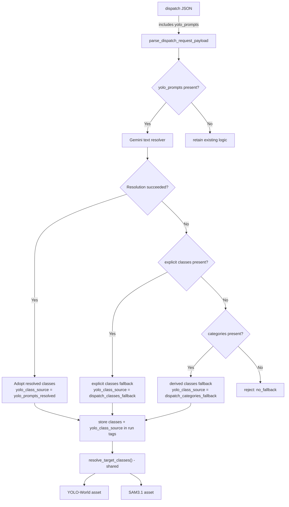

# YOLO-World / SAM3.1 Natural Language Prompt Integration Design and Implementation Plan

> Last updated: 2026-04-09
> Status: Codebase analysis complete, implementation pending

## Purpose

- Document the design and implementation plan for wiring natural language-based detection requests into the dispatch path.
- When a user puts a natural language phrase such as `"a scene where smoke is rising near the warehouse entrance"` into the dispatch JSON, a Gemini text resolver normalizes it into a `classes` list that YOLO-World/SAM3.1 can consume.
- Build a preprocessing layer that supplies identical detection classes to both YOLO-World and SAM3.1.
- Define a structure that normalizes natural language input while maximally preserving the existing dispatch-centric pipeline.

---

## Current Structure Summary

### Pipeline Flow

```text
dispatch JSON
  -> parse_dispatch_request_payload()
  -> prepare_dispatch_request()
  -> classes/categories stored in run tags
  -> each asset calls resolve_target_classes(tags, db)
```

### YOLO-World Path

- `dispatch JSON -> dispatch_sensor/service -> run tags -> defs/yolo/assets.py -> lib/yolo_world.py -> docker/yolo/app.py`
- Server receives `classes_json` (array of English phrases), calls `model.set_classes()`, then performs detection
- Does not accept free-form sentence prompts directly

### SAM3.1 Path

- `dispatch JSON -> dispatch_sensor/service -> run tags -> defs/sam/detection_assets.py -> lib/sam3.py -> docker/sam3/app.py`
- Server receives `prompts_json` (array of English text), calls `set_text_prompt()`, then performs segmentation
- Text prompt is required — skips if `target_classes` is empty

### Common Class Resolution

- `resolve_target_classes()` in `lib/detection_common.py` is used identically by both YOLO and SAM3
- Resolution priority: `spec_id` -> `tags["classes"]` -> `tags["categories"]` -> `server_default`

### Current Limitations

- YOLO-World's open-vocabulary capability is used only at the level of "text class/phrase list"
- No intermediate layer to accept natural language sentences as detection targets
- `GeminiAnalyzer` has no text-only method (only `analyze_image` and `analyze_video` exist)

---

## Codebase Analysis Findings

### Key Findings

1. **SAM3 and YOLO already share the same `resolve_target_classes()` function** — injecting natural language resolution results upstream of this function automatically applies to both
2. **A text-only method must be added to `GeminiAnalyzer`** — it just needs to pass a string to the existing `_generate_content_with_retry()`
3. **SAM3 requires a text prompt** — the natural language prompt feature provides greater value to SAM3
4. **Gemini can be called from the dispatch ingress path** — credentials are shared via environment variables
5. **Minimal DB schema change needed** — adding 2 columns to `staging_dispatch_requests` is sufficient

### Implementation Feasibility: Feasible

This can be implemented without major architectural changes.

- Since `resolve_target_classes()` is already shared by YOLO/SAM3, converting natural language → classes at the dispatch stage and putting them into run tags' `classes` automatically applies to both
- Gemini text-only calls reuse the existing retry logic as-is
- No changes needed to the YOLO HTTP API or SAM3 HTTP API

---

## Architecture Flow



---

## Input/Output Interface Changes

### 1. Dispatch JSON Input

New field: `yolo_prompts: list[str]`

```json
{
  "request_id": "req-001",
  "folder_name": "sample-folder",
  "labeling_method": ["bbox"],
  "yolo_prompts": [
    "a scene where smoke is spreading near the warehouse entrance",
    "a person lying on the floor"
  ]
}
```

### 2. Existing Fields Retained

- `prompts`: retained exclusively for Gemini `timestamp` and `captioning`
- `classes`: retained as explicit YOLO/SAM3 classes or phrase list
- `categories`: retained as existing derived fallback input

### 3. DB Storage Fields (staging_dispatch_requests)

- `yolo_prompts TEXT` — original natural language input (JSON array string)
- `yolo_class_source VARCHAR` — which path determined the final classes

### 4. Run Tags

- `classes` — final YOLO/SAM3 classes (reuse existing field)
- `yolo_prompts` — original natural language input
- `yolo_class_source` — resolution path

### 5. YOLO/SAM3 API Contract

In v1, neither the YOLO HTTP API nor the SAM3 HTTP API is changed.

- YOLO: sends only the final `classes_json`
- SAM3: sends only the final `prompts_json`

---

## Processing Flow

```text
Receive dispatch JSON
-> parse_dispatch_request_payload()
-> Check for bbox request
-> If yolo_prompts present, run Gemini text resolver
-> Generate resolved classes
-> Apply fallback policy
-> Save to staging_dispatch_requests (including yolo_prompts, yolo_class_source)
-> Generate run tags (including classes, yolo_prompts, yolo_class_source)
-> resolve_target_classes() prioritizes tags["classes"] as before
-> YOLO: lib/yolo_world.py sends classes_json
-> SAM3: lib/sam3.py sends prompts_json
```

Detailed steps:

1. Normalize dispatch payload
2. Check for `bbox` request
3. If `yolo_prompts` present, run text resolver
4. If resolver result is valid, adopt as `classes`
5. If failed or empty result, apply fallback
6. Record final classes and source in request DB and run tags
7. YOLO/SAM3 stages proceed with existing logic unchanged

---

## Natural Language → Classes Conversion Rules

### 1. Output Contract

Only strict JSON is accepted:

```json
{
  "classes": ["smoke", "person lying on floor"]
}
```

### 2. Output Rules

- Lowercase English only
- No duplicates
- Maximum 12 items
- Each item is 1–5 words
- Include only visually detectable targets
- Remove policies, intentions, situation descriptions, and action directives

### 3. Conversion Principles

Make phrases as short as possible to favor YOLO-World/SAM3.1.

| Input (natural language) | Output (classes) |
|--------------------------|------------------|
| `"a scene where smoke is spreading near the warehouse entrance"` | `["smoke", "warehouse door"]` |
| `"a person lying on the floor"` | `["person lying on floor"]` |
| `"a person threatening with a knife"` | `["person with knife", "knife"]` |
| `"a suspicious situation"` | excluded (non-visual concept) |
| `"a dangerous-looking atmosphere"` | excluded (non-visual concept) |

### 4. Examples

#### Example 1. Korean natural language only

Input:

```json
{
  "labeling_method": ["bbox"],
  "yolo_prompts": [
    "창고 출입문 근처에서 연기가 퍼지는 장면",
    "바닥에 사람이 쓰러져 있음"
  ]
}
```

Expected resolution:

```json
{
  "classes": ["smoke", "warehouse door", "person lying on floor"]
}
```

#### Example 2. Natural language + explicit classes fallback

Input:

```json
{
  "labeling_method": ["bbox"],
  "yolo_prompts": ["위협 장면"],
  "classes": ["knife", "gun"]
}
```

On resolution failure, final classes: `["knife", "gun"]`

#### Example 3. Failure case

Input:

```json
{
  "labeling_method": ["bbox"],
  "yolo_prompts": ["이상한 분위기"],
  "classes": [],
  "categories": []
}
```

Result: natural language resolution yields empty result + no fallback source → request rejected

---

## Fallback Policy

### Priority (fixed)

1. `yolo_prompts` → Gemini resolver → resolved classes
2. Explicit `classes` (dispatch JSON)
3. `categories` → `derive_classes_from_categories()`
4. If all absent and `bbox` was requested → reject

### Failure Conditions

- Gemini text resolver call failure
- JSON parse failure
- `classes` field missing
- Result array is empty
- Result items do not satisfy the rules

### Behavior Rules

| Condition | Final classes | yolo_class_source |
|-----------|--------------|-------------------|
| `yolo_prompts` resolution succeeded | resolved classes | `yolo_prompts_resolved` |
| `yolo_prompts` resolution failed + explicit `classes` present | explicit classes | `dispatch_classes_fallback` |
| `yolo_prompts` resolution failed + `categories` present | derived classes | `dispatch_categories_fallback` |
| None of the three present | reject | error: `yolo_prompt_resolution_failed_no_fallback` |

---

## SAM3.1 Application Method

SAM3 already uses `resolve_target_classes(tags, db)`, so it is **automatically applied without additional code changes**.

Once resolved classes are placed in run tags' `classes` at the dispatch stage:

- **YOLO**: `resolve_target_classes()` → `class_source="dispatch_tags"` → sent as `classes_json`
- **SAM3**: `resolve_target_classes()` → `class_source="dispatch_tags"` → sent as `prompts`

The `yolo_class_source` tag is additionally recorded to maintain traceability — "these classes came from natural language resolution".

Since SAM3 requires a text prompt (skips if `target_classes` is empty), the natural language prompt feature provides greater value to SAM3.

---

## Files to Change

### Step 1: Interface/Schema Updates

| File | Changes |
|------|---------|
| `src/vlm_pipeline/sql/schema.sql` | Add `yolo_prompts TEXT`, `yolo_class_source VARCHAR` to `staging_dispatch_requests` |
| `src/vlm_pipeline/resources/duckdb_migration.py` | Add ALTER TABLE migration |
| `src/vlm_pipeline/lib/staging_dispatch.py` | Add `yolo_prompts` parsing to `parse_dispatch_request_payload()` |
| `src/vlm_pipeline/defs/dispatch/service.py` | Add `yolo_prompts`, `yolo_class_source` fields to `PreparedDispatchRequest`; reflect in run tags via `build_dispatch_run_request()` |

### Step 2: Gemini Text Resolver + Dispatch Wiring

| File | Changes |
|------|---------|
| `src/vlm_pipeline/lib/gemini.py` | Add `GeminiAnalyzer.generate_text()` text-only method |
| `src/vlm_pipeline/lib/gemini_prompts.py` | Add `YOLO_PROMPT_RESOLVER_TEMPLATE` — system prompt for natural language → detection phrases conversion |
| `src/vlm_pipeline/lib/yolo_prompt_resolver.py` (new) | `resolve_yolo_prompts_to_classes(prompts) -> ResolverResult` — Gemini call + JSON parsing + validation + fallback logic |
| `src/vlm_pipeline/defs/dispatch/service.py` | Within `process_dispatch_ingress_request()`: call resolver when `bbox` is requested + `yolo_prompts` present; reflect result as `classes`/`yolo_class_source` |

### Step 3: Tests

| File | Changes |
|------|---------|
| `tests/unit/test_yolo_prompt_resolver.py` (new) | Resolver unit tests (Gemini mocked) |
| `tests/unit/test_staging_dispatch.py` (existing) | Add `yolo_prompts` parsing tests |

---

## Detailed Design

### Gemini Text Resolver Prompt (YOLO_PROMPT_RESOLVER_TEMPLATE)

Implement the conversion rules from the design proposal as a system prompt:

- Input: array of natural language sentences (Korean/English mix allowed)
- Output: strict JSON `{"classes": ["smoke", "person lying on floor"]}`
- Rules: lowercase English, no duplicates, max 12 items, 1–5 words, visual targets only

### GeminiAnalyzer.generate_text()

Add a text-only wrapper reusing the existing `_generate_content_with_retry()` internal method:

```python
def generate_text(self, prompt: str, *, source_name: str = "text") -> str:
    response = self._generate_content_with_retry(
        [prompt],
        content_type="text",
        source_name=source_name,
    )
    return _extract_response_text(response)
```

### yolo_prompt_resolver.py Structure

```python
@dataclass(frozen=True)
class PromptResolverResult:
    classes: list[str]
    source: str          # yolo_prompts_resolved | dispatch_classes_fallback | ...
    raw_prompts: list[str]
    error: str | None

def resolve_yolo_prompts_to_classes(
    yolo_prompts: list[str],
    explicit_classes: list[str],
    categories: list[str],
) -> PromptResolverResult:
    # 1. Call Gemini text resolver
    # 2. JSON parsing + validation
    # 3. Apply fallback on failure
    ...
```

### DB Changes

Only 2 columns added to `staging_dispatch_requests`:

```sql
ALTER TABLE staging_dispatch_requests ADD COLUMN IF NOT EXISTS yolo_prompts TEXT;
ALTER TABLE staging_dispatch_requests ADD COLUMN IF NOT EXISTS yolo_class_source VARCHAR;
```

The existing `classes` field in run tags is reused as-is; only `yolo_class_source` and `yolo_prompts` tags are added.

---

## Caveats

- Gemini text resolver calls execute inside the dispatch sensor, so **sensor tick timeout** must be considered (`DAGSTER_SENSOR_GRPC_TIMEOUT_SECONDS`)
- Gemini 429 rate limit: existing retry logic (`_generate_content_with_retry`) is automatically applied
- On resolver failure, fallback is applied so there is no pipeline interruption
- YOLO HTTP API and SAM3 HTTP API are not changed in v1

---

## Test Scenarios

### 1. yolo_prompts only

- `bbox` request
- Only `yolo_prompts` present
- Resolver generates valid classes
- Final YOLO receives only `classes_json`; SAM3 receives only `prompts_json`

### 2. yolo_prompts + classes

- `yolo_prompts` resolution fails
- Explicit `classes` present
- Successful fallback to explicit classes
- Same classes applied to both YOLO/SAM3

### 3. yolo_prompts + categories

- `yolo_prompts` resolution fails
- No explicit `classes`
- Fallback via `categories -> classes`

### 4. Invalid or empty natural-language resolution

- Resolver response is empty array or malformed JSON
- No fallback source → request rejected

### 5. bbox not requested

- `labeling_method` does not include `bbox`
- `yolo_prompts` is ignored even if present
- No impact on Gemini `prompts` behavior

### 6. YOLO/SAM3 stage receives final classes only

- YOLO asset and SAM3 asset do not use the original natural language text
- Verify that only final normalized classes are passed

### 7. SAM3 standalone run

- `ENABLE_SAM3_DETECTION=true` + `yolo_prompts` present
- Resolved classes are correctly passed to SAM3 `prompts`
- SAM3 server performs text prompt-based segmentation

---

## Out of Scope

- Extension of `labeling_specs`-based spec flow
- YOLO HTTP API changes
- SAM3 HTTP API changes
- Structure where YOLO/SAM3 servers directly receive natural language sentences
- Structure where free-form prompts are re-interpreted in real time at each runtime
- Introduction of a separate LLM microservice
- Modification of README or other operational documents in general

---

## Per-Step Implementation Checklist

### Step 1. Interface/Schema Updates

- [ ] Add `yolo_prompts` field to dispatch JSON (payload parsing)
- [ ] Add tracking fields to `staging_dispatch_requests` (schema + migration)
- [ ] Add fields to `PreparedDispatchRequest`
- [ ] Reflect run tags design

### Step 2. Gemini Text Resolver + Dispatch Wiring

- [ ] Add `GeminiAnalyzer.generate_text()` text-only method
- [ ] Add `YOLO_PROMPT_RESOLVER_TEMPLATE` prompt
- [ ] Create `lib/yolo_prompt_resolver.py`
- [ ] Implement `yolo_prompts -> classes` resolution and fallback in dispatch ingress
- [ ] Reflect result in run tags/DB

### Step 3. Tests

- [ ] `test_yolo_prompt_resolver.py` unit tests
- [ ] `test_staging_dispatch.py` yolo_prompts parsing tests
- [ ] Staging environment E2E validation

### Step 4. Operational Validation and Prompt Quality Tuning

- [ ] Adjust phrase quality based on real request examples
- [ ] Strengthen rules for removing overly abstract results
- [ ] Quality refinement for frequently used domain phrases
