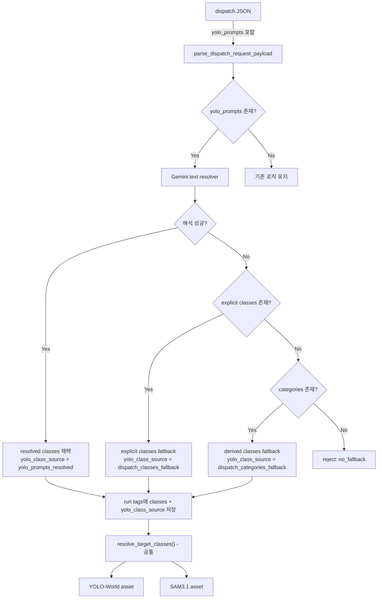

# YOLO-World / SAM3.1 자연어 프롬프트 연결 설계 및 구현 계획

> 최종 갱신: 2026-04-09
> 상태: 코드베이스 분석 완료, 구현 대기

## 목적

- dispatch 경로에 자연어 기반 탐지 요청을 연결하기 위한 설계 및 구현 계획을 문서화한다.
- 사용자가 `"창고 입구에서 연기가 나는 장면"` 같은 자연어를 dispatch JSON에 넣으면, Gemini text resolver가 이를 YOLO-World/SAM3.1이 소비 가능한 `classes` 목록으로 정규화한다.
- YOLO-World와 SAM3.1 양쪽에 동일한 detection classes를 공급하는 전처리 계층을 구축한다.
- 기존 dispatch 중심 파이프라인을 최대한 유지하면서, 자연어 입력을 정규화하는 구조를 정의한다.

---

## 현행 구조 요약

### 파이프라인 흐름

```text
dispatch JSON
  -> parse_dispatch_request_payload()
  -> prepare_dispatch_request()
  -> run tags에 classes/categories 저장
  -> 각 asset에서 resolve_target_classes(tags, db) 호출
```

### YOLO-World 경로

- `dispatch JSON -> dispatch_sensor/service -> run tags -> defs/yolo/assets.py -> lib/yolo_world.py -> docker/yolo/app.py`
- 서버는 `classes_json`(영문 phrase 배열)을 받아 `model.set_classes()` 후 detection 수행
- 자유문장 프롬프트를 직접 받지 않음

### SAM3.1 경로

- `dispatch JSON -> dispatch_sensor/service -> run tags -> defs/sam/detection_assets.py -> lib/sam3.py -> docker/sam3/app.py`
- 서버는 `prompts_json`(영문 텍스트 배열)을 받아 `set_text_prompt()` 후 segmentation 수행
- 텍스트 프롬프트가 필수 — `target_classes`가 비어 있으면 스킵

### 공통 클래스 해석

- `lib/detection_common.py`의 `resolve_target_classes()`가 YOLO/SAM3 양쪽에서 동일하게 사용됨
- 해석 우선순위: `spec_id` -> `tags["classes"]` -> `tags["categories"]` -> `server_default`

### 현재 제약

- YOLO-World의 open-vocabulary 기능을 "텍스트 클래스/phrase 목록" 수준으로만 활용
- 자연어 문장을 직접 입력받아 탐지 대상으로 해석하는 중간 계층이 없음
- `GeminiAnalyzer`에 text-only 메서드가 없음 (`analyze_image`, `analyze_video`만 존재)

---

## 코드베이스 분석 결과

### 핵심 발견

1. **SAM3와 YOLO는 이미 동일한 `resolve_target_classes()` 함수를 공유** — 자연어 해석 결과를 이 함수의 상위에서 주입하면 양쪽 모두 자동 적용됨
2. **GeminiAnalyzer에 text-only 메서드 추가 필요** — 기존 `_generate_content_with_retry()`에 문자열만 넘기면 됨
3. **SAM3는 텍스트 프롬프트가 필수** — 자연어 프롬프트 기능이 SAM3에 더 큰 가치를 줌
4. **dispatch ingress 경로에서 Gemini 호출 가능** — credentials 설정이 환경변수로 공유됨
5. **DB 스키마 변경 최소화 가능** — `staging_dispatch_requests`에 2개 컬럼 추가로 충분

### 구현 가능성: 가능

기존 아키텍처를 크게 변경하지 않고 구현 가능하다.

- `resolve_target_classes()`가 이미 YOLO/SAM3 공통이므로, dispatch 단계에서 자연어 -> classes 변환 후 run tags의 `classes`에 넣으면 양쪽 모두 자동 적용
- Gemini text-only 호출은 기존 retry 로직을 그대로 재사용
- YOLO HTTP API, SAM3 HTTP API 모두 변경 불필요

---

## 아키텍처 흐름



---

## 입력/출력 인터페이스 변경안

### 1. Dispatch JSON 입력

신규 필드: `yolo_prompts: list[str]`

```json
{
  "request_id": "req-001",
  "folder_name": "sample-folder",
  "labeling_method": ["bbox"],
  "yolo_prompts": [
    "창고 출입문 근처에서 연기가 발생한 장면",
    "바닥에 쓰러져 있는 사람"
  ]
}
```

### 2. 기존 필드 유지

- `prompts`: Gemini `timestamp`, `captioning` 전용으로 유지
- `classes`: 명시 YOLO/SAM3 클래스 또는 phrase 목록으로 유지
- `categories`: 기존 파생 fallback 입력으로 유지

### 3. DB 저장 필드 (staging_dispatch_requests)

- `yolo_prompts TEXT` — 원본 자연어 입력 (JSON 배열 문자열)
- `yolo_class_source VARCHAR` — 최종 classes가 어떤 경로로 결정되었는지

### 4. Run tags

- `classes` — 최종 YOLO/SAM3 classes (기존 필드 재사용)
- `yolo_prompts` — 원본 자연어 입력
- `yolo_class_source` — 결정 경로

### 5. YOLO/SAM3 API 계약

v1에서는 YOLO HTTP API, SAM3 HTTP API 모두 변경하지 않는다.

- YOLO: 최종 `classes_json`만 전송
- SAM3: 최종 `prompts_json`만 전송

---

## 처리 흐름

```text
dispatch JSON 수신
-> parse_dispatch_request_payload()
-> bbox 요청 여부 확인
-> yolo_prompts 존재 시 Gemini text resolver 실행
-> resolved classes 생성
-> fallback 정책 적용
-> staging_dispatch_requests 저장 (yolo_prompts, yolo_class_source 포함)
-> run tags 생성 (classes, yolo_prompts, yolo_class_source 포함)
-> resolve_target_classes() 에서 기존처럼 tags["classes"] 우선 해석
-> YOLO: lib/yolo_world.py 가 classes_json 전송
-> SAM3: lib/sam3.py 가 prompts_json 전송
```

세부 순서:

1. dispatch payload 정규화
2. `bbox` 요청 여부 확인
3. `yolo_prompts` 존재 시 text resolver 실행
4. resolver 결과가 유효하면 `classes`로 채택
5. 실패 또는 빈 결과면 fallback 적용
6. 최종 classes와 source를 request DB 및 run tags에 기록
7. 이후 YOLO/SAM3 stage는 기존 로직 그대로 수행

---

## 자연어 -> classes 변환 규칙

### 1. 출력 계약

strict JSON만 허용:

```json
{
  "classes": ["smoke", "person lying on floor"]
}
```

### 2. 출력 규칙

- 영어 소문자만 사용
- 중복 제거
- 최대 12개 항목
- 각 항목은 1~5단어
- 시각적으로 탐지 가능한 대상만 포함
- 정책, 의도, 상황 설명, 행위 지시문은 제거

### 3. 변환 원칙

가능한 한 YOLO-World/SAM3.1에 유리한 짧은 phrase로 만든다.

| 입력 (자연어) | 출력 (classes) |
|--------------|----------------|
| `"창고 출입문 근처에서 연기가 발생한 장면"` | `["smoke", "warehouse door"]` |
| `"바닥에 쓰러져 있는 사람"` | `["person lying on floor"]` |
| `"칼을 들고 위협하는 사람"` | `["person with knife", "knife"]` |
| `"수상한 상황"` | 제외 (비가시적 개념) |
| `"위험해 보이는 분위기"` | 제외 (비가시적 개념) |

### 4. 예시

#### 예시 1. 한국어 자연어만 있는 경우

입력:

```json
{
  "labeling_method": ["bbox"],
  "yolo_prompts": [
    "창고 출입문 근처에서 연기가 퍼지는 장면",
    "바닥에 사람이 쓰러져 있음"
  ]
}
```

예상 해석:

```json
{
  "classes": ["smoke", "warehouse door", "person lying on floor"]
}
```

#### 예시 2. 자연어 + 명시 classes fallback

입력:

```json
{
  "labeling_method": ["bbox"],
  "yolo_prompts": ["위협 장면"],
  "classes": ["knife", "gun"]
}
```

해석 실패 시 최종 classes: `["knife", "gun"]`

#### 예시 3. 실패 케이스

입력:

```json
{
  "labeling_method": ["bbox"],
  "yolo_prompts": ["이상한 분위기"],
  "classes": [],
  "categories": []
}
```

처리 결과: 자연어 해석 결과 비어 있음 + fallback source 없음 -> request reject

---

## Fallback 정책

### 우선순위 (고정)

1. `yolo_prompts` -> Gemini resolver -> resolved classes
2. explicit `classes` (dispatch JSON)
3. `categories` -> `derive_classes_from_categories()`
4. 모두 없고 `bbox`가 요청된 경우 reject

### 실패 조건

- Gemini text resolver 호출 실패
- JSON 파싱 실패
- `classes` 필드 누락
- 결과 배열이 비어 있음
- 결과 항목이 규칙을 만족하지 않음

### 동작 규칙

| 조건 | 최종 classes | yolo_class_source |
|------|-------------|-------------------|
| `yolo_prompts` 해석 성공 | resolved classes | `yolo_prompts_resolved` |
| `yolo_prompts` 해석 실패 + explicit `classes` 존재 | explicit classes | `dispatch_classes_fallback` |
| `yolo_prompts` 해석 실패 + `categories` 존재 | derived classes | `dispatch_categories_fallback` |
| 셋 다 없음 | reject | 에러: `yolo_prompt_resolution_failed_no_fallback` |

---

## SAM3.1 적용 방식

SAM3는 이미 `resolve_target_classes(tags, db)`를 사용하므로 **추가 코드 변경 없이** 자동 적용된다.

dispatch 단계에서 resolved classes가 run tags의 `classes`에 들어가면:

- **YOLO**: `resolve_target_classes()` -> `class_source="dispatch_tags"` -> `classes_json`으로 전송
- **SAM3**: `resolve_target_classes()` -> `class_source="dispatch_tags"` -> `prompts`로 전송

`yolo_class_source` 태그를 추가로 기록하여 "이 classes가 자연어 해석에서 왔다"는 추적성을 확보한다.

SAM3는 텍스트 프롬프트가 필수(`target_classes`가 비어 있으면 스킵)이므로, 자연어 프롬프트 기능이 SAM3에 더 큰 가치를 준다.

---

## 변경 대상 파일

### 1단계: 인터페이스/스키마 반영

| 파일 | 변경 내용 |
|------|-----------|
| `src/vlm_pipeline/sql/schema.sql` | `staging_dispatch_requests`에 `yolo_prompts TEXT`, `yolo_class_source VARCHAR` 추가 |
| `src/vlm_pipeline/resources/duckdb_migration.py` | ALTER TABLE migration 추가 |
| `src/vlm_pipeline/lib/staging_dispatch.py` | `parse_dispatch_request_payload()`에 `yolo_prompts` 파싱 추가 |
| `src/vlm_pipeline/defs/dispatch/service.py` | `PreparedDispatchRequest`에 `yolo_prompts`, `yolo_class_source` 필드 추가. `build_dispatch_run_request()`에서 run tags에 반영 |

### 2단계: Gemini text resolver + dispatch wiring

| 파일 | 변경 내용 |
|------|-----------|
| `src/vlm_pipeline/lib/gemini.py` | `GeminiAnalyzer.generate_text()` text-only 메서드 추가 |
| `src/vlm_pipeline/lib/gemini_prompts.py` | `YOLO_PROMPT_RESOLVER_TEMPLATE` 추가 — 자연어 -> detection phrases 변환 시스템 프롬프트 |
| `src/vlm_pipeline/lib/yolo_prompt_resolver.py` (신규) | `resolve_yolo_prompts_to_classes(prompts) -> ResolverResult` — Gemini 호출 + JSON 파싱 + 검증 + fallback 로직 |
| `src/vlm_pipeline/defs/dispatch/service.py` | `process_dispatch_ingress_request()` 내에서 `bbox` 요청 + `yolo_prompts` 존재 시 resolver 호출, 결과를 `classes`/`yolo_class_source`로 반영 |

### 3단계: 테스트

| 파일 | 변경 내용 |
|------|-----------|
| `tests/unit/test_yolo_prompt_resolver.py` (신규) | resolver 단위 테스트 (Gemini mock) |
| `tests/unit/test_staging_dispatch.py` (기존) | `yolo_prompts` 파싱 테스트 추가 |

---

## 세부 설계

### Gemini text resolver 프롬프트 (YOLO_PROMPT_RESOLVER_TEMPLATE)

설계안의 변환 규칙을 시스템 프롬프트로 구현:

- 입력: 자연어 문장 배열 (한국어/영어 혼용 가능)
- 출력: strict JSON `{"classes": ["smoke", "person lying on floor"]}`
- 규칙: 영어 소문자, 중복 제거, 최대 12개, 1~5단어, 시각적 대상만

### GeminiAnalyzer.generate_text()

기존 `_generate_content_with_retry()` 내부 메서드를 재사용하여 text-only 래퍼 추가:

```python
def generate_text(self, prompt: str, *, source_name: str = "text") -> str:
    response = self._generate_content_with_retry(
        [prompt],
        content_type="text",
        source_name=source_name,
    )
    return _extract_response_text(response)
```

### yolo_prompt_resolver.py 구조

```python
@dataclass(frozen=True)
class PromptResolverResult:
    classes: list[str]
    source: str          # yolo_prompts_resolved | dispatch_classes_fallback | ...
    raw_prompts: list[str]
    error: str | None

def resolve_yolo_prompts_to_classes(
    yolo_prompts: list[str],
    explicit_classes: list[str],
    categories: list[str],
) -> PromptResolverResult:
    # 1. Gemini text resolver 호출
    # 2. JSON 파싱 + 검증
    # 3. 실패 시 fallback 적용
    ...
```

### DB 변경

`staging_dispatch_requests`에만 2개 컬럼 추가:

```sql
ALTER TABLE staging_dispatch_requests ADD COLUMN IF NOT EXISTS yolo_prompts TEXT;
ALTER TABLE staging_dispatch_requests ADD COLUMN IF NOT EXISTS yolo_class_source VARCHAR;
```

run tags에는 기존 `classes` 필드를 그대로 활용하고, `yolo_class_source`와 `yolo_prompts` 태그만 추가한다.

---

## 주의사항

- Gemini text resolver 호출은 dispatch sensor 내에서 실행되므로, **sensor tick timeout**에 주의 필요 (`DAGSTER_SENSOR_GRPC_TIMEOUT_SECONDS` 고려)
- Gemini 429 rate limit 시 기존 retry 로직(`_generate_content_with_retry`)이 자동 적용됨
- resolver 실패 시 fallback으로 넘어가므로 파이프라인 중단 없음
- YOLO HTTP API, SAM3 HTTP API는 v1에서 변경하지 않음

---

## 테스트 시나리오

### 1. yolo_prompts only

- `bbox` 요청
- `yolo_prompts`만 존재
- resolver가 유효 classes를 생성
- 최종 YOLO는 `classes_json`만 수신, SAM3는 `prompts_json`만 수신

### 2. yolo_prompts + classes

- `yolo_prompts` 해석 실패
- explicit `classes` 존재
- explicit classes로 정상 fallback
- YOLO/SAM3 양쪽에 동일 classes 적용

### 3. yolo_prompts + categories

- `yolo_prompts` 해석 실패
- explicit `classes` 없음
- `categories -> classes`로 fallback

### 4. invalid or empty natural-language resolution

- resolver 응답이 빈 배열 또는 잘못된 JSON
- fallback source 없으면 request reject

### 5. bbox 미요청

- `labeling_method`에 `bbox` 없음
- `yolo_prompts`가 있어도 무시
- Gemini `prompts` 동작에는 영향 없음

### 6. YOLO/SAM3 stage receives final classes only

- YOLO asset과 SAM3 asset은 자연어 원문을 사용하지 않음
- 최종 정규화된 classes만 전달됨을 검증

### 7. SAM3 단독 실행

- `ENABLE_SAM3_DETECTION=true` + `yolo_prompts` 존재
- resolved classes가 SAM3 `prompts`로 정상 전달
- SAM3 서버가 텍스트 프롬프트 기반 segmentation 수행

---

## 비범위

- `labeling_specs` 기반 spec flow 확장
- YOLO HTTP API 변경
- SAM3 HTTP API 변경
- YOLO/SAM3 서버가 자연어 문장을 직접 받는 구조
- 자유문장 프롬프트를 runtime마다 실시간 재해석하는 구조
- 별도 LLM 마이크로서비스 도입
- README 또는 운영 문서 전반 수정

---

## 구현 단계별 체크리스트

### 1단계. 인터페이스/스키마 반영

- [ ] dispatch JSON에 `yolo_prompts` 필드 추가 (payload 파싱)
- [ ] `staging_dispatch_requests`에 추적 필드 추가 (schema + migration)
- [ ] `PreparedDispatchRequest`에 필드 추가
- [ ] run tags 설계 반영

### 2단계. Gemini text resolver + dispatch wiring

- [ ] `GeminiAnalyzer.generate_text()` text-only 메서드 추가
- [ ] `YOLO_PROMPT_RESOLVER_TEMPLATE` 프롬프트 추가
- [ ] `lib/yolo_prompt_resolver.py` 신규 생성
- [ ] dispatch ingress에서 `yolo_prompts -> classes` 해석 및 fallback 적용
- [ ] run tags/DB에 결과 반영

### 3단계. 테스트

- [ ] `test_yolo_prompt_resolver.py` 단위 테스트
- [ ] `test_staging_dispatch.py` yolo_prompts 파싱 테스트
- [ ] staging 환경 E2E 검증

### 4단계. 운영 검증 및 prompt quality tuning

- [ ] 실제 요청 예시 기반 phrase 품질 조정
- [ ] 과도하게 추상적인 결과 제거 규칙 강화
- [ ] 자주 쓰는 도메인 phrase의 품질 보정
