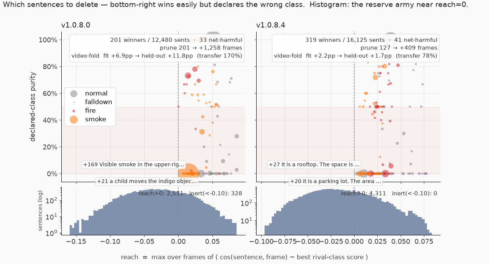

# 프롬프트 뱅크 기하 분석 — 개수가 아니라 위치인가

- 생성: 2026-07-31 06:51 | 프레임 13,144장 (사람 재라벨 GT)
- 가설 H1=뱅크 크기(개수) / H2=문장의 임베딩 공간 배치(기하)
- ⚠️ **2026-07-31 개정 2**: falldown GT 를 2라운드에 걸쳐 **40장 정정**(앉음·무릎 → normal, falldown 286→246)
  하고 전 스테이지를 재실행한 수치다. §1~§6 은 자동 생성, §7 이후는 손으로 붙인 인라인 실험이며
  둘 다 정정 GT 기준으로 갱신했다. 정정 배경·라운드별 방향은
  `docs/prompt-analysis-report-2026-07-31.md` §0-2 참조.

## 1. 동일 예산 검정 (H1 vs H2 의 1차 판정)

| 조건 | micro accuracy |
|---|---|
| v1.0.8.0 전체 (12,480개) | 82.80% |
| **v1.0.8.4 를 12,480개로 축소** (층화 ×10 seeds) | **91.20% ± 0.36%** |
| v1.0.8.4 전체 (16,125개) | 91.27% |

→ 같은 개수에서의 차이(**기하 효과**) = +8.4%p, 개수를 16,125로 늘린 추가분(**개수 효과**) = +0.1%p

## 2. matched-min (클래스별 동수)

클래스별 n = {'normal': 8625, 'falldown': 160, 'fire': 573, 'smoke': 1044} 로 양쪽 통일 (falldown 은 v084 가 3,000→160 으로 깎임)

| 뱅크 | micro | normal | falldown | fire | smoke |
|---|---|---|---|---|---|
| v1.0.8.0 | 82.40%±0.66% | 91.2% | 98.9% | 12.3% | 70.2% |
| v1.0.8.4 | 91.63%±0.25% | 97.5% | 97.8% | 70.1% | 62.5% |

## 3. 클래스별 한계곡선 (개수의 한계효용)

### falldown

| 프롬프트 수 | v1.0.8.0 | v1.0.8.4 |
|---|---|---|
| 25 | 95.0%±5.8% | 92.2%±6.0% |
| 50 | 96.9%±4.9% | 93.7%±6.9% |
| 100 | 98.8%±0.0% | 97.1%±1.5% |
| 160 | 98.8%±0.0% | — |
| 200 | — | 97.5%±1.2% |
| 400 | — | 98.4%±0.9% |
| 800 | — | 99.5%±0.7% |
| 1,600 | — | 100.0%±0.0% |
| 3,000 | — | 100.0%±0.0% |

### fire

| 프롬프트 수 | v1.0.8.0 | v1.0.8.4 |
|---|---|---|
| 25 | 3.5%±1.6% | 25.7%±12.6% |
| 50 | 5.1%±1.8% | 35.2%±8.0% |
| 100 | 6.1%±1.5% | 48.4%±4.5% |
| 200 | 9.3%±1.7% | 57.6%±5.6% |
| 400 | 10.4%±1.5% | 65.0%±2.3% |
| 573 | 12.1%±0.0% | — |
| 800 | — | 70.4%±1.8% |
| 1,600 | — | 76.1%±0.8% |
| 2,250 | — | 77.8%±0.0% |

### smoke

| 프롬프트 수 | v1.0.8.0 | v1.0.8.4 |
|---|---|---|
| 25 | 21.3%±13.0% | 35.3%±11.6% |
| 50 | 33.7%±10.5% | 39.0%±7.5% |
| 100 | 40.2%±10.9% | 47.6%±2.9% |
| 200 | 54.9%±6.8% | 51.6%±1.0% |
| 400 | 64.1%±2.2% | 53.6%±2.1% |
| 800 | 68.1%±1.0% | 56.9%±1.4% |
| 1,044 | 69.2%±0.0% | — |
| 1,600 | — | 60.2%±0.8% |
| 2,250 | — | 61.6%±0.0% |

## 4. per-prompt 기하 통계

| 뱅크 | 프롬프트 | 승자 | 사용률 | 승수↔근접도 Spearman | 승자 근접도 | 비승자 근접도 |
|---|---|---|---|---|---|---|
| v1.0.8.0 | 12,480 | 353 | 2.83% | 0.066 | 0.2883 | 0.2149 |
| v1.0.8.4 | 16,125 | 618 | 3.83% | -0.188 | 0.2808 | 0.2260 |

## 5. 절제 실험 — 장면 접두가 벡터를 이미지 영역으로 옮기는가

### falldown (GT 246프레임)

| 뱅크 | 승수 | 변형 | would-win | 평균 cos | 문장 |
|---|---|---|---|---|---|
| v1.0.8.0 | 5591 | full | 97.2% | 0.3178 | A lone individual is lying on the ground in the evening in the warehou |
| v1.0.8.0 | 5591 | scene_prefixed | 93.1% | 0.3021 | It is a warehouse. A lone individual is lying on the ground in the eve |
| v1.0.8.0 | 3623 | full | 99.6% | 0.3380 | A lone individual is lying on the ground in the morning in the warehou |
| v1.0.8.0 | 3623 | scene_prefixed | 98.8% | 0.3229 | It is a warehouse. A lone individual is lying on the ground in the mor |
| v1.0.8.0 | 1301 | full | 100.0% | 0.3336 | One person is lying on the ground in the morning in the warehouse. |
| v1.0.8.0 | 1301 | scene_prefixed | 99.2% | 0.3235 | It is a warehouse. One person is lying on the ground in the morning in |
| v1.0.8.0 | 613 | full | 100.0% | 0.3360 | An individual is lying on the ground in the morning in the warehouse. |
| v1.0.8.0 | 613 | scene_prefixed | 100.0% | 0.3304 | It is a warehouse. An individual is lying on the ground in the morning |
| v1.0.8.0 | 481 | full | 80.5% | 0.2847 | A person is lying on the ground in the morning in the parking lot. |
| v1.0.8.0 | 481 | scene_prefixed | 97.6% | 0.3150 | It is a warehouse. A person is lying on the ground in the morning in t |
| v1.0.8.4 | 2415 | full | 1.2% | 0.2473 | It is a warehouse. The area is mostly empty. Someone has fallen onto t |
| v1.0.8.4 | 2415 | event_only | 5.3% | 0.2481 | Someone has fallen onto the ground. |
| v1.0.8.4 | 2415 | scene_only | 0.0% | 0.1820 | It is a warehouse. The area is mostly empty. |
| v1.0.8.4 | 2415 | no_scene | 0.0% | 0.2275 | The area is mostly empty. Someone has fallen onto the ground. |
| v1.0.8.4 | 2166 | full | 48.0% | 0.2652 | It is a warehouse. People are scattered throughout the area. Someone h |
| v1.0.8.4 | 2166 | event_only | 5.3% | 0.2481 | Someone has fallen onto the ground. |
| v1.0.8.4 | 2166 | scene_only | 0.0% | 0.2054 | It is a warehouse. People are scattered throughout the area. |
| v1.0.8.4 | 2166 | no_scene | 0.0% | 0.2284 | People are scattered throughout the area. Someone has fallen onto the  |
| v1.0.8.4 | 1408 | full | 50.4% | 0.2652 | It is a warehouse. The location seems busy. Someone has fallen onto th |
| v1.0.8.4 | 1408 | event_only | 5.3% | 0.2481 | Someone has fallen onto the ground. |
| v1.0.8.4 | 1408 | scene_only | 0.0% | 0.1756 | It is a warehouse. The location seems busy. |
| v1.0.8.4 | 1408 | no_scene | 0.4% | 0.2438 | The location seems busy. Someone has fallen onto the ground. |
| v1.0.8.4 | 1103 | full | 74.4% | 0.2749 | It is a warehouse. Only a few people are visible. Someone has fallen o |
| v1.0.8.4 | 1103 | event_only | 5.3% | 0.2481 | Someone has fallen onto the ground. |
| v1.0.8.4 | 1103 | scene_only | 0.0% | 0.1876 | It is a warehouse. Only a few people are visible. |
| v1.0.8.4 | 1103 | no_scene | 0.0% | 0.2395 | Only a few people are visible. Someone has fallen onto the ground. |
| v1.0.8.4 | 1069 | full | 22.0% | 0.2588 | It is a warehouse. The surroundings look quiet. Someone has fallen ont |
| v1.0.8.4 | 1069 | event_only | 5.3% | 0.2481 | Someone has fallen onto the ground. |
| v1.0.8.4 | 1069 | scene_only | 0.0% | 0.2013 | It is a warehouse. The surroundings look quiet. |
| v1.0.8.4 | 1069 | no_scene | 0.0% | 0.2292 | The surroundings look quiet. Someone has fallen onto the ground. |

### fire (GT 1,142프레임)

| 뱅크 | 승수 | 변형 | would-win | 평균 cos | 문장 |
|---|---|---|---|---|---|
| v1.0.8.0 | 7658 | full | 5.3% | 0.1841 | There is fire in the upper-right corner at the warehouse in the evenin |
| v1.0.8.0 | 7658 | scene_prefixed | 1.1% | 0.1569 | It is a warehouse. There is fire in the upper-right corner at the ware |
| v1.0.8.0 | 1521 | full | 11.1% | 0.1984 | There is flames in the upper-left corner at the warehouse in the after |
| v1.0.8.0 | 1521 | scene_prefixed | 3.8% | 0.1733 | It is a warehouse. There is flames in the upper-left corner at the war |
| v1.0.8.0 | 687 | full | 35.9% | 0.2097 | Fire at the top of the warehouse in the afternoon. |
| v1.0.8.0 | 687 | scene_prefixed | 0.6% | 0.1852 | It is a warehouse. Fire at the top of the warehouse in the afternoon. |
| v1.0.8.0 | 473 | full | 14.3% | 0.2015 | Flames in the upper-right corner of the warehouse in the morning. |
| v1.0.8.0 | 473 | scene_prefixed | 6.2% | 0.1820 | It is a warehouse. Flames in the upper-right corner of the warehouse i |
| v1.0.8.0 | 459 | full | 3.2% | 0.1711 | Bright flames in the lower-right corner seen at the warehouse in the e |
| v1.0.8.0 | 459 | scene_prefixed | 0.8% | 0.1519 | It is a warehouse. Bright flames in the lower-right corner seen at the |
| v1.0.8.4 | 2556 | full | 0.2% | 0.1757 | It is a parking lot. The environment looks typical. Sparks are flying  |
| v1.0.8.4 | 2556 | event_only | 0.0% | 0.1691 | Sparks are flying around. |
| v1.0.8.4 | 2556 | scene_only | 0.0% | 0.1313 | It is a parking lot. The environment looks typical. |
| v1.0.8.4 | 2556 | no_scene | 0.1% | 0.1688 | The environment looks typical. Sparks are flying around. |
| v1.0.8.4 | 2121 | full | 0.1% | 0.1689 | It is a parking lot. The area is mostly empty. Sparks are flying aroun |
| v1.0.8.4 | 2121 | event_only | 0.0% | 0.1691 | Sparks are flying around. |
| v1.0.8.4 | 2121 | scene_only | 0.0% | 0.1215 | It is a parking lot. The area is mostly empty. |
| v1.0.8.4 | 2121 | no_scene | 0.0% | 0.1728 | The area is mostly empty. Sparks are flying around. |
| v1.0.8.4 | 1691 | full | 0.9% | 0.1816 | It is a warehouse. People are scattered throughout the area. The fire  |
| v1.0.8.4 | 1691 | event_only | 34.9% | 0.2042 | The fire is spreading. |
| v1.0.8.4 | 1691 | scene_only | 0.0% | 0.1239 | It is a warehouse. People are scattered throughout the area. |
| v1.0.8.4 | 1691 | no_scene | 3.3% | 0.1850 | People are scattered throughout the area. The fire is spreading. |
| v1.0.8.4 | 987 | full | 9.4% | 0.1902 | It is a warehouse. The surroundings look quiet. The fire is spreading. |
| v1.0.8.4 | 987 | event_only | 34.9% | 0.2042 | The fire is spreading. |
| v1.0.8.4 | 987 | scene_only | 0.0% | 0.1297 | It is a warehouse. The surroundings look quiet. |
| v1.0.8.4 | 987 | no_scene | 6.5% | 0.1921 | The surroundings look quiet. The fire is spreading. |
| v1.0.8.4 | 539 | full | 2.6% | 0.1821 | It is a warehouse. Only a few people are visible. The fire is spreadin |
| v1.0.8.4 | 539 | event_only | 34.9% | 0.2042 | The fire is spreading. |
| v1.0.8.4 | 539 | scene_only | 0.0% | 0.1222 | It is a warehouse. Only a few people are visible. |
| v1.0.8.4 | 539 | no_scene | 22.9% | 0.2000 | Only a few people are visible. The fire is spreading. |

### smoke (GT 1,328프레임)

| 뱅크 | 승수 | 변형 | would-win | 평균 cos | 문장 |
|---|---|---|---|---|---|
| v1.0.8.0 | 5299 | full | 2.6% | 0.2167 | Visible smoke in the upper-right corner around the warehouse in the ev |
| v1.0.8.0 | 5299 | scene_prefixed | 0.5% | 0.2060 | It is a warehouse. Visible smoke in the upper-right corner around the  |
| v1.0.8.0 | 3084 | full | 49.1% | 0.2430 | There is smoke in the upper-left corner at the warehouse in the mornin |
| v1.0.8.0 | 3084 | scene_prefixed | 41.0% | 0.2269 | It is a warehouse. There is smoke in the upper-left corner at the ware |
| v1.0.8.0 | 1198 | full | 47.7% | 0.2441 | There is smoke in the upper-left corner at the warehouse in the aftern |
| v1.0.8.0 | 1198 | scene_prefixed | 38.6% | 0.2264 | It is a warehouse. There is smoke in the upper-left corner at the ware |
| v1.0.8.0 | 358 | full | 27.4% | 0.2194 | A red extinguisher is placed beside rising smoke. |
| v1.0.8.0 | 358 | scene_prefixed | 8.0% | 0.2297 | It is a warehouse. A red extinguisher is placed beside rising smoke. |
| v1.0.8.0 | 320 | full | 48.3% | 0.2385 | A few people notice smoke on the left side of the warehouse in the mor |
| v1.0.8.0 | 320 | scene_prefixed | 43.7% | 0.2225 | It is a warehouse. A few people notice smoke on the left side of the w |
| v1.0.8.4 | 2677 | full | 28.2% | 0.2203 | It is a warehouse. The area is mostly empty. White smoke is spreading. |
| v1.0.8.4 | 2677 | event_only | 4.4% | 0.2212 | White smoke is spreading. |
| v1.0.8.4 | 2677 | scene_only | 0.0% | 0.1581 | It is a warehouse. The area is mostly empty. |
| v1.0.8.4 | 2677 | no_scene | 0.7% | 0.2134 | The area is mostly empty. White smoke is spreading. |
| v1.0.8.4 | 1594 | full | 44.5% | 0.2273 | It is a warehouse. The location seems busy. White smoke is spreading. |
| v1.0.8.4 | 1594 | event_only | 4.4% | 0.2212 | White smoke is spreading. |
| v1.0.8.4 | 1594 | scene_only | 0.0% | 0.1585 | It is a warehouse. The location seems busy. |
| v1.0.8.4 | 1594 | no_scene | 2.2% | 0.2212 | The location seems busy. White smoke is spreading. |
| v1.0.8.4 | 1405 | full | 42.0% | 0.2298 | It is a warehouse. People are scattered throughout the area. White smo |
| v1.0.8.4 | 1405 | event_only | 4.4% | 0.2212 | White smoke is spreading. |
| v1.0.8.4 | 1405 | scene_only | 0.0% | 0.1722 | It is a warehouse. People are scattered throughout the area. |
| v1.0.8.4 | 1405 | no_scene | 0.5% | 0.2064 | People are scattered throughout the area. White smoke is spreading. |
| v1.0.8.4 | 1392 | full | 34.0% | 0.2270 | It is a warehouse. People are scattered throughout the area. Smoke is  |
| v1.0.8.4 | 1392 | event_only | 5.4% | 0.2184 | Smoke is rising. |
| v1.0.8.4 | 1392 | scene_only | 0.0% | 0.1722 | It is a warehouse. People are scattered throughout the area. |
| v1.0.8.4 | 1392 | no_scene | 1.0% | 0.2054 | People are scattered throughout the area. Smoke is rising. |
| v1.0.8.4 | 799 | full | 44.2% | 0.2334 | It is a warehouse. The surroundings look quiet. White smoke is spreadi |
| v1.0.8.4 | 799 | event_only | 4.4% | 0.2212 | White smoke is spreading. |
| v1.0.8.4 | 799 | scene_only | 0.0% | 0.1740 | It is a warehouse. The surroundings look quiet. |
| v1.0.8.4 | 799 | no_scene | 0.6% | 0.2139 | The surroundings look quiet. White smoke is spreading. |

## 6. 커버리지 공백 지도 + 문장 프로브

### falldown — 미검출 0프레임

### fire — 미검출 253프레임

**fire_miss_0** (n=70, 평균 부족분 0.0192)
- 현재 이 군집을 잡아먹는 프롬프트: [30] It is a construction site. Daily routines are unfolding. Someone is kneeling. / [11] It is a gas station. The space is sparsely occupied. Someone is kneeling.
- 최고 프로브: would-win 0.0% — “It is an industrial yard at night. A small orange flame flickers between stacked drums.”

**fire_miss_1** (n=102, 평균 부족분 0.0063)
- 현재 이 군집을 잡아먹는 프롬프트: [30] It is a rooftop. The space is sparsely occupied. A reflection on the camera lens looks like a flame. / [27] It is a rooftop. The space is sparsely occupied. Black smoke is billowing up.
- 최고 프로브: would-win 2.0% — “A CCTV view of a storage area. A bright fire is burning with visible flames.”

**fire_miss_2** (n=31, 평균 부족분 0.0140)
- 현재 이 군집을 잡아먹는 프롬프트: [5] It is a warehouse. Daily routines are unfolding. Someone is spraying water. / [5] It is a warehouse. The scene appears calm. Someone is spraying water.
- 최고 프로브: would-win 9.7% — “A CCTV view of a storage area. A bright fire is burning with visible flames.”

**fire_miss_3** (n=50, 평균 부족분 0.0137)
- 현재 이 군집을 잡아먹는 프롬프트: [10] It is a construction site. The scene shows a normal day. Someone is kneeling. / [8] It is a construction site. People are scattered throughout the area. There are dust smudges on the camera lens
- 최고 프로브: would-win 8.0% — “A CCTV view of a storage area. A bright fire is burning with visible flames.”

### smoke — 미검출 510프레임

**smoke_miss_0** (n=128, 평균 부족분 0.0183)
- 현재 이 군집을 잡아먹는 프롬프트: [23] It is a construction site. Daily routines are unfolding. The fire is spreading. / [18] It is a warehouse. The scene appears calm. Someone is spraying water.
- 최고 프로브: would-win 1.6% — “It is a warehouse. The camera lens is slightly dirty. Thin white smoke is drifting upward.”

**smoke_miss_1** (n=162, 평균 부족분 0.0080)
- 현재 이 군집을 잡아먹는 프롬프트: [51] It is a rooftop. The space is sparsely occupied. Flames are burning. / [25] It is a parking lot. The space is sparsely occupied. Intense flames are shooting up.
- 최고 프로브: would-win 0.0% — “It is a warehouse. The camera lens is slightly dirty. Thin white smoke is drifting upward.”

**smoke_miss_2** (n=110, 평균 부족분 0.0176)
- 현재 이 군집을 잡아먹는 프롬프트: [105] It is a parking lot. The space is sparsely occupied. The fire is spreading. / [2] It is a construction site. The space is sparsely occupied. Intense flames are shooting up.
- 최고 프로브: would-win 0.0% — “It is a warehouse. The camera lens is slightly dirty. Thin white smoke is drifting upward.”

**smoke_miss_3** (n=110, 평균 부족분 0.0113)
- 현재 이 군집을 잡아먹는 프롬프트: [21] It is a construction site. Daily routines are unfolding. The fire is spreading. / [20] It is a parking lot. Daily routines are unfolding. The fire is spreading.
- 최고 프로브: would-win 0.0% — “It is a warehouse. The camera lens is slightly dirty. Thin white smoke is drifting upward.”

## 6-2. 문장 ↔ 이미지 ↔ 영상 연결 (`atlas` 스테이지, 2026-08-03)

"채택 문장의 임베딩과 이미지·영상 임베딩을 비교하자"는 요구에 대한 답. **세 종류를 한
좌표계/한 벡터 컬럼에 올리는 방식은 실측 기각**됐고(§14-4), 대신 **뱅크 내부 상대량 +
소속 관계**만 낸다. 영상은 벡터가 아니라 **집계 키**로만 쓰므로 길이 편향이 원천 발생하지 않는다.

| 산출물 | 관점 | 주요 컬럼 |
|---|---|---|
| `prompt_frames_<ver>.csv` (201 / 319행) | **문장 → 이미지·영상** | wins · purity · n_videos_won · **n_cameras_won** · top_videos · cameras · nearest_frames(key:cos:GT:승패) |
| `video_prompts_<ver>.csv` (869행) | **영상 → 문장** | camera · n_frames · gt · accuracy · n_distinct_winners · top_prompts · **margin_min** · margin_median |

실측 결과:

- **점유 집중**: top3 문장이 전체 프레임의 **50.4%(v080) / 55.1%(v084)**.
- **사이트 일반성**: 2대 이상 카메라에서 이기는 문장은 v080 56개 / v084 68개뿐. `n_cameras_won=1`
  인 문장은 **사이트 특이** — 공통 뱅크에서 빼지 말고 현장 프로파일로 분리할 후보다.
- **커버리지 최악 영상**(= 담당 문장이 없는 영상)은 `margin_min` 오름차순 맨 위:

  | 영상 | v080 margin_min / acc | v084 margin_min / acc |
  |---|---|---|
  | `폐기물보관장_화재_20260320_144814` (fire 153프레임) | −0.104 / **0%** | −0.055 / 79% |
  | `ODC폐기물보관장_연기_20260323_1508` | — | −0.050 / **29%** |

  `margin_min`(영상 내 최악 프레임의 GT 마진)을 쓰는 이유: 영상 센트로이드보다 영상 오답률
  예측이 강하다(spearman **−0.733** vs −0.654). 위 영상은 15개 문장이 나눠 먹고 있고
  1위가 `10064`(54프레임) — 그 gidx 를 `prune_<ver>.csv` 에서 찾으면 왜 틀리는지가 이어진다.

**추적 경로**: 성적 나쁜 영상(`video_prompts` 상단) → `top_prompts` 의 gidx →
`prune_<ver>.csv` 에서 그 문장의 `purity`/`stolen`/`loo_gain`/카메라별 `reach` 확인 →
삭제할지, 고쳐 쓸지, 새 문장을 넣을지 결정(`guide` 표의 층화 게이트).
FiftyOne 에서는 사이드바 `top_prompt_<ver>` 값으로 필터하면 그 문장이 가져간 프레임을 바로 본다.

## 7. 추가 검증 (인라인 실험 — 위 스테이지 산출물 밖)

### 7-1. would-win 상위 문장의 정체 (어떤 문장이 이미지 영역에 접근했나)

| 클래스 | 뱅크 | 최고 would-win | 문장 특징 |
|---|---|---|---|
| fire | v1.0.8.0 | 4.5% | "A large torch flares in the bottom corner in daylight." — 위치·시간 수식 |
| fire | v1.0.8.4 | **50.9%** | "It is a construction site. Daily routines are unfolding. **The fire is spreading.**" — 일반 서술 |
| smoke | v1.0.8.0 | **49.0%** | "Visible smoke around the middle area around the storage room in the morning." |
| smoke | v1.0.8.4 | 46.3% | "It is a warehouse. The scene shows a normal day. White smoke is spreading." |

### 7-2. 문장 구성 절제 (would-win 1위 문장 기준, /embed_text 라이브)

| fire 변형 | would-win | 해석 |
|---|---|---|
| 전문 (construction site + 상태 + 이벤트) | **50.9%** | |
| 이벤트만 ("The fire is spreading.") | 34.9% | 장면 문장이 +16%p 기여 |
| construction site + 이벤트 | 33.9% | **"Daily routines are unfolding" 상태 문장도 +17%p 기여** |
| **warehouse** + 이벤트 | **6.3%** | 장면 단어 하나로 8배 차이 — 이 현장 화재 프레임은 임베딩상 'construction site' 에 가깝다 |
| v080 스타일 (위치·시간 수식) | 5.3% | |

| smoke 변형 | would-win |
|---|---|
| 전문 | **46.3%** |
| 이벤트만 ("White smoke is spreading.") | 4.3% — smoke 는 장면 문장이 **필수** (+39%p) |
| warehouse + 이벤트 | 43.4% |

→ 문장 구성 효과는 **비가산적이고 직관으로 예측 불가**. "이 문장이 좋을 것"이라는 감이 아니라
`/embed_text` → would-win 측정으로 **검증 후 채택**해야 한다 (프로브 워크플로).

### 7-3. 합본 시뮬레이션 — 순진한 병합은 역효과

| 뱅크 구성 | micro | macro | fire | smoke | normal |
|---|---|---|---|---|---|
| v1.0.8.0 | 82.8% | 68.0% | 12.1% | 69.2% | 91.9% |
| v1.0.8.4 | **91.3%** | **83.9%** | 77.8% | 61.6% | **96.3%** |
| 두 뱅크 전체 합본 (28,605) | 84.7% | 71.1% | **20.4%** | 72.0% | 93.0% |
| v084 + v080 **smoke 만** 수입 | **51.0%** | 69.0% | 34.9% | 95.1% | **46.0%** |
| v084 + v080 **falldown 만** 수입 | 90.6% | 83.7% | 77.8% | 61.6% | 95.5% |

v080 smoke 문장은 smoke recall 을 95%로 올리는 대신 normal 을 46%로 붕괴시킨다 —
**smoke 에 가까운 게 아니라 모든 프레임에 가까운(고스케일) 문장**이었다.
반면 **v080 falldown 수입은 이득이 0 이다** — falldown GT 정정(2026-07-31) 후 v084 단독으로 이미
246장 전부(100%)를 맞추므로, 수입해도 falldown 은 그대로이고 normal 96.3→95.5% / macro 83.9→83.7%
/ micro 91.3→90.6% 만 잃는다. 초판이 "macro 최고"로 본 것은 GT 오류가 만든 허수였다.

### 7-4. 선택도(selectivity) — 뱅크 큐레이션의 올바른 지표

자기 클래스 would-win ÷ 타 클래스 오탈취율:

| 문장 | 자기 would-win | 타클래스 오탈취 | 선택도 |
|---|---|---|---|
| v084 smoke 1위 | 46.3% | 0.06% | **781x** |
| v080 falldown 1위 (수입 이득) | 87.8% | 0.56% | 157x |
| v080 smoke 1위 (수입시 붕괴) | 49.0% | 0.85% | 58x |
| v084 fire 1위 | 50.9% | 1.04% | 49x |
| v080 fire 1위 | 30.4% | 2.59% | 12x |

→ 근접도(recall 기여)만 보면 v080 smoke 가 좋아 보이지만, 선택도를 보면 즉시 걸러진다.

## 8. 결론 — 사용자 가설 판정

**"프롬프트가 늘어서가 아니라, 특정 값(영역)에 접근한 문장이 필요하다" → 확정 (H2).**

1. 동일 예산(12,480개)에서 v084 = 91.20%, v080 = 82.80% → **기하 효과 +8.4%p, 개수 효과 +0.07%p**
2. fire 는 v084 문장 **25개**만으로 v080 전체 573개(12.1%)의 2배(25.7%)를 넘는다
3. 단, "접근" = 근접도가 아니라 **선택도** (자기 영역에 가깝고 타 영역에서 멀 것)
4. 문장 구성 효과는 비가산적 → 뱅크 갱신은 감이 아니라 **would-win/선택도 측정 후 채택**
   (이 리포트의 프로브 워크플로가 그 절차이며, `/embed_text` 7.5ms 로 문장당 즉시 검증 가능)

## 9. FiftyOne 시각화 (비교가 눈에 보이는 지점)

| 도구 | 내용 |
|---|---|
| 브레인 키 `margin_viz` + 색 `flip.label` | **사분면이 곧 결론**: x=v080 마진, y=v084 마진 (뱅크 내부 차이라 스케일 상쇄). 우상=둘다 정답 10,440 / 좌상=only_v084 1,557 / 우하=only_v080 443 / 좌하=둘다 오답 704. 워크스페이스 `margin` |
| 워크스페이스 `prompt` — `emb_viz` + 색 `winner_purity_*` / `winner_loo_*` / `winner_pair_cos` | **프롬프트 차이를 Color by 로 보는 지점.** §14 참조 |
| `gap_cluster` + 뷰 `05~07_gap_*` | v084 미검출 프레임 군집(공백 지도) — fire 4군집 253장, smoke 4군집 510장. `gap_deficit` 정렬 = 가장 아깝게 놓친 순. 워크스페이스 `gap` |
| 필드 `margin_v080/v084`, `margin_delta` | 프레임별 정답기준 수치 |

> `cover_viz`(x=cos(이미지, v080 GT클래스 최근접), y=v084 버전) 는 **제거됐다** — 뱅크 간
> 가산 오프셋 때문에 절대 코사인 비교가 애초에 공정하지 않았고 `margin_viz` 가 대체한다.

## 10. 한계

- 프레임이 영상 내 상관(869 영상) — seed 분산은 프롬프트 표집 분산만 반영, 프레임 독립 가정의 CI 는 낙관적
- modality gap 으로 절대 코사인(0.2~0.35) 자체는 의미 제한 — 모든 판정은 뱅크 내 상대량(margin) 기준
- 공백 프로브 후보는 수작업 4~5문장 (방법론 시연) — 실제 뱅크 갱신 시 후보를 넓게 생성해 선택도로 걸러야 함

---

## 11. codex 설계 비평 반영 (2026-07-31)

codex(gpt-5.6-sol, ultra) 판정: A(동일예산)=H1/H2 증거로 **폐기**(클래스별 배분이 다름 — fire 에 1,741 vs 573 draw), C(한계곡선)=경쟁 뱅크가 버전별로 달라 혼재, D(would-win)=증분 플립이 아닌 커버리지 지표 + 선택 편향, F(상관 통계)=순환. **대안으로 매칭 카운트 2⁴ 하이브리드 팩토리얼 권고** → 실행함.

### 11-1. 2⁴ 팩토리얼 (클래스별 소스만 v080/v084 전환, 카운트는 8625/160/573/1044 고정, 20 seeds)

| 조합 (normal·fall·fire·smoke) | micro | 해석 |
|---|---|---|
| NNNN (전부 v080 문장) | 82.40%±0.66% | v080 재현 |
| **4444 (전부 v084 문장, 같은 카운트)** | **91.63%±0.25%** | **카운트 완전 동일에서 +9.2%p — H2 최종 확정** |
| 44N4 (fire 만 v080) | 80.06% | fire recall 82.5%로 오르지만 normal 83.5%·smoke 50.2%로 붕괴 |

fire 를 v080 카운트(573)로 깎아도 v084 문장이면 91.1% — "fire draw 가 3배라서"라는 잔여 반론까지 소거.

### 11-2. 주효과가 아니라 상호작용이 지배한다 (뱅크 공동 캘리브레이션)

클래스 소스를 하나만 v084로 바꾸면(나머지 8조합 평균): normal 소스 전환 = micro **−15.5%p**
(자기 recall −26.0%p, 대신 fire +33.7·smoke +20.8), smoke 소스 전환 = micro **+18.8%p**
(자기 recall −36.1%p인데 normal +24.7·fire +33.0 회복).
재계산 스크립트: `docker/analysis/merge_factorial.py` (초판은 애드혹이라 GT 변경 시 되살릴 수 없었다).

→ 각 뱅크는 **내부적으로 스케일·선택도가 공동 조율**돼 있다. v080 normal/smoke 는 고스케일이라
v084 이벤트 문장과 섞으면 경쟁이 깨진다. **클래스 단위 문장 수입은 §7-3 의 falldown 처럼
전체 재평가를 통과한 경우에만 유효** — "좋은 문장"은 뱅크 맥락 없이는 정의되지 않는다.

### 11-3. 영상 단위 부트스트랩 (codex Q3 반영)

프레임 상관을 무시한 CI 는 낙관적 → 869 영상을 통째로 재표집(2,000회, 짝지음):
micro 델타(v084−v080) = **+8.2%p, 95% CI [+4.3, +13.8]** — 영상 단위로도 유의.

### 11-4. 지표 정정

- `would-win` 은 **커버리지 지표**다(이미 맞은 프레임 포함) — 증분 가치는 "베이스라인 FN 에서의
  구조율 − 유발 FP" 로 읽어야 한다. §6 공백 프로브는 미검출(FN) 프레임에서만 측정했으므로
  구조율에 해당. §7-2 절제표의 절대값은 과대, **상대 비교(50.9% vs 6.3%)만** 신뢰.
- 승수 상위 ≠ would-win 상위 (선택 편향) — 절제는 would-win 상위 문장 기준이 유효.
- §1 동일예산 검정은 "고정 저장량에서의 운영 벤치마크"로 강등, H2 증거는 §11-1 팩토리얼.

---

## 12. 프레임 단위 플립 추적 + 작성 가이드 (표준 절차화, 2026-07-31)

### 12-1. 오탐→정탐 확인 (FiftyOne)

| flip | n | 보는 곳 |
|---|---|---|
| **오탐→정탐** | **1,557** | 뷰 `30_fixed_오탐to정탐`, 워크스페이스 `flips`(emb_viz × flip.label) |
| 정탐→오탐 | 443 | 뷰 `31_broken_정탐to오탐` |
| 계속 정탐 / 계속 오탐 | 10,440 / 704 | |

### 12-2. 바뀐 이유 (`flip_reason` — centered rel 분해, 오탐→정탐 1,557건)

| 이유 | n |
|---|---|
| 자기문장 접근 + 경쟁 소거 | 969 |
| **경쟁문장 소거만** | 565 |
| 자기문장 접근만 | 18 |
| 재배열(미세) | 5 |

→ 순수 "새 문장이 이미지에 접근"한 경우는 1%뿐. **98.5%는 경쟁(오답) 문장의 소거가 개입** —
§11-2 공동 조율 발견과 정합. 각 프레임의 `why_text` 필드에 전·후 승자 문장과 코사인이 적혀 있다.

### 12-3. 작성 가이드 자동화 (`prompt_authoring_guide.md`)

> 위치: 원본 = `docker/data/fiftyone/sourceh_v2/report/prompt_authoring_guide.md` (guide 스테이지가 재생성),
> 열람용 사본 = `docs/prompt-authoring-guide-2026-07-31.md`

장면어 9개 × 템플릿 2형을 라이브 임베딩해 FN 구조율/유발 FP/선택도를 자동 측정.
**현재 결과의 정직한 판정: 남은 미검출(fire 253, smoke 519)은 장면어 교체로 안 잡힌다** —
최고 후보(fire: loading dock+state, 구조율 11.5%)도 FP 1.27%로 채택 기준(≤0.10%) 탈락.
쉬운 기하 개선은 v084 가 소진했고, 다음 뱅크는 **새로운 이벤트 서술**(gap_cluster 의 실제
화면을 보고 작성)이 필요하다. 후보를 `SCENE_WORDS`/이벤트절에 추가하고 guide 를 재실행하면
채택/기각이 값으로 나온다.

### 12-4. 표준 절차 (신규 버전 평가 원커맨드)

```bash
# 예: v1.0.9.0 CSV 가 나오면
./docker/analysis/bank_eval.sh v1.0.8.4 v1.0.9.0 /path/to/text_features_v1.0.9.0.csv
```
bank 임베딩(~2분) → analyze → **gap** → flips(#1·#2) → **prune** → viz → guide(#3) → slim → report
전 과정 멱등 실행. (`gap` 이 루프에서 빠져 있어 사이드바 "다음 타깃"이 옛 버전 군집을 계속
표시하던 버그를 2026-07-31 수정)

---

## 13. 분석 표면 큐레이션 (`slim` 스테이지, 2026-07-31)

세션 누적으로 같은 정보가 3중 인코딩(예: `outcome` ≡ `margin_quadrant` ≡ `flip`)돼 분석이
어려워짐 → 실사용 워크플로 5개(플립 검수 / 사분면 판정 / **프롬프트 품질** / 다음 타깃 /
자유 탐색) 기준으로 정리.

| | 전 | 후 | 삭제된 것 (전부 스테이지 재실행으로 복원 가능) |
|---|---|---|---|
| 필드 | 59 | **32** | outcome·margin_quadrant·correct_×2·v084_missed(→`flip`/`gap_cluster` 하나로), folder·relabeled·original_event(→`relabel_transition`), 정답기준 수치축(→`margin_v080/v084`+`margin_delta`), 변화축(→`shift_direction`), 각도 전부(고정 카메라 3대 = 카메라 프록시), why_text 등 |
| brain | 6 | **3** | cover_viz(가산오프셋 오염)·tradeoff_viz(중복)·shift_viz(GT-free 축 = margin_viz 에 열등) |
| 워크스페이스 | 9 | **5** | `flips`·`margin`·**`prompt`**·`gap`·`explore` |
| 뷰 | 10 | **6** | `00_analysis`·`30_fixed`·`31_broken`·`05~07_gap` 만 |

사이드바 = 워크플로 그룹: **① 판정**(flip/flip_reason/GT/pred×2) · **② 근거**(why×2/top_prompt×2/
shift_direction) · **③ 프롬프트 품질**(winner_purity×2/winner_loo×2/winner_pair_cos) ·
④ 다음 타깃(gap_cluster/gap_deficit) · ⑤ 층화(접힘) · ⑥ 상세(접힘).
`bank_eval.sh` 의 `slim` 이 마지막 직전에 배선돼 다음 버전 평가도 같은 큐레이션이 자동 적용된다.

**2026-07-31 추가 삭제 근거**(codex ↔ ai-modeler 토론, 실측 우선):
`shift_mag_q`(13,144 중 10,880=82.8% 가 "변화없음" 한 통 — 존재 이유였던 `flip_confidence` 는
871영상 시절 필드로 이 데이터셋에 없음) · `dscore_pred_v080/v084`(유일 소비자가 삭제된 `shift_viz`) ·
`gt_rel_delta`(fixed 중 354건 역부호 — `margin_delta` 가 대체) · `tilt_bin`(두 bin 에 9,758장,
카메라 프록시이고 A/B 는 동일 프레임 대응비교라 층화 교란 자체가 불가) ·
`v084_missed`(`gap_cluster is not None` 과 정확히 동치 + 이름에 버전이 박혀 BANK_B 변경 시 거짓말).

**stage 소유권 불변식**: `stage_flips` 가 `why_text` 를, `stage_gap` 이 `v084_missed` 를 매번 쓰는데
둘 다 `SLIM_DROP_FIELDS` 라 "쓰고→지우고→다시 쓰는" 순환이 돌고 있었다. 각 스테이지의 쓰기를
제거하고, `stage_selftest` 가 **자기 소스의 `ds.set_values("리터럴")` 집합 ∩ `SLIM_DROP_FIELDS` = ∅**
을 검사한다 (수동 매니페스트가 아니라 소스 검사라 드리프트하지 않음).

---

## 14. 프롬프트 차이를 Color by 로 보기 (`prune` 스테이지, 2026-07-31)

### 14-1. 기각된 원안 — 승자 문장으로 이미지 UMAP 칠하기

"어느 문장이 어느 영토를 먹었나"를 색으로 보는 안은 라이브 13,144장 실측으로 **기각**됐다.

| 측정 | 값 | 함의 |
|---|---|---|
| UMAP 영역 분산 ↔ LOO 제거이득 spearman | **+0.13 (v080) / −0.10 (v084)** | 무상관 — "흩어진 영토 = 나쁜 문장" 전제가 거짓 |
| 최악 문장 `"Visible smoke in the upper-right corner…"` (n=490, GT 전부 normal) | 원공간 응집도 0.966 | 나쁜 자석은 **조밀**하다. 국소적으로 잘못 조준된 것이지 넓은 그물이 아니다 |
| v084 top-1 문장 점유율 | **43.3%** (top-2 = 50%) | 색칠해도 화면이 2~5색 |
| 승자문장 → 카메라 예측력 | **86.8% / 82.3%** (다수 베이스라인 60.7%) | "프롬프트 영토" ≈ "카메라". 널 모델 확인 필수 |
| 두 뱅크 공통 문장 | **0개** | 문장 정체성으로는 색 범례를 공유 불가 → 토글 비교 원리적 불가 |
| top-K=20 컷이 `기타` 로 묻는 것 | 이벤트 프레임의 40~51%, 저순도 문장의 78~90% | 관심 대상을 정확히 지움 |

### 14-2. 채택 — 문장 *정체성* 이 아니라 *품질* 로 칠한다

문장 이름은 공유 불가지만 **품질 스케일은 공유 가능**하다. 이 치환 하나로 토글 비교가 산다.

| 필드 | 값 | v080 | v084 | 읽는 법 |
|---|---|---|---|---|
| `winner_purity_<vtag>` | 5구간 | **0-25%: 1,514장(11.5%)** / 90-100%: 10,410 | **0-25%: 658장(5.0%)** / 90-100%: 10,965 | 그 프레임을 이긴 문장의 **선언클래스 순도** = `(GT == 문장이 선언한 class).mean()`. 낮은 색 = 엉뚱한 클래스를 선언한 문장이 그 영역을 먹고 있음 |
| `winner_loo_<vtag>` | 4구간 | **유해 +10↑: 3,024장** | **유해 +10↑: 217장** | 그 승자 문장을 지우면 늘어나는 정답 프레임 수 |
| `winner_pair_cos` | 분위 5 | 중앙 0.689 (min 0.340 / max 0.935) | | `cos(v080승자, v084승자)`. 높음=같은 자리를 고쳐 씀, 낮음=딴 문장이 영토를 뺏음 |

**선언클래스 순도**를 쓰는 이유: 다수결 순도는 위 최악 문장을 1.00 으로 본다(가져간 게 전부
normal 프레임이므로). 선언 기준으로는 0.00 이고 그게 맞는 판정이다.
순도↔LOO spearman = −0.54 / −0.38 (쓸만한 프록시), UMAP 분산은 +0.13 / −0.10 (쓸모 없음).

> ⚠️ **널 모델 먼저**: 워크스페이스 `prompt` 를 열면 **Color by 를 `camera` 로 한 번 바꿔** 보라.
> 승자문장→카메라 예측력이 82~87% 라, 그림이 카메라 지도와 닮으면 그 그림은 프롬프트에 대해
> 아무것도 말하지 않는다.

**App 함정 2개 (2026-07-31 실측)**

1. `app_config.active_fields` 는 **allowlist** 이고, 여기 없는 필드로 Color by 를 걸면 App 이
   `TypeError: Cannot read properties of undefined (reading 'id')` 로 죽는다. 이전 설정이
   `["ground_truth","flip"]` 뿐이라 `gap` 워크스페이스(색 `gap_cluster.label`)는 이 커밋 이전부터
   깨져 있었다. 이제 `slim` 이 **워크스페이스 색 필드에서 목록을 파생**한다 — 손으로 안 적는다.
2. 워크스페이스를 **`?workspace=<name>` URL 파라미터로 전환하면** 같은 TypeError 가 산발적으로
   난다. 손대지 않은 `flips` 에서도 동일 재현되는 **App 자체의 상태 버그**다. 정상 경로(그냥
   `/datasets/source-h` 로 들어가 UI 드롭다운으로 전환)는 55초 관찰에서 무오류였다.

### 14-2b. ⚠️ "사용률 2.83%" 는 구조를 숨긴 서술이었다 — 올바른 축은 `reach`

§4 는 v1.0.8.0 승자 353개 / 사용률 2.83% 라고 적었다. 이 숫자는 "나머지 97%는 쓸모없다"로
읽히는데 **틀렸다.** 승수(wins)는 1위를 한 **횟수**라 뱅크의 97~98%가 0에 뭉쳐 순위가 죽는다.
연속 축으로 바꾸면:

```
reach(p) = maxᵢ ( cos(p, i) − others_best(i) )      # others_best = 자기 클래스를 뺀 최고점
```

| | 실제 승자 | **reach > 0** (어디선가 이길 수 있음) | 완전 불활성 (reach < −0.10) |
|---|---|---|---|
| v1.0.8.0 | 201 | **2,511 / 12,480 (20.1%)** | 329 |
| v1.0.8.4 | 319 | **4,312 / 16,125 (26.7%)** | **0** |

`others_best` 를 빼므로 뱅크 간 가산 오프셋이 상쇄된다(절대 코사인으로 재면 안 되는 이유는
§13 `cover_viz` 폐기와 같다). **비승자는 중복도 죽은 문장도 아니고, 같은 클래스 팀메이트에게
내부 경쟁에서 지는 예비군이다.** 근거 3개:

1. **승자만 남겨도 성능이 정확히 동일하다** — v080 82.7982%→82.7982%, 예측 13,144/13,144 동일.
   문장 삭제는 클래스 점수를 내리기만 하는데 내려가는 클래스는 이미 지고 있었으므로 argmax
   불변. 즉 "채택된 것만 추린다"는 절단은 **정의상 정보량이 0**이다.
2. **탐욕 삭제 201개 중 109개(54%)가 라운드0 비승자**다. 앞 라운드 삭제로 승격됐다가 지워진
   것 — 예비군이 실제로 승격한다는 직접 증거. (v084: 127 중 51개)
3. **사이트 전이에서 예비군이 주력이 된다** — leave-one-camera-out 에서 못 본 카메라 승자
   85개 중 **56개(66%)가 학습 카메라에서 한 번도 안 이긴 문장**이고, 그 문장들이 held 프레임의
   **84%를 정확도 92%로** 결정한다. 승자 상위 25개만 남기면 held 카메라에서 **−55.3pp**.

**→ 버전업 지침: 예산 절감 목적으로 뱅크를 깎지 마라.** 안전한 삭제는 `reach < −0.10`
(v084 는 0개)과 아래 §14-3 의 LOO-유해 문장뿐이다.

### 14-3. `prune` — 삭제의 counterfactual (지금까지 없던 절반)

`guide` 는 문장 **추가**의 counterfactual(FN 구조율/유발 FP)을 잰다. 그런데 이번 이득의
98.6% 가 "경쟁 문장 소거"였다 — 즉 실제 레버는 **삭제**인데 그 counterfactual 이 없었다.

- **LOO 제거이득**: 문장 p 를 지우면 그 클래스 점수가 클래스 내 2위로 떨어진다 → p 가 이기던
  프레임만 argmax 재계산. `bank_top2_stream` (타일 스트리밍, fp32) 로 뱅크당 ~5초.
- **탐욕 그룹 제거**: LOO-양수 집합을 라운드마다 통째로 지우고 실측 이득 확인.

| | v1.0.8.0 | v1.0.8.4 |
|---|---|---|
| 승자 문장 | 201 | 319 |
| 순유해(LOO>0) | **33** | **41** |
| 개별 LOO 합 | +286 | +140 |
| 탐욕 12라운드 후 제거 문장 | 201 / 12,480 (1.6%) | 127 / 16,125 (0.79%) |
| ┗ 그중 라운드0 **비승자**(승격 후 삭제) | **109 (54%)** | 51 (40%) |
| micro | 82.80% → **92.37%** (+1,258장) | 91.27% → **94.39%** (+409장) |

- **개별 LOO 합 < 실측 배치 이득**이 전 라운드에서 성립했다(v080 R1: +286 vs **+364**).
  중복 백업(과대평가)이 아니라 **시너지** — 나쁜 문장 뒤에 또 나쁜 문장이 있어 같이 지워야 드러난다.
- ⚠️ 12라운드에서 **아직 수렴하지 않았다**. `PRUNE_ROUNDS` 로 올릴 수 있고, 상한 절단 시
  로그에 경고가 찍힌다 (조용한 truncation 금지). 라운드마다 같은 13,144 라벨에 재적합하므로
  **라운드를 늘릴수록 과적합 표면도 커진다** — 아래 전이 검정 없이 라운드를 올리지 말 것.

#### 전이 검정 — 인용해도 되는 숫자는 이것뿐 (2026-08-03 정정)

⚠️ **이전 판의 "홀드아웃 +11.79 vs 인샘플 +9.57pp" 비교는 성립하지 않았다.** 두 숫자는
적합 대상이 달랐다 — 앞은 fold A 에서 고른 삭제셋의 B 이득, 뒤는 **전체 13,144 에 적합한**
greedy 의 이득. 올바른 대조군은 **같은 삭제셋을 A 자신에 적용한 이득**이다. 코드에서
`pa.greedy()` 가 이미 반환하던 base/hits 를 버리고 있었다(`_prune_bank`).

| 영상 2폴드 (A 8,803 / B 4,341프레임) | v1.0.8.0 | v1.0.8.4 |
|---|---|---|
| A 에서 고른 삭제셋 | 115문장 | 67문장 |
| **A (적합)** | +6.92pp | +2.17pp |
| **B (홀드아웃)** | **+11.79pp** | **+1.68pp** |
| **전이율** | **170%** | **78%** |
| 폴드 기준선 | A 86.36% / B **75.58%** | A 91.90% / B 90.00% |

v080 의 170% 는 과적합의 반대 신호이고, **B 가 10.8pp 어려운 폴드**라 개선 여지가 컸던 것으로
설명된다(이제 측정으로 뒷받침 — 이전 판의 같은 주장은 근거가 없었다). v084 의 78% 는 정상적인
가벼운 과적합이다.

⚠️ **단, 영상 폴드는 같은 카메라 3대를 공유한다.** 카메라로 가르면(사이트 전이) 결과가 갈린다:

| leave-one-camera-out | v1.0.8.0 | v1.0.8.4 |
|---|---|---|
| held = ODC폐기물보관장 | +0.61pp | **−0.09pp** |
| held = 폐기물보관장 | +1.32pp | **−0.18pp** |
| held = 폐촉매보관장 | **+10.37pp** | **−0.17pp** |

**v080 의 삭제는 사이트를 건너 전이되고(고스케일 smoke 자석은 어디서나 나쁘다), v084 의 남은
삭제 이득은 사이트 특이다.** 새 현장에 v084 prune 을 그대로 들고 가지 말 것.
(한계: 카메라 3대뿐이라 n=3. 방향은 예비군 활성화율 66%/84% 로 독립 확인되지만 크기는 신뢰 금지.)

**함의**: v1.0.8.0 → v1.0.8.4 전면 교체가 만든 +8.5pp 는, **구 뱅크에서 문장 201개(1.6%)를
지우는 것만으로 넘어선다**(92.37% > 91.27%, 영상 홀드아웃 전이율 170%).
§8 의 H2(기하) 판정은 그대로 유효하되, 그 "기하"의 실체는 **좋은 문장을 새로 쓴 것보다
나쁜 문장이 없어진 것**임이 counterfactual 로 확정됐다.

산출물: `{work}/geometry/prune.json`(결정 대상만), `{report}/prune_<version>.csv`
(**전 뱅크** — gidx·wins·purity·**stolen**(훔친 프레임의 GT 분포)·loo_gain·**reach**·
카메라별 reach·n_cams_win·dropped·text). 예전엔 CSV 가 라운드0 승자만 담아 **실제 삭제셋의
46% 가 빠져 있었다**(v080 201 중 92행) — 2026-08-03 전량화.
차트 `docs/img/bank-report/c4_sentence_prune.png` (x=**reach**, y=선언순도, 크기=|LOO|,
하단 히스토그램=예비군 분포).

**`stolen` 을 새로 넣은 이유**: 선언클래스 순도 한 숫자는 `normal` 오탈취(임계치 문제)와
`fire↔smoke` 오탈취(개념 경계 붕괴)를 둘 다 0.00 으로 뭉갠다. 처방이 다르므로 훔친 프레임의
GT 분포를 그대로 남긴다.



### 14-4. 기각된 원안 — "채택 문장 + 이미지 + 영상 임베딩을 한 좌표계에" (2026-08-03)

| 전제 | 판정 | 근거 (라이브 13,144프레임) |
|---|---|---|
| 채택 문장만 추려서 본다 | **기각** | 승자만 남겨도 성능 **완전 동일**(v080 82.7982%→82.7982%, 예측 13,144/13,144 일치). 문장 삭제는 클래스 점수를 내리기만 하므로 argmax 불변 = **정의상 정보량 0**. 게다가 leave-one-camera-out 에서 승자 상위 25개만 남기면 **−55.3pp** |
| 영상 임베딩(프레임 센트로이드) | **기각** | 존재하지 않고(pgvector `video` 0건), 만들어도 프레임 중앙값 커버리지와 spearman **0.993** 인 재인코딩. 회수가능 오답 지목력 **36.3%** vs `gap_cluster` **62.3%**(오라클 69.1%). 집계 7종 상호 ρ 0.894~0.993 이라 방식 선택 자체가 무의미 |
| 세 종류를 한 벡터 컬럼/UMAP 에 | **기각** | text↔image cos 중앙 **0.147** / text↔text **0.631** / image↔image **0.756** — 세 분포가 겹치지 않아 최근접 질의가 엔티티 타입 분류기가 되고 UMAP 은 modality 2덩이가 된다 |
| 후보 문장 즉시 투영 | **채택(수정)** | `guide` 에 이미 있었으나 pooled 게이트라 전이 실패(미검증 카메라 구조율 6/6 케이스 0.0%) → 카메라 층화로 교체 |

살아남은 형태가 **§6-2 `atlas`** 다 — 절대 코사인 비교·joint 좌표계·영상 벡터를 전부 빼고,
**뱅크 내부 상대량(reach·margin·승수)과 소속 관계**만 낸다. 영상은 벡터가 아니라 집계 키다.

검토는 페르소나 `ai-modeler` + **Gemini 3.1 Pro**(codex 쿼터 소진 대체) 병렬 진행했고,
두 의견이 갈린 항목(`shift_mag_q`·`shift_viz` 유지 여부, 영상 커버리지 가치)은 라이브 실측을
우선해 중재했다.
