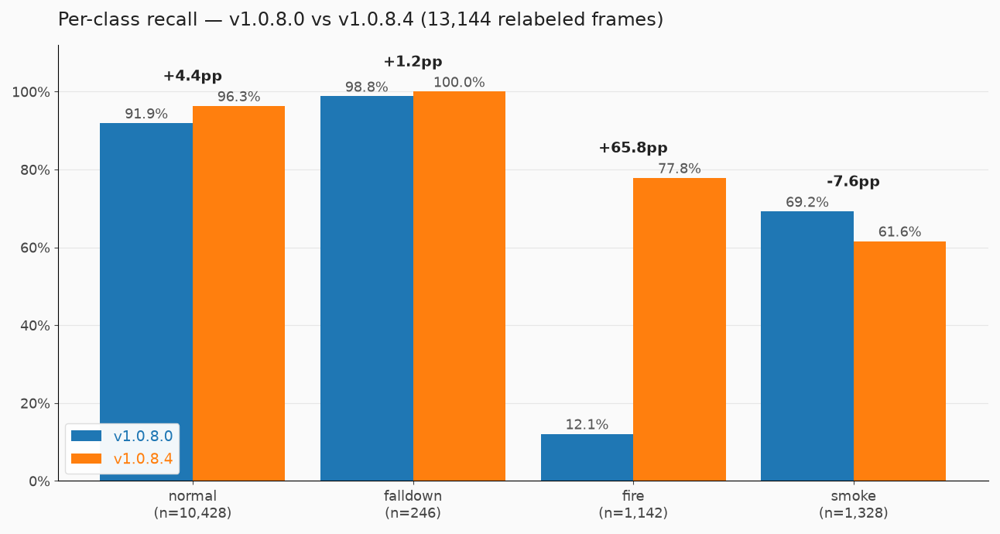
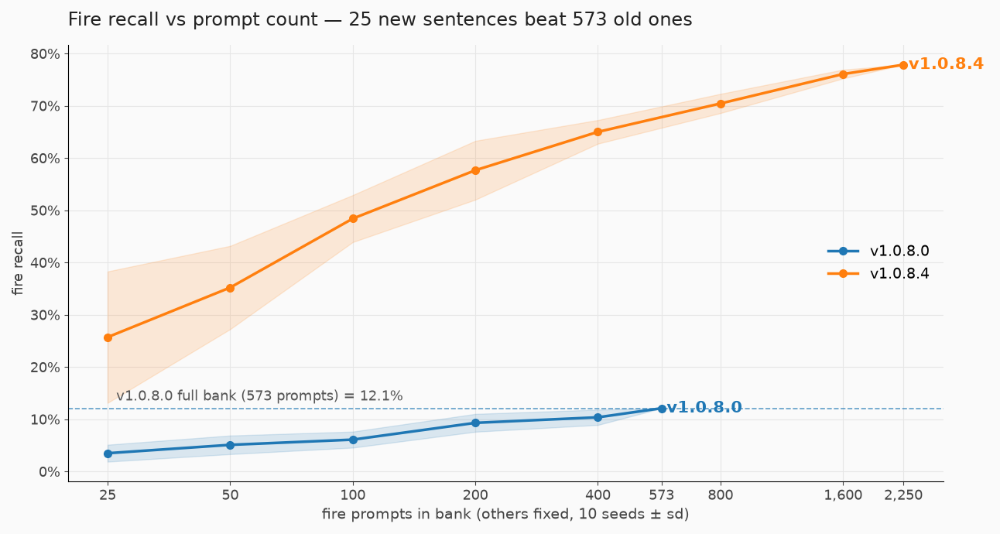
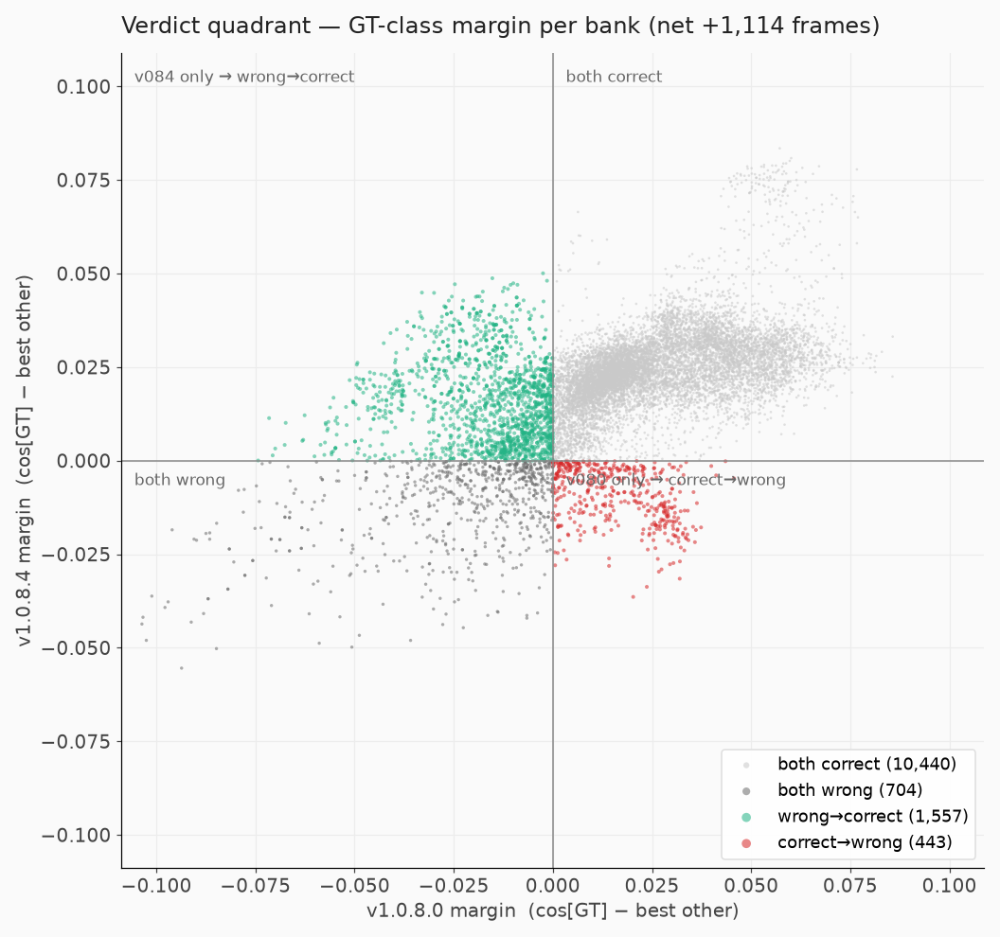
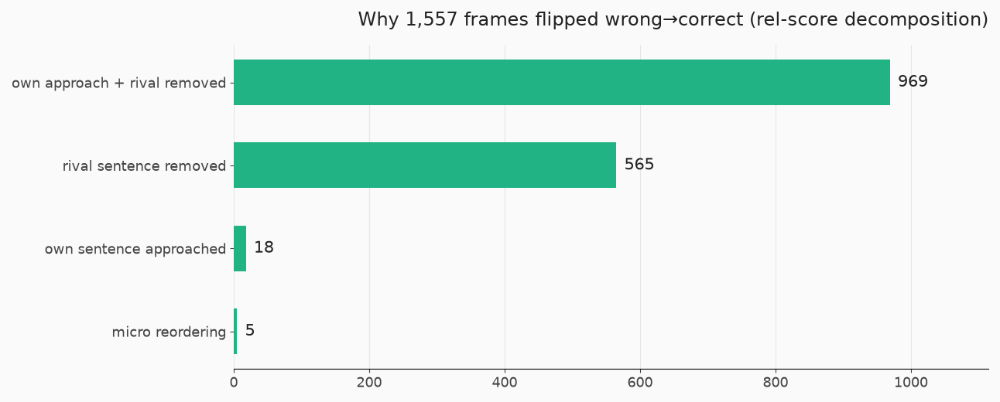
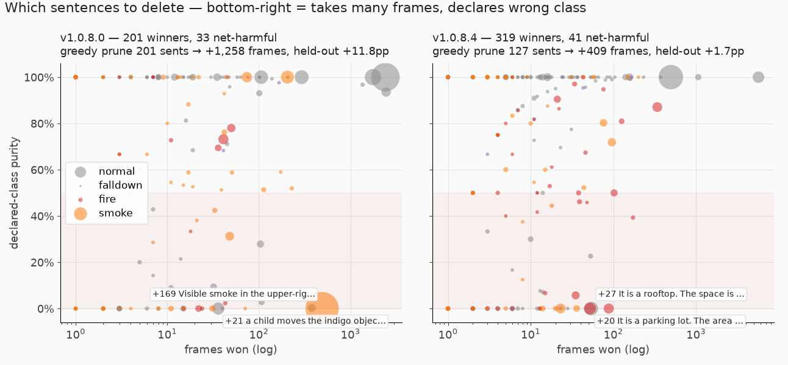
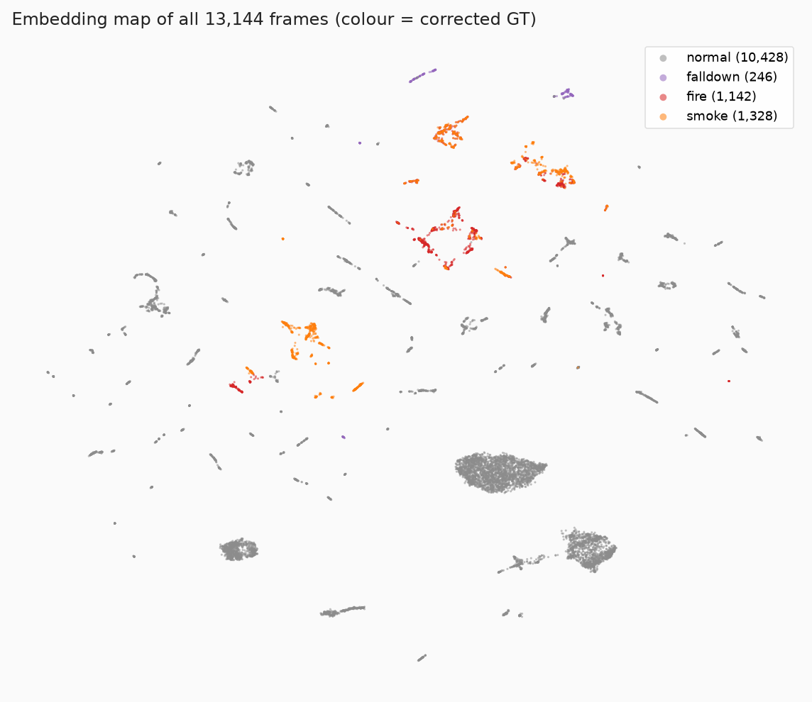

# source-h 프롬프트 뱅크 v1.0.8.0 → v1.0.8.4 분석 보고서

**— 성능 향상은 프롬프트 개수가 아니라 문장의 임베딩 공간 배치에서 왔다**

| | |
|---|---|
| 작성 | 2026-07-31 · **개정 2 (falldown GT 2라운드 정정 40장 반영)** |
| 데이터 | source-h CCTV 프레임 **13,144장** (사람이 프레임별 재라벨한 GT + falldown 정정 §0-2), 원본 영상 869편, 카메라 3곳 |
| 비교 대상 | 프롬프트 뱅크 v1.0.8.0 (12,480문장) vs v1.0.8.4 (16,125문장) |
| 인코더 | PE-Core-L14-336 — 제품 뱅크 벡터와 파이프라인 `/embed_text`가 **cosine=1.000000 동일** 검증 |
| 탐색 | FiftyOne <http://10.0.0.10:5153/datasets/source-h> (뷰·워크스페이스는 §10) |

## 0. 이 보고서의 위치 — FiftyOne 분석 플랫폼 구축의 검증 사례

이 보고서의 목적은 프롬프트 뱅크 평가 자체를 넘어, **"이런 질문에 답할 수 있는 분석 체계를 FiftyOne 위에 구축한다"**는 것이다. 보고서의 모든 주장은 FiftyOne의 뷰·필드·산점도로 클릭해 검증할 수 있고(§10 인덱스), 전 과정이 원커맨드(`sourceh_bank_eval.sh`)로 재현된다 — 다음 뱅크 버전(v1.0.9.x, v3.x)이 나오면 같은 분석이 자동으로 나온다. 즉 이 문서는 일회성 분석이 아니라 **뱅크 개발 iteration 을 지원하는 상설 분석 플랫폼의 첫 가동 결과**다.

## 0-1. 비교 대상 버전 선정 근거

회사 프롬프트 버전 체계(노션 [프롬프트 버전/관리 체계 구축](https://app.notion.com/p/2ea6a557fb8e8061a528c9e2138c2153))
기준 `v(classes).(model).(domain).(patch)` 에서 **domain 8 = source-h** — v1.0.8.x 가 source-h 전용 라인이며,
**최초 버전(v1.0.8.0, MACS 적용 2026-03-12)과 현행 최신(v1.0.8.4, 2026-06-10)**을 비교했다.

| 버전 | Base Prompt | MACS 적용일 | 성격 |
|---|---|---|---|
| v1.0.8.0 | v1.0.6.1 | 2026-03-12 | source-h 최초 적용 — 비교 기준 |
| v1.0.8.1~8.3 | 직전 버전 | 03-13 ~ 04-15 | 증분 패치 |
| **v1.0.8.4** | **자기 자신** | 2026-06-10 | **전면 재작성 — 현행 최신** |

> **교차 확인**: 두 CSV 의 문장 교집합 **0개**(12,480 전부 삭제 + 16,125 전부 신규) — 관리 대장의
> "v1.0.8.4 Base=자기 자신" 기록과 정확히 일치한다. 추가/삭제가 아니라 **전면 재작성 관계**다.

## 0-2. 개정 이력 — falldown GT 오류 정정 (2026-07-31)

초판의 `falldown −2.1%p` 는 **모델 퇴행이 아니라 GT 오류**였다. 프레임 재라벨 1차 작업이
helmet·fire·smoke 폴더만 훑고 **falldown 폴더(9영상 286장)는 한 장도 열지 않아**, 영상 폴더명
`*_쓰러짐_*` 을 전 프레임에 상속한 weak GT 가 그대로 남아 있었다. 그 결과 **앉아 있는/무릎 꿇은
프레임까지 falldown** 으로 채점됐고, "Someone is sitting on the floor" 를 정확히 고른 v1.0.8.4 가
오탐으로 집계됐다.

확정한 클래스 정의는 뱅크가 이미 쓰고 있던 것이다: **바닥에 누움/엎어짐 = falldown,
앉음·무릎꿇음 = normal**. v1.0.8.4 는 애초에 sitting/kneeling 을 normal 하드네거티브로 넣어
뒀으므로, **GT 만 다른 정의를 쓰고 있던 것이 진짜 버그**였다.

정정은 두 라운드로 진행됐고, **방향이 서로 반대**라는 점이 중요하다:

| 라운드 | 대상 | 이동 | 모델 예측이었던 것 | 채점에 준 효과 |
|---|---|---|---|---|
| 1차 | 양 버전 중 하나라도 normal 로 답한 37장 (+근접 18장) | **34장** | `normal` (모델이 맞고 GT 가 틀렸다) | 두 버전 모두 **정답으로 전환** |
| 2차 | 1차에서 안 걸린 앉음·무릎 프레임 육안 재검수 | **6장** | `falldown` (모델이 과검출했다) | 두 버전 모두 **오답으로 전환** |

- 1차에서 제외한 3장은 v1.0.8.4 만 falldown 으로 맞춘 프레임이라 유지했다.
- 2차 후보 7장 중 `area-a_쓰러짐_20260320_162615_0002` 는 **바닥에 완전히 엎드린 프레임**이라
  제외했다 — 같은 영상의 0093/0094 는 일어나 앉은 뒤라 normal 이 맞지만, 0002 는 정의상 falldown 이다.
  (이걸 옮기면 1차에서 고친 것과 **반대 방향의 GT 오류**가 된다.)
- 남은 14장(falldown 이 normal 을 0.02 이내로 간신히 이긴 근접 케이스)은 FiftyOne 태그 `gt_suspect`.

누적 **40장 이동 → falldown 286 → 246장**. v1.0.8.4 는 246장 전부 정답(recall 100%)이고,
Δ가 −2.1%p 에서 **+1.2%p** 로 부호가 뒤집힌다.

> 💡 **2차 라운드의 값은 정확도가 아니라 새 축이다.** 6장은 두 뱅크가 모두 `falldown` 이라 답한
> 프레임이므로 옮기는 순간 양쪽이 함께 틀린다(micro −0.05%p, Δ는 불변). 대신 이제껏 weak GT 에
> 가려져 **측정 자체가 불가능했던 falldown 오탐(precision)이 드러난다** — §1 참조.

⚠️ NAS 원본(`nas_primary/source-h/falldown/`)은 아직 이동 전이므로 `scan` 재실행 시 되살아난다.

## 요약 (3줄)

1. **정확도 82.80% → 91.27% (+8.48%p, +1,114장)** 인데, 프롬프트 개수를 완전히 동일하게 맞춰도 **+9.2%p가 그대로 남는다** — 향상의 사실상 전부가 "문장이 어디에 놓였는가"다.
2. 오탐→정탐으로 바뀐 프레임 1,557장의 **98.5%에 "경쟁(오답) 문장의 소거"가 개입** — 좋은 문장을 더한 것 못지않게 **모든 것에 들러붙던 나쁜 문장을 없앤 것**이 향상의 메커니즘이다.
3. 남은 트레이드오프는 **smoke −7.6%p 하나**이며, 회귀가 아니라 **허브 문장 제거의 부수 피해**로 다음 뱅크에서 문장 단위로 회수 가능하다(§6 처방). falldown 은 −2.1%p 로 집계됐었으나 **GT 오류였고**(§0-2), 정정 후 recall 100% / **precision 95.0%** 다 — 남은 falldown 과제는 미검출이 아니라 **오탐 13장**이다.

---

## 1. 수치 변화 — 헤드라인

| 지표 | v1.0.8.0 | v1.0.8.4 | 변화 |
|---|---|---|---|
| micro accuracy | 82.80% | **91.27%** | **+8.48%p** (+1,114장) |
| macro recall | 67.99% | **83.94%** | **+15.95%p** |
| 영상 단위 부트스트랩 95% CI (869영상×2,000회, 짝지음) | — | — | **[+4.4, +14.8]%p** ✅ 유의 |

클래스별 recall — 향상과 트레이드오프가 공존한다:



| GT | n | v1.0.8.0 | v1.0.8.4 | Δ |
|---|---|---|---|---|
| fire | 1,142 | 12.1% | **77.8%** | **+65.8%p** |
| normal | 10,428 | 91.9% | 96.3% | +4.4%p |
| falldown | 246 | 98.8% | **100.0%** | +1.2%p |
| smoke | 1,328 | 69.2% | 61.6% | **−7.6%p** |

### 1-1. falldown 은 recall 이 아니라 precision 으로 봐야 한다 (정정 GT 로 처음 열린 축)

weak GT 시절에는 falldown 영상의 모든 프레임이 falldown 이었으므로 **오탐이 정의상 존재할 수 없어
precision 을 측정할 수 없었다.** 정정 후 처음으로 계산된다:

| 버전 | falldown 이라 답한 프레임 | TP | FP | precision | recall |
|---|---|---|---|---|---|
| v1.0.8.0 | 262 | 243 | 19 | 92.7% | 98.8% |
| **v1.0.8.4** | 259 | 246 | **13** | **95.0%** | **100.0%** |

FP 13장의 GT 는 normal 12 + fire 1 이고, **전원 마진이 −0.049 ~ −0.000 구간**(간신히 뒤집힌 판정)이다.
대부분 "바닥에 앉아 있는 작업자"로, normal 뱅크의 sitting/kneeling 하드네거티브가 **이 카메라 각도·거리에서는
충분히 강하지 않다**는 뜻이다. 뷰 `32_falldown_fp` / 태그 `falldown_fp` 로 바로 열린다:


> ⚠️ 같은 데이터를 **영상 단위 weak GT**로 채점하면 결론의 부호가 뒤집힌다(−5.3%p). fire 영상에서 뽑힌 프레임의 79%가 실제로는 normal이었기 때문이다(§7). 이 보고서의 모든 수치는 사람이 프레임별로 재라벨한 GT 기준이다.

## 2. 왜 좋아졌나 — 개수가 아니라는 3중 증명

### 2-1. 매칭 카운트 팩토리얼 (결정적 증거)

클래스별 프롬프트 수를 **8,625 / 160 / 573 / 1,044로 완전히 고정**하고 문장 소스만 v080/v084로 전환한 2⁴ 실험 (10 seeds):

| 조합 | micro |
|---|---|
| 전부 v1.0.8.0 문장 | 82.40% ± 0.66% |
| **전부 v1.0.8.4 문장 (동일 개수)** | **91.63% ± 0.25%** |

**개수가 완전히 같은데 +9.2%p.** fire를 573개로, falldown을 3,000→160개로 깎아도 v084 문장이면 성능이 유지된다. 개수 효과의 실측값: v084를 12,480개(=v080 전체)로 줄여도 91.20% — 즉 **개수를 16,125개로 늘려 얻은 것은 +0.07%p뿐**이다.

### 2-2. 한계곡선 — 새 문장 25개 > 옛 문장 573개



fire 뱅크만 크기를 바꾸고 나머지는 고정한 곡선: v084 문장 **25개**(recall 25.7%)가 v080 **전체 573개**(12.1%)의 2배를 넘는다. 곡선이 어떤 크기에서도 겹치지 않는다 — 문장 하나하나의 배치 품질이 다르다.

### 2-3. 판정 사분면 — 눈으로 확인

x=v080의 GT클래스 마진, y=v084의 마진(뱅크 내부 차이라 스케일 상쇄). 사분면이 곧 판정이다:



| 사분면 | n |
|---|---|
| 우상 — 둘 다 정탐 | 10,440 |
| **좌상 — v084만 정탐 (오탐→정탐)** | **1,557** |
| 우하 — v080만 정탐 (정탐→오탐) | 443 |
| 좌하 — 둘 다 오탐 | 704 |

순개선 **+1,114 프레임**. FiftyOne 워크스페이스 `margin`에서 임의 점을 올가미로 선택하면 해당 프레임이 바로 열린다.

## 3. 무엇이 어떻게 바뀌었나 — 프레임 플립 추적

오탐→정탐 1,557장 (뷰 `30_fixed_오탐to정탐`, 개선 폭 `margin_delta` 순 정렬):


**바뀐 이유의 분해** (프레임별 rel 점수 분해, `flip_reason` 필드):



| 이유 | n | 비율 |
|---|---|---|
| **자기접근+경쟁소거** | 969 | 62.2% |
| **경쟁문장 소거만** | 565 | 36.3% |
| 자기문장 접근만 | 18 | 1.2% |
| 재배열(미세) | 5 | 0.3% |

**핵심 발견**: 순수하게 "새 문장이 이미지에 접근해서" 고쳐진 건 1%뿐이다. **98.5%는 v080에서 이기던 오답 문장이 사라진 것이 개입**했다. 즉 v084의 개선은 "좋은 문장 추가"의 이야기이기 이전에 **"모든 것에 들러붙던 문장 제거"의 이야기**다. 각 프레임의 `why_before`/`why_after` 필드에 전·후 승자 문장과 코사인이 기록돼 있다:

```
why_before: [v1.0.8.0] 오답 normal «A worker squatting low near the entrance...» cos 0.298 > falldown 0.292
why_after : [v1.0.8.4] 정답 falldown «It is a warehouse. ... Someone has fallen onto the gr...» cos 0.296 ≥ 경쟁 0.286
```


### 3-1. 플립 이유 분류의 의미 — 프롬프트 작성 참고서

**계산 방법**: 프레임별로 각 뱅크의 클래스 최고 코사인 4개를 구하고, 프레임 내 4클래스 평균을 빼서(rel) 뱅크 간 가산 오프셋을 상쇄한 뒤, 버전 간 변화를 두 축으로 분해한다 — **own_d** = 정답 클래스 rel 변화, **rival_d** = 오답(프레임을 뺏던/뺏는) 클래스 rel 변화. 문턱 ±0.005 (v084 코사인 표준편차 0.0273의 ~18% — 이보다 작으면 노이즈로 간주).

> **전제 사실**: 두 뱅크는 추가·삭제 관계가 아니라 **전면 재작성**이다 — 문장 교집합 **0개**
> (12,480문장 전부 삭제, 16,125문장 전부 신규, 정규화 후에도 0). 따라서 아래의 "소거/접근"은
> 개별 문장 편집이 아니라 **전면 재작성이 프레임별로 남긴 효과의 해부**다. 다음 버전부터는
> 이 도구들(선택도·프로브·플립 추적)로 전면 재작성 대신 **문장 단위 외과수술**이 가능하다.

#### 오탐→정탐 방향 (1,557건)

| 분류 | 조건 | n | 주 GT | 평균 Δmargin |
|---|---|---|---|---|
| **자기접근+경쟁소거** | own_d↑ 그리고 rival_d↓ | 969 (62%) | fire 566, normal 271 | +0.0413 |
| **경쟁문장 소거** | rival_d↓ 만 | 565 (36%) | normal 271, fire 196 | +0.0161 |
| **자기문장 접근** | own_d↑ 만 | 18 (1%) | normal 15 | +0.0132 |
| 재배열(미세) | 둘 다 문턱 이하 | 5 | — | +0.0042 |

**① 자기문장 접근** — 정답 클래스에 **이 이미지에 실제로 닿는 새 문장이 생겼다** (경쟁은 그대로). 순수한 "표적 작성"의 성공례이며 단 18건(1%)뿐이라는 것이 중요하다. 18건의 실체: v080이 헤드라이트 반사·렌즈 플레어를 "Bright flames…"로 읽던 프레임을, v084가 **오탐의 원인을 정면으로 서술하는 normal 문장**("A reflection on the camera lens…", "Vehicle headlights are shining…")으로 회수했다.
→ **작성 시사점**: 오탐이 나는 진짜 이유(반사·렌즈오염·광원)를 그대로 문장으로 쓰면 그 영역을 직접 회수한다. 이것이 "특정 값에 접근하는 문장"의 실제 모습이다.

> 📖 **용어: 허브 문장(hub)** — 자기 클래스 사진만이 아니라 **아무 사진과도 다 비슷하다고 계산되는
> 문장**(쉬운 표현으로 '만능 자석'). 내용이 틀려서가 아니라 임베딩 공간에서 "어디에나 가까운"
> 위치(hub)에 떨어져서 생긴다. 예: "Visible smoke in the upper-right corner around the warehouse
> in the evening."은 'smoke'가 아니라 **창고 전경·구도·저녁 조명**과 정합해, smoke 문장 1,044개 중
> 이 하나가 전체 프레임의 40%(5,299장)에서 smoke 대표로 뽑혔고 연기 없는 ~100장을 훔쳐갔다.
> 자기 성적(win 49%)만 보면 좋아 보여서 위험하며, 판별은 **선택도(자기 win ÷ 오탈취)** —
> 58x(허브) vs 781x(좋은 문장). 채택 기준 "유발 FP ≤ 0.10%"가 허브 차단선이다.

**② 경쟁문장 소거** — 정답 쪽 문장은 그대로인데, **프레임을 훔쳐가던 오답 문장이 뱅크에서 사라져서** 고쳐졌다. 소거 효과 상위 문장(이 문장이 사라진 것만으로 고쳐진 프레임 수):

| 회복 프레임 | 소거된 v1.0.8.0 문장 | 허브가 된 이유 |
|---|---|---|
| **247** | "Visible smoke in the upper-right corner around the warehouse in the evening." | 위치·시간 수식이 CCTV 전경과 광범위하게 정합 |
| 73 | "A red bag is placed beside rising smoke." | **빨간 물체**(소화기 등)가 있는 온갖 프레임과 정합 |
| 42 | "A red container sits within light smoke." | 〃 |
| 36 | "a clear view of the loading dock from a cctv camera" | 장면 일반 서술 = 만능 허브 |

→ **작성 시사점**: ⑴ 물체 앵커("red bag/container")·위치 수식·"a clear view of…" 류 일반 서술은 허브가 된다 — 쓰지 말 것. ⑵ **문장을 추가하지 않고 제거만 해도 성능이 오른다** — 뱅크 정리(오탈취율 > 0.1% 문장 삭제)는 신규 작성과 동급의 레버다.

**③ 자기접근+경쟁소거** — 둘이 동시에 일어난 경우로 가장 크고(+0.0414) 가장 흔하다(62%). fire 회복(566건)의 주 메커니즘: 좋은 fire 문장이 들어오고 + fire 프레임을 뺏던 normal 허브가 사라졌다. **재작성은 추가와 제거를 한 몸으로 설계할 때 가장 크게 움직인다.**

**④ 재배열(미세)** — 양쪽 이동이 모두 문턱(0.005) 이하인데 순서만 뒤집힌 것. 사실상 동점 구간의 운이다. → **이 프레임들을 근거로 프롬프트를 설계하지 말 것**. 오히려 GT 재확인 후보다.

#### 정탐→오탐 방향 (443건) — 라벨 의미가 반대다

| 분류 | 의미 | n | 주 GT | 평균 Δmargin |
|---|---|---|---|---|
| **자기문장 약화** | 이 프레임을 잡던 정답 문장이 v084에 없거나 약함 | 249 (56%) | **smoke 184** | −0.0197 |
| **자기약화+경쟁등장** | 약화 + 새 경쟁 문장의 침식 | 181 (41%) | **smoke 148** | −0.0341 |
| 경쟁문장 등장 | 새 문장이 순수하게 뺏음 | 5 (1%) | normal 5 | −0.0123 |
| 재배열(미세) | 동점 구간 | 8 | normal 8 | −0.0043 |

> 정정된 GT 에서 이 방향에는 **falldown 이 한 장도 없다** — 손상은 smoke 332 / normal 98 / fire 13 이다.

**smoke −7.6%p의 해부**: 손상 443건 중 smoke가 332건이고, 그 대부분이 **자기문장 약화**다 — §3-1②에서 소거된 허브 문장들("Visible smoke in the upper-right corner…")이 **진짜 연기 프레임도 잡고 있었기** 때문에, 허브를 버리자 그 프레임들이 갈 곳을 잃었다. 침식한 새 경쟁 문장 상위: "It is a parking lot. … **The fire is spreading.**"(99건 관여), "It is a rooftop. … Flames are burning."(51건) — smoke→fire 오분류의 주범.

→ **작성 시사점 (가장 중요)**: **허브 문장을 제거할 때는 그 문장이 잡던 진짜 양성을 대체할 고선택도 문장을 반드시 함께 공급하라.** v084는 smoke 허브를 제거만 하고 대체를 충분히 넣지 않았다 — 이것이 smoke 트레이드오프의 전부다. 다음 뱅크의 smoke 문장은 `07_gap_smoke` 뷰의 실제 화면(소화기 분사, 야간 원거리 연기)을 서술하되, 선택도(§4) 기준으로 fire·normal 을 뺏지 않는지 검증 후 채택.

#### 분류 → 작성 전략 요약

| 신호 | 전략 |
|---|---|
| 자기문장 접근이 잘 통한 영역 | 오탐 원인(반사·광원·렌즈)을 정면 서술하는 문장 추가 |
| 경쟁문장 소거가 많음 | 뱅크에서 오탈취율 > 0.1% 허브 삭제 (추가보다 먼저) |
| 자기문장 약화가 많음 (현 smoke) | 허브 삭제의 부수 피해 — 대체 문장 공급 필수 |
| 재배열(미세) | 설계 근거 금지, GT 재확인 후보 |

## 4. 트레이드오프의 이유 — 뱅크는 공동 조율된 시스템이다

smoke −7.6%p는 "일부 클래스 희생" 같은 단순한 이야기가 아니다. 팩토리얼의 주효과가 이를 보여준다:

| 한 클래스 소스만 v080→v084 전환 | micro 변화 | 자기 recall | 타클래스 부수효과 |
|---|---|---|---|
| smoke 소스 전환 | **+18.8%p** | **−36.1%p** | normal +24.7, fire +33.0 |
| normal 소스 전환 | **−15.5%p** | −26.0%p | fire +33.7, smoke +20.8 |

smoke 소스를 v084로 바꾸면 자기 recall이 36.1%p **떨어지는데 전체는 18.8%p 오른다** — v080 smoke 문장들이 훔쳐가던 normal·fire 프레임이 풀려나기 때문이다. **각 뱅크는 클래스 간 스케일·경쟁이 공동 조율(co-calibrated)돼 있어, 클래스 단위 효과가 분리되지 않는다.**

이를 문장 수준에서 확정하는 **선택도(자기클래스 win율 ÷ 타클래스 오탈취율)**:

| 문장 | 자기 win | 오탈취 | 선택도 |
|---|---|---|---|
| v084 smoke 1위 "…White smoke is spreading." | 46.3% | 0.06% | **781x** |
| v080 smoke 1위 "Visible smoke around the middle area…" | 49.0% | **0.85%** | 58x |

v080 smoke 문장은 자기 win율이 더 높아 보이지만 **smoke에 가까운 게 아니라 모든 프레임에 가까운(고스케일) 문장**이었다. 검증 실험: 이 문장들을 v084에 도로 수입하면 smoke는 95.1%가 되지만 **normal이 46.0%로 붕괴**하고(micro 51.0%), 두 뱅크 CSV를 통째로 합쳐도 84.7%로 v084 단독(91.3%)보다 나쁘다. **v084의 smoke recall −7.6%p는 이 고스케일 문장들을 버린 대가**이며, 그 대가로 normal +4.4%p·fire +65.8%p를 얻었다.

남은 smoke 미검출 510장은 특정 시각 영역에 몰려 있다 (뷰 `07_gap_smoke`, 소화기 분사 훈련 장면 등 — GT 자체가 경계적인 프레임 포함):


이미지 임베딩만으로 "이 프레임이 버전 전환 시 뒤집힐지"를 **AUC 0.866**으로 예측할 수 있다 — 변화는 무작위가 아니라 특정 시각 영역을 표적으로 일어났다.

## 5. 문장 수준 원인 — 무엇이 "잘 배치된" 문장인가

각 클래스에서 실제로 프레임을 획득하는(would-win) 문장 비교:

| 클래스 | 뱅크 | 최고 would-win | 문장 |
|---|---|---|---|
| fire | v1.0.8.0 | 4.5% | "A large torch flares in the bottom corner in daylight." |
| fire | v1.0.8.4 | **50.9%** | "It is a construction site. Daily routines are unfolding. **The fire is spreading.**" |

v080 스타일(위치·시간 수식: "in the bottom corner in daylight")은 CCTV 프레임 임베딩과 만나지 못했고, v084의 **장면 + 상태 + 일반 이벤트 서술** 구성이 만난다. 그런데 구성 효과는 비가산적이다 — 절제 실험:

| fire 1위 문장의 변형 | would-win |
|---|---|
| 전문 (construction site + 상태 + 이벤트) | **50.9%** |
| 이벤트만 ("The fire is spreading.") | 34.9% |
| **warehouse** + 이벤트 (장면 단어만 교체) | **6.3%** |
| 상태 문장 제거 | 33.9% |

**장면 단어 하나("construction site"↔"warehouse")로 8배** 갈리고, 무의미해 보이는 상태 문장("Daily routines are unfolding")이 +17%p를 낸다. smoke는 반대로 장면 문장이 없으면 4.3%로 추락한다(+39%p 기여). → **문장이 좋은지는 감으로 예측 불가하며, 임베딩해서 측정해야만 안다.**

## 6. 다음 뱅크 처방 (측정 기반)

1. **채택 절차 표준화**: 후보 문장 → `/embed_text`(7.5ms) → 대상 클래스 FN 구조율 + 타클래스 유발 FP 측정 → **FP ≤ 0.10% 중 구조율 최대만 채택**. 자동화됨: `prompt_authoring_guide.md`가 후보별 값을 표로 생성.
2. **정직한 현실**: 장면어 9종 × 템플릿 2형(18후보/클래스)을 전수 측정한 결과, **남은 미검출은 장면어 교체로 안 잡힌다**(fire 최고 후보도 FP 1.27%로 탈락). 다음 뱅크는 `gap_cluster` 뷰의 실제 화면(소화기 분사, 야간 원거리 연기 등)을 보고 쓴 **새로운 이벤트 서술**이 필요하다.
3. **초판의 "v080 falldown 수입" 처방은 폐기한다** — GT 정정 후 v084 는 falldown 246장 전부를 맞춘다(100%). 재측정하면 수입의 이득은 **0**이고 비용만 남는다:

   | 뱅크 구성 | micro | macro | falldown | normal |
   |---|---|---|---|---|
   | v1.0.8.4 단독 | **91.3%** | **83.9%** | 100.0% | **96.3%** |
   | v084 + v080 falldown 수입 | 90.6% | 83.7% | 100.0% | 95.5% |

   초판이 이득으로 본 `88.8→95.5%` 는 **GT 오류가 만든 허수**였다. 이것이 GT 정정이 처방까지 뒤집은 사례다.
   더불어 falldown 공백 지도는 **미검출 0프레임**이 되어, 자동 작성 가이드의 falldown 섹션도 사라졌다
   (초판에서 회수 대상이던 32프레임은 전부 GT 오류였고, 후보 문장의 FN 구조율이 0~3%로 나온 이유가 이것이다).
4. **falldown 의 새 과제는 미검출이 아니라 오탐 13장이다**(§1-1). 회수(recall)는 끝났고 남은 것은 정밀도다.
   FP 전원이 마진 −0.05 이내라 **normal 쪽에 "바닥에 앉은 작업자" 하드네거티브를 1~2문장 보강**하면
   되돌릴 수 있는 크기다 — 단 falldown recall 100% 를 깨지 않는지 `32_falldown_fp` + 전체 재평가로 확인해야 한다.
   (이 처방은 **2차 GT 정정 없이는 존재할 수도 없었다** — weak GT 에서는 falldown 오탐이 정의상 0이었다.)
5. **선택도 낮은 문장 제거가 추가보다 효과적일 수 있다** — §3에서 개선의 98.5%가 경쟁 소거 개입이었다.
   삭제 후보는 두 축(많이 가져가는데 선언 클래스가 틀림)으로 바로 읽힌다 — **우하단이 우선 삭제 대상**:

   

   실측: v080 에서 문장 **201개(1.6%)만 탐욕적으로 지우면 82.80 → 92.37%** (영상 2폴드 홀드아웃 +11.79pp)로
   **v084 전면 재작성(91.27%)을 넘어선다**. v084 자신도 127문장 제거로 91.27 → 94.39%.
6. **가장 큰 실질 타깃은 여전히 smoke 다** (미검출 510장), 그다음이 fire(253장)의 야간·원거리 코호트다.

## 7. GT 품질이 결론을 바꾼다 (재라벨의 가치)

| GT | v084 − v080 (micro) |
|---|---|
| 영상 단위 폴더 GT (871편) | **−5.3%p** ("v084가 나쁨") |
| 프레임 단위 재라벨 GT (falldown 미검수) | +8.3%p |
| **프레임 단위 재라벨 GT + falldown 40장 정정 (13,144장)** | **+8.5%p** ("v084가 좋음") |

Δ 자체는 GT 해상도를 올려도 안정적이다(+8.3 → +8.5%p). **바뀌는 것은 클래스별 진단과 처방**이다 —
falldown 이 퇴행(−2.1%p)에서 완결(recall 100%)로, 그리고 "문장을 수입하라"에서 "오탐 13장을 줄여라"로.

fire 영상에서 뽑힌 프레임의 79%(4,311/5,453), smoke 영상 프레임의 상당수가 실제로는 normal이었다. **평가 GT의 해상도가 모델 판정보다 거칠면 결론의 부호까지 뒤집힌다** — 이후 모든 버전 평가는 프레임 GT 기준으로 수행할 것.

전체 데이터의 임베딩 지도 (GT 색):



## 7-1. 카메라 각도는 영향을 주었나 — 아니다 (변량 부재)

source-h 은 각도 축의 **변량 자체가 없다**: 전 카메라가 벽면 사각 설치로 13,144프레임 중 plan_view 21장(0.16%), tilt 중앙값 13.0°, 전 범위 0.4~32.8°. DAv2 각도 분류(`tilt_bin`)별 정확도 차이는 있지만 **전부 클래스·카메라 구성의 교란**이다:

| tilt 구간 | n | v080→v084 | 실체 |
|---|---|---|---|
| 00-05° | 615 | 66→97% | 98%가 ODC 카메라의 smoke — 각도가 아니라 그 코호트의 smoke 스토리 |
| 25-30° | 139 | 11→92% | 94%가 폐촉매 카메라의 normal — v080 오탐의 fire-fix 스토리 |
| 15-20° | 4,725 | 92→93% | 86%가 normal — 원래 쉬운 구간 |

각 구간이 한 카메라·한 클래스에 지배되므로 각도의 독립 효과는 **이 데이터로는 추정 불가**하다. 각도 축(migration 017, DAv2)이 의미를 가지려면 다기지·다각도 데이터(파이프라인 본체 18.7만 프레임)에서 봐야 하며, 그것이 이 축을 파이프라인 표준 스키마에 넣어둔 이유다.

## 8. 한계

- 프레임이 영상 내 상관(869 영상 / 카메라 3곳) — 부트스트랩은 영상 단위로 보정했으나 **카메라 3곳으로는 새 현장 일반화를 추정할 수 없다**.
- 코사인 절대값(0.2~0.35 대역)은 modality gap으로 의미 제한 — 모든 판정은 뱅크 내 상대량(margin) 기준.
- would-win은 커버리지 지표(이미 맞은 프레임 포함) — 절대값보다 상대 비교로 읽을 것.
- GT 재라벨도 사람 판단이며 경계 케이스가 존재한다. **주저앉음 vs 쓰러짐은 2026-07-31 정정으로 해소**됐고(§0-2, 2라운드 40장 이동 + 클래스 정의 확정), 남은 논쟁은 ⑴ 소화분사 vs 연기 ⑵ falldown 근접 14장(`gt_suspect` 태그)이다. 특히 **"반쯤 누움/기댐"은 여전히 정의의 회색지대**다 — 2차에서 옮긴 6장 중 1장(`162615_0036`)이 이 구간이고, 같은 영상의 `162615_0002`(완전히 엎드림)는 정의상 falldown 이라 남겼다.
- 이번 사례의 교훈 둘: ⑴ **한 클래스의 recall 이 혼자 퇴행하면 모델보다 그 클래스의 GT 를 먼저 의심할 것** — falldown 은 프레임 재검수를 안 거친 유일한 클래스였다. ⑵ **weak GT 는 지표를 틀리게 만드는 데 그치지 않고 지표를 아예 지운다** — falldown precision 은 정정 전에는 정의상 100% 라 측정할 수 없었다.

## 9. 재현

```bash
# 새 뱅크 버전이 나오면 (CSV 만 있으면 전 과정 자동)
./docker/analysis/sourceh_bank_eval.sh v1.0.8.4 v1.0.9.0 /path/to/text_features_v1.0.9.0.csv
# 개수/기하 분리 판정이 필요하면 팩토리얼 (docs/source-h-prompt-geometry-2026-07-31.md §11)
```

GT 를 고쳤을 때의 전체 재현 절차 (이 개정판이 실제로 거친 경로):

```bash
# 1) 프레임 이동 + 산출물 키 재정렬 (embed.npz / ledger / angle 까지 함께)
docker exec docker-analysis-1 python /tmp/sourceh_frames_relabel.py normal <stem> …
# 2) 재채점 → 3) 전 스테이지 → 4) 애드혹이던 §4 실험 → 5) 보고서 이미지 9장
docker exec docker-analysis-1 python /workspace/sourceh_frames_eval.py score
./docker/analysis/sourceh_bank_eval.sh v1.0.8.0 v1.0.8.4
docker exec docker-analysis-1 python3 /workspace/sourceh_prompt_geometry.py ablate
docker exec docker-analysis-1 python3 /tmp/sourceh_merge_factorial.py
docker exec docker-analysis-1 python /tmp/sourceh_report_charts.py    # c1~c4 + s1~s5
```

산출물: `sourceh_prompt_geometry.py`(analyze/ablate/gap/viz/flips/guide/slim/report) ·
`sourceh_merge_factorial.py`(합본·수입 시뮬레이션 + 2⁴ 팩토리얼) ·
`sourceh_report_charts.py`(보고서 이미지 9장 — s1~s5 는 FiftyOne 앱 스크린샷을 대체한 직접 렌더로,
앱 상태가 URL 로 주소지정되지 않아 캡처가 재현되지 않았기 때문이다) ·
데이터 `/data/fiftyone/sourceh_v2/` · 상세 분석 `docs/source-h-prompt-geometry-2026-07-31.md`

## 10. FiftyOne 탐색 인덱스

| 무엇을 보고 싶나 | 어디서 |
|---|---|
| 오탐→정탐 1,557장 (개선 큰 순) | 뷰 `30_fixed_오탐to정탐` |
| 정탐→오탐 443장 (손상 큰 순) | 뷰 `31_broken_정탐to오탐` |
| **falldown 오탐 13장** (다음 처방 대상) | 뷰 `32_falldown_fp` / 태그 `falldown_fp` |
| falldown GT 근접 잔여 14장 | 태그 `gt_suspect` |
| 각 프레임이 바뀐 이유 | 필드 `flip_reason` + `why_before`/`why_after` (모달 하단 칩, 전문은 `{}` JSON 토글) |
| 판정 사분면 | 워크스페이스 `margin` (margin_viz × flip) |
| 다음 뱅크가 겨냥할 공백 | 뷰 `05~07_gap_*` + 워크스페이스 `gap` |
| 변화의 구조 (GT 무관) | 워크스페이스 `shift` (shift_viz × shift_direction) |
| 문장으로 이미지 검색 | 상단 돋보기 (text_search, 제품과 동일 인코더) |

*채점 규칙: 클래스 점수 = max over (프레임 × 그 클래스 프롬프트) cosine → argmax. 뱅크 임베딩과 제품 벡터의 동일성은 두 버전 전수 정합(12,480 + 16,125행) + 10지점 cosine=1.000000으로 검증됨.*
